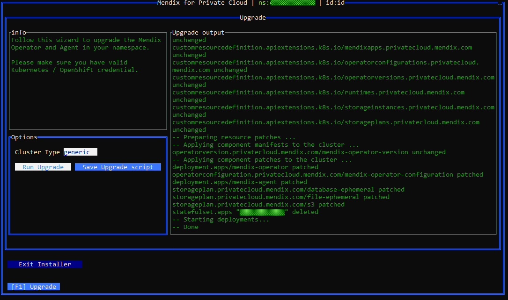

## 1 Introduction

This document describes how an existing installation of Mendix for Private Cloud can be upgraded.

This procedure allows you to upgrade to any supported (v1.9.0 and later) version of the Mendix for Private Cloud Operator.

{}
Upgrading the Mendix for Private Cloud Operator in a namespace will modify global resources such as Mendix Custom Resource Definitions in the cluster.

[Custom Resource Definitions](https://kubernetes.io/docs/tasks/extend-kubernetes/custom-resources/custom-resource-definitions/) allow Mendix applications to be managed with Kubernetes APIs and tools such as `kubectl` and `oc`.

Once you have installed a particular version of the Mendix Operator into any namespace in the cluster, you should not install older versions of the Mendix Operator into the same cluster, even if they are in other namespaces.
{}

If you are using your own private registry, follow the [Migrating to Your Own Registry](private-cloud-migrating) guide first
to migrate new component versions of Mendix for Private Cloud into your private registry.

## 2 Download the Configuration Tool{#download-configuration-tool}

Follow the instructions to [Download the Configuration Tool](private-cloud-cluster#download-configuration-tool).
Before downloading the Configuration Tool, choose the version you would like to upgrade to (1.9.0 or a later version) in the **Mendix Operator Version** dropdown.

If you're using an OpenShift cluster, follow the [Signing in to OpenShift](private-cloud-cluster#openshift-signin) instructions.

## 3 Upgrade Namespace{#upgrade-cluster}

1. Follow the instructions to [Run the Configuration Tool](private-cloud-cluster#running-the-tool). You will see the initial screen:

    
2. Click **Upgrade Namespace**. You will see the screen below:

    

### 3.1 Automatic Upgrade Mode

This mode will automatically upgrade components in the namespace.

1. Select your current required **Cluster Type** – *openshift* or *generic*.

2. Click **Run Upgrade** to upgrade Mendix for Private Cloud components in the namespace.

	{}The upgrade is successful if the **Upgrade output** ends with **Done**.{}

### 3.2 Manual Upgrade Mode

This mode allows you to review and audit any changes the Configuration Tool would need to perform to upgrade Mendix for Private Cloud in your namespace.

{}
Manual upgrade is an alternative to automatic upgrade mode. If you have already performed an automatic upgrade, you don't need to follow the instructions in this section.
{}

To get the current configuration, this tool will need permissions to read resources in the namespace.

#### 3.2.1 Generate Upgrade Patches

This step will prepare upgrade patches on your local machine in the subfolder `.mxpc-cli` of your user home directory (for example `C:\Users\<User id>\.mxpc-cli` in Windows or `/home/<User id>/.mxpc-cli` for Mac and U*ix).

1. Select your **Cluster Type** – *openshift* or *generic*.

2. Click **Save Upgrade script** to generate upgrade patches for the namespace.

	{}The patches are successfully generated if the **Upgrade output** ends with **Done**.{}

#### 3.2.2 Stop Deployments

Stop the deployed `mendix-operator` (replace `{namespace}` with the namespace where the Mendix Operator is deployed):

```shell
kubectl -n {namespace} scale deployment mendix-operator --replicas=0
```

If you have installed the cluster in Connected mode, stop the deployed `mendix-agent` (replace `{namespace}` with the namespace where the Mendix Agent is deployed):

```shell
kubectl -n {namespace} scale deployment mendix-agent --replicas=0
```

#### 3.2.3 Apply the Upgrade Patches

Run the following command to upgrade Custom Resource Definitions for the Mendix Operator:

```shell
kubectl apply -f crds.manifest.yaml
```

[Custom Resource Definitions](https://kubernetes.io/docs/tasks/extend-kubernetes/custom-resources/custom-resource-definitions/) allow Mendix applications to be managed with Kubernetes APIs and tools such as `kubectl` and `oc`.

Run the following command to upgrade the dependency versions for the Mendix Operator:

```shell
kubectl -n {namespace} apply -f upgrade_manifest.yaml
```

Open the `upgrade_patches.txt` file and run the commands printed in that file.
The `upgrade_patches.txt` file contains a list of `kubectl` commands (or `oc` commands for OpenShift) that you will need to execute in a command line terminal to complete the upgrade process.

{}
The `upgrade_patches.txt` file uses Bash escaping rules. If you're using another terminal such as the Windows command prompt, you will need to adjust the commands so that they are compatible with your command line terminal's escaping rules.
{}

#### 3.2.4 Start Deployments

Start the `mendix-operator` deployment (replace `{namespace}` with the namespace where the Mendix Operator is deployed):

```shell
kubectl -n {namespace} scale deployment mendix-operator --replicas=1
```

If you have installed the cluster in Connected mode, start the `mendix-agent` deployment (replace `{namespace}` with the namespace where the Mendix Agent is deployed):

```shell
kubectl -n {namespace} scale deployment mendix-agent --replicas=1
```
