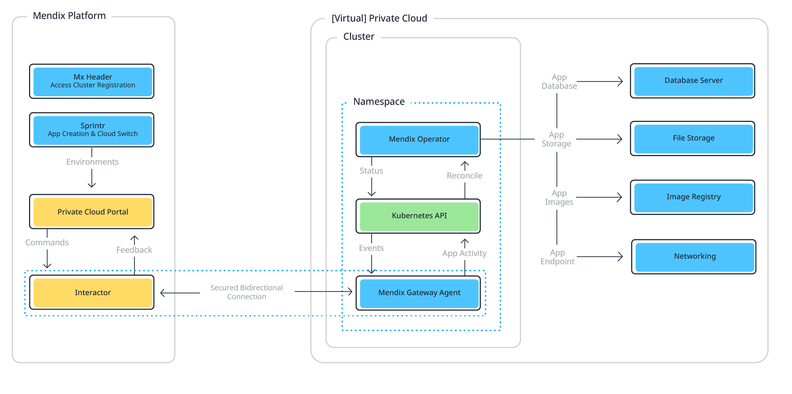
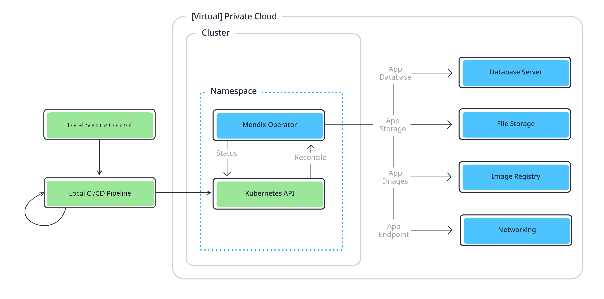

## 1 Introduction

**Mendix for Private Cloud** allows you to deploy and manage your Mendix apps in a Kubernetes private cloud cluster. It automates operations, such as database provisioning, that you would have to perform manually if you used the Mendix Docker buildpack. It also provides options for monitoring and logging through third-party tools. 

Your organization may have a requirement to use a private cloud, perhaps as part of a multi-cloud strategy. This could be because of legal requirements or a desire to have complete control over your data. Mendix for Private Cloud allows you to do this while keeping the familiar components of Docker and Kubernetes.

You can use Mendix for Private Cloud with the *connected* option to keep the simplicity of one-click deployments from the Developer Portal, or utilize the *standalone* Mendix Operator to deploy Mendix apps through your own DevOps process, which is particularly useful for private clouds with an *air-gap* isolating them from the internet. See [Connected and Standalone Clusters](#connected-standalone), below, for more information.

Please see [Supported Providers](private-cloud-supported-environments) for a list of platforms supported by Mendix for Private Cloud.

There are two steps required to achieve this, listed below.

{}
Mendix for Private Cloud is a premium offering from Mendix, and there are additional licensing and cost implications if you want to use it for applications in production. See [Licensing Mendix for Private Cloud](#licensing), below, for more information.
{}

### 1.1 Registering Your Cluster

The first step is to register your private cloud cluster in the Developer Portal. For more information see [Creating a Private Cloud Cluster](private-cloud-cluster).

This activity needs to be done by a systems administrator who has administration rights to the platform where the cluster is being created.

### 1.2 Deploying Your App

To deploy your app, you have two options:

1. You can deploy the app from within the Developer Portal. For more information see [Deploying a Mendix App to a Private Cloud Cluster from Developer Portal](private-cloud-deploy).
2. You can create a CI/CD pipeline and deploy your app from within the cluster. For more information see [Using Command Line to Deploy a Mendix App to a Private Cloud Cluster](private-cloud-operator).

When you deploy through the Developer Portal, this can be done by any Mendix user who has been given the appropriate rights to the cluster which has been registered.

## 2 Connected and Standalone Clusters{#connected-standalone}

To allow you to manage the deployment of your apps to Red Hat OpenShift and Kubernetes, you first need to register a cluster in the Mendix Developer Portal. This will provide you with the information you need to deploy the **Mendix Operator** in your cluster.
If you have chosen a *connected* cluster, the **Mendix Gateway Agent** will also be deployed.
Once the Mendix Operator is deployed to your cluster, you can use it to configure the resources which will be used by your apps.

You then have two options, depending on whether you have chosen to create a *connected* cluster or a *standalone* cluster.

### 2.1 Connected Architecture

If you have chosen to register a connected cluster, the Mendix Gateway Agent will create a link to the **Environments** pages of your Mendix app through the **Interactor**. This is a secure bi-directional communication channel which is initiated from the Mendix Gateway Agent running on the cluster.

Using this channel, any Mendix user who has been given the correct authority can pass instructions to the Mendix Operator and receive status information about the cluster. This includes instructions needed to deploy an app, or to configure the environment.

### 2.2 Standalone Architecture

If you have chosen to register a standalone cluster, then all communication with the Mendix Operator will be through instructions which are made directly through the Kubernetes API. These can be made manually, but are generally performed by your CI/CD pipeline. In this case, you will also have to have local source control of the Mendix app deployment packages to ensure that the deployment process can discover them.

## 3 Product Capability Comparison

The table below shows the differences between the capabilities for apps deployed to the Mendix Cloud, Mendix for Private Cloud (Mx4PC) Connected, and Mx4PC Standalone.

| Capability | Mendix Cloud | Mx4PC Connected | Mx4PC Standalone |
| --- | --- | --- | --- |
| Environment provisioning | Fully automated | Provisioned with database and blob storage provided by the customer | Provisioned with database and blob storage provided by the customer|
| Environment configuration *For example, constants and scheduled event* | Mendix Developer Portal | Mendix Developer Portal | Custom Resources via Mendix Operator |
| Mendix app/deployment package deployment | Mendix Developer Portal, Studio Pro, & Studio | Mendix Developer Portal & Studio Pro | Custom Resources via Mendix Operator *normally combined in a CI/CD pipeline* |
| Backup and restore | Mendix Developer Portal | Services supplied by the database server and file storage used | Services supplied by the database server and file storage used |
| Monitoring | Mendix Developer Portal | App metrics sent to a Prometheus-compatible monitoring tool | App metrics sent to a Prometheus-compatible monitoring tool |
| App logs | Mendix Developer Portal | Prints app logs to `stdout` | Prints app logs to `stdout` |
| Remote debugging | Mendix Developer Portal + Studio Pro | Mendix Developer Portal + Studio Pro | Not supported |

## 4 Licensing Mendix for Private Cloud{#licensing}

### 4.1 Operator License

Mendix for Private Cloud is a premium offering from Mendix, and you will need an additional license to use it for your applications. This **Operator license** allows you to manage Mendix apps in your cluster through the Mendix Operator and, optionally, the Mendix Gateway Agent.

You need one license for each namespace you want to manage.

You can request an Operator license by doing the following:

1. Open the [Request New App Node](https://newnode.mendix.com/) app.

2. Fill in the basic information, such as your company name and app name.

3. For **Hosting Type**, select *Mendix for Private Cloud* and click **Next**.

4. Fill in the required information:

    * The name of your company
    * License Type: Operator
    * The Mendix for Private Cloud architecture type. See [Connected and Standalone Clusters](#connected-standalone), above, for more information — optionally, leave additional information in the **comment** field
    * The namespace(s) for which you want to request an Operator license

5. Save the request.

You will receive your Operator license(s) from Mendix Support, together with instructions on how to configure it(them).

You can run the Mendix Operator in trial mode for evaluation purposes. When the Operator is running in trial mode, it will stop managing an environment ninety days (thirty days for Mendix Operator versions 1.12.0 and earlier) after the environment was created. In this case you will be unable to stop or start your app, or deploy an app to this environment. The only action you can take is to delete the environment. 

### 4.2 Runtime License

The Operator license is independent of a Mendix Runtime license. The Mendix Runtime license removes trial restrictions from a Mendix App itself. You need both licenses to manage and run an application through Mendix for Private Cloud.

You can request a Runtime license by doing the following:

1. Open the [Request New App Node](https://newnode.mendix.com/) app.

2. Fill in the basic information, such as your company name and app name.

3. For **Hosting Type**, select *Mendix for Private Cloud* and click **Next**.

4. Provide the required information:

    * The name of your company
    * License Type: Runtime
    * The Mendix for Private Cloud architecture type. See [Connected and Standalone Clusters](#connected-standalone), above, for more information — optionally, leave additional information in the **comment** field
    * If "Connected" please provide the namespace(s) for which you are requesting the runtime license(s)

5. Save the request.

You will receive your Runtime license(s) from Mendix Support. See [Online Private Cloud Apps](#activate-online) and [Offline Private Cloud Apps](#activate-offline), below, for instructions on how to configure them.

### 4.3 Request Both Operator and Runtime license

You can also request for both the Operator and Runtime license within the same request following the steps below:

1. Open the [Request New App Node](https://newnode.mendix.com/) app.

2. Fill in the basic information, such as your company name and app name.

3. For **Hosting Type**, select *Mendix for Private Cloud* and click **Next**

4. Fill in the required information:

    * The name of your company
    * License Type: Operator and Runtime
    * The Mendix for Private Cloud architecture type. See [Connected and Standalone Clusters](#connected-standalone), above, for more information — optionally, leave additional information in the **comment** field
    * The namespace(s) for which you want to request an Operator license

### 4.4 Activating Your License(s)

#### 4.4.1 Online Private Cloud Apps{#activate-online}

If your app is able to connect to the internet to contact the Mendix license server, you will receive a **Subscription Secret** from Mendix Support.

If your app is **Connected** to the Developer Portal, you can enter the subscription secret [in the Developer Portal](private-cloud-deploy#change-subscription-secret)

If your app is **Standalone**, then you will have to apply the subscription secret by [editing the CR](private-cloud-operator#edit-cr) in the cluster.

#### 4.4.2 Offline Private Cloud Apps{#activate-offline}

If your app is unable to contact the Mendix license server, you will receive a **LicenseId** and a **LicenseKey**. You will have to apply these by [editing the CR](private-cloud-operator#edit-cr) in the cluster.
