{}
This documentation is only relevant to customers deploying their Mendix app on the Tencent Cloud.
{}

## 1 Introduction

The Qianfan SSO module enables your app end-users to sign in with single sign-on (SSO) using an iDaaS account when your app is deployed to the Tencent Cloud. This document explains how to integrate the Qianfan SSO module with your Mendix app.

Full documentation in Chinese can be downloaded as a PDF from [千帆玉符 SSO 模块使用手册](https://mendix-cdn-prod-1305133312.cos.ap-shanghai.myqcloud.com/qianfansso/QianFanSSO%E4%BD%BF%E7%94%A8%E8%AF%B4%E6%98%8E.pdf).

## 2 Purchasing and Launching the Service

1. Open Qianfan Yufu identity management services

2. Use the following URL to purchase and launch the service:

    [https://cloud.tencent.com/product/cig](https://cloud.tencent.com/product/cig)

    After activation, you'll receive the following email:

    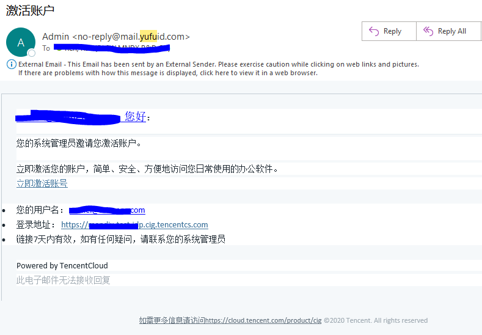

## 3 Configuring Yufu iDaaS

### 3.1 Logging in to Yufu iDaaS
    
1. Log in to Yufu iDaaS using login address provided by the above-mentioned email, log in to Yufu iDaaS control panel

    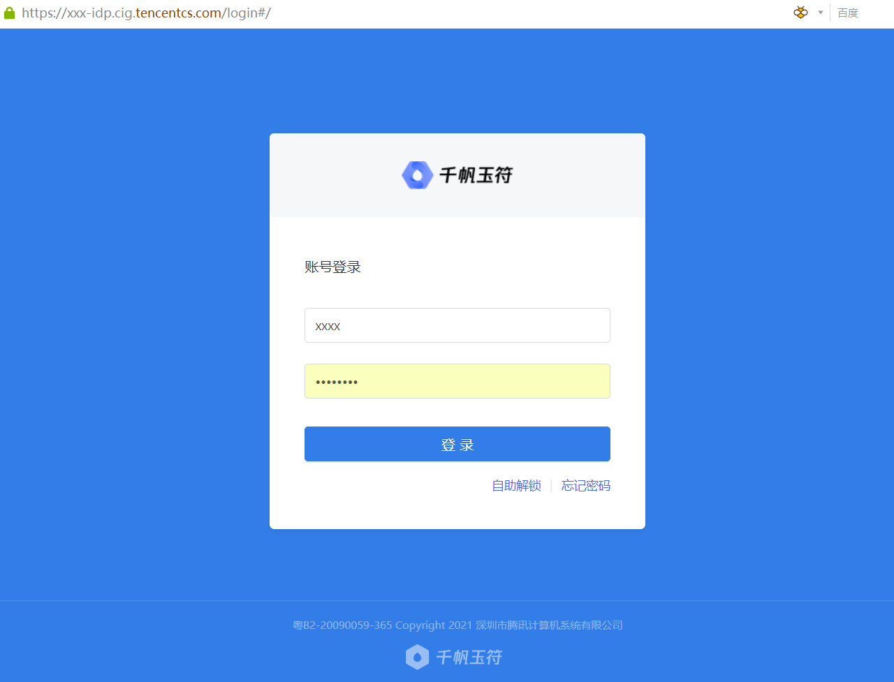

2. Go into administrator mode

    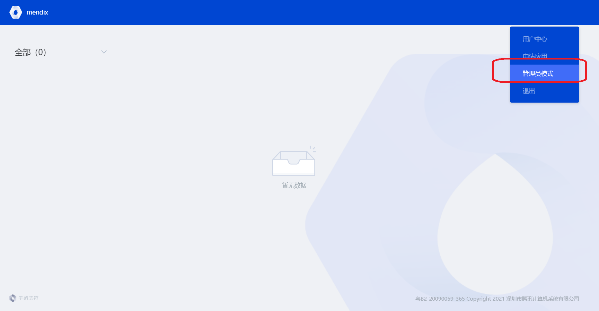

### 3.2 User management
    
#### 3.2.1 Adding Users

1. Select Object Management -\> Department Management -\> Department Data

    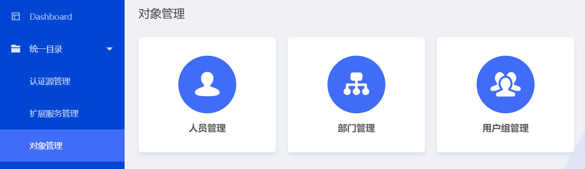

2. Click on the corresponding department and select "department users"

    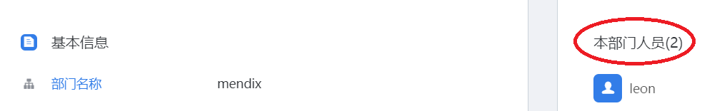

3. Click "Add User" - "Create User"

    

    Or click "Transfer Users"

4. Enter the user information and click **OK**

### 3.3 Application Management
    
#### 3.3.1 Adding an App

1. Click the "Add App" button on the right side

    

2. Select **Create Custom App**

    

3. Select OpenID Connect

    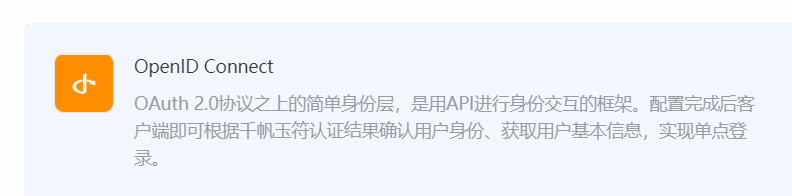

4. Select Web

    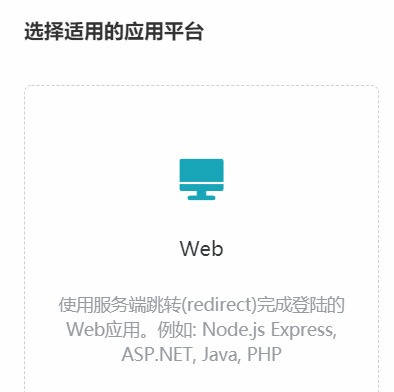

5. Enter the basic information

    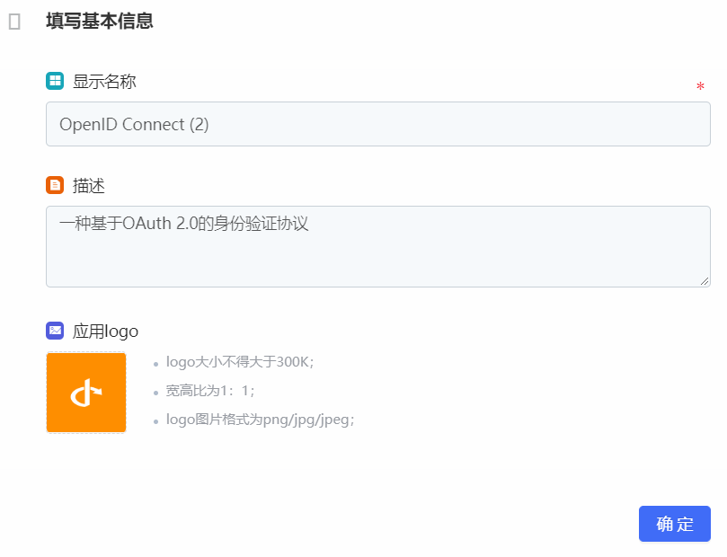

6. Enter the callback URI.

    Since Yufu does not support localhost, please enter this during the local testing phase

    `http://127.0.0.1:8080/Qianfan/callback`

7. After the app gets an the official domain name, update the URI to the following format

    `<APP Domain>/Qianfan/callback`

8. Save the Client ID & Client Secret values locally

    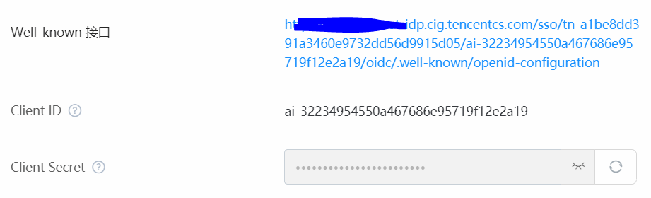

9. Save the 'Well-known interface' address locally, and also save the contents shown when you click the link

#### 3.3.2 Configuring the app

1. Click on "Self-Service Request"

    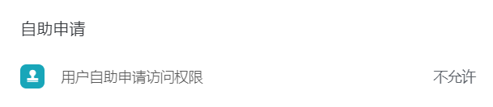

    The configuration is as follows

    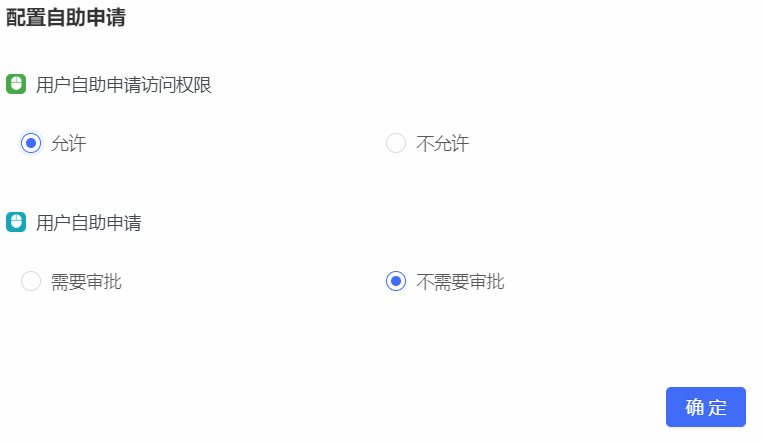

2. Click "Add users".

    If you have already clicked on "Users", click on the plus sign to add users

    

3. Enter the user's name and click OK

    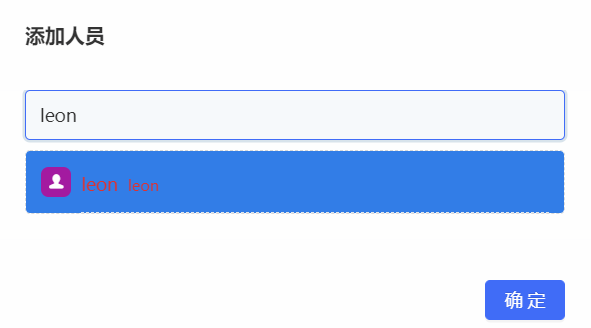

### 3.4 Applying Permissions Management

The permissions in Yufu are equivalent to the roles in Mendix.

#### 3.4.1 API Management

1. Select "Apps" -\> "API Management" -\> "Create"

    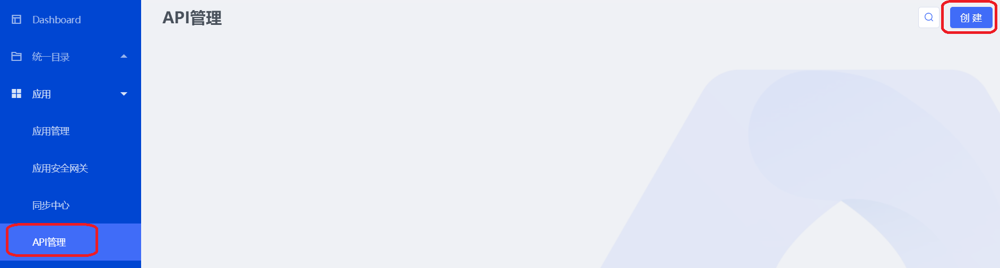

2. Enter the basic information click OK. And remember the API unique identifier. For example:

    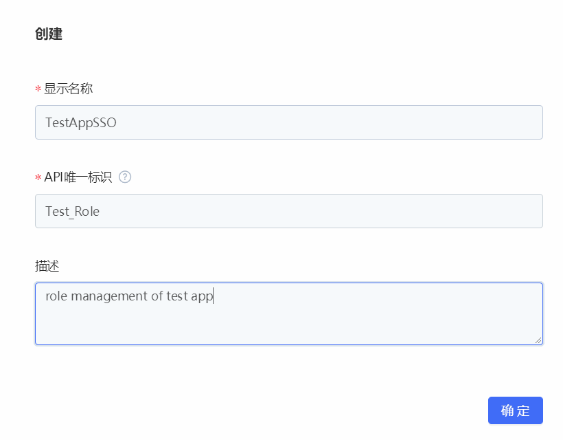

3. Go to the API management interface and click "Add permissions"

    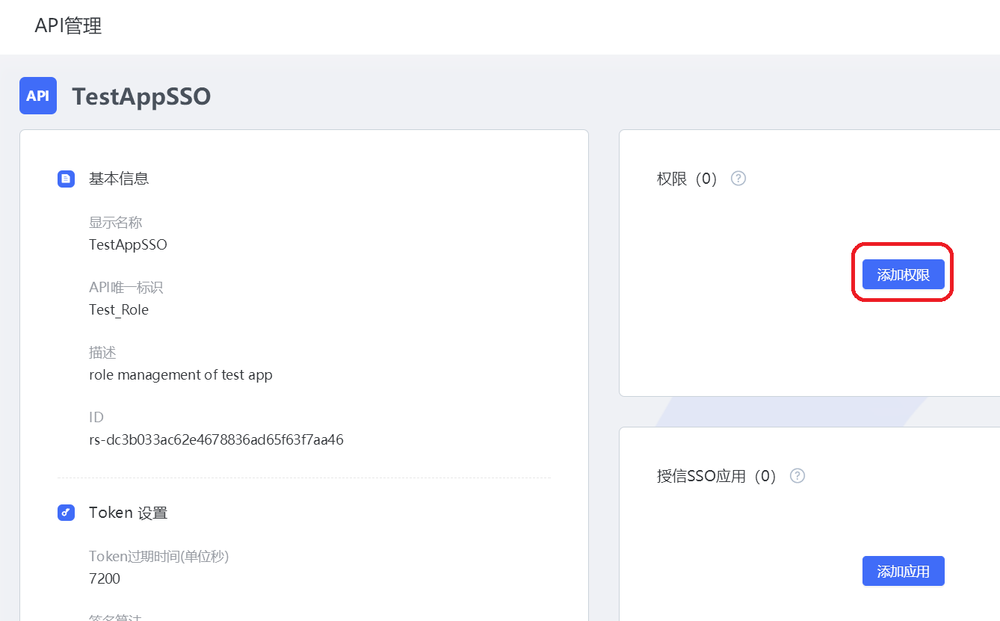

4. Enter the basic information and click OK. If you have multiple roles, please add them separately. For example:

    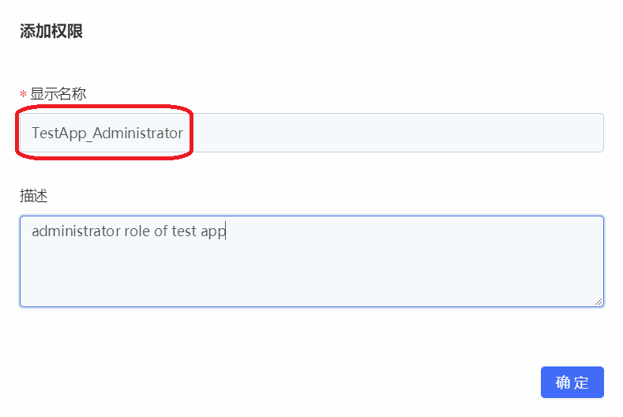

    {}Please set the Display Name as follows: {App name} + underscore “\_” + {App role name}. For example: “TestApp\_Administrator”{}

    Permissions are displayed in the API management interface when successful

    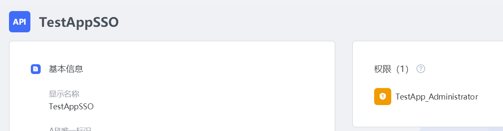

5. Click "Add apps"

    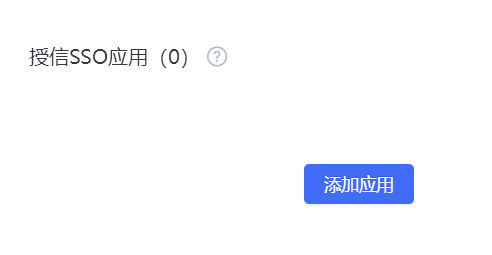

7. Select the app created in Section 3.3 and confirm. For example:

    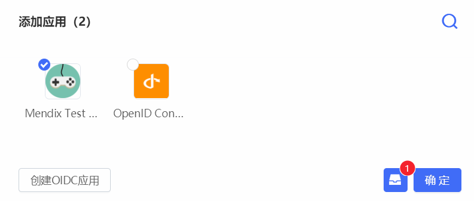

8. Upon completion, check whether the permissions and the trusted SSO application is correct. For example:

    

#### 3.4.2 Rights Group Management

1. Select Object Management - Rights Group Management

    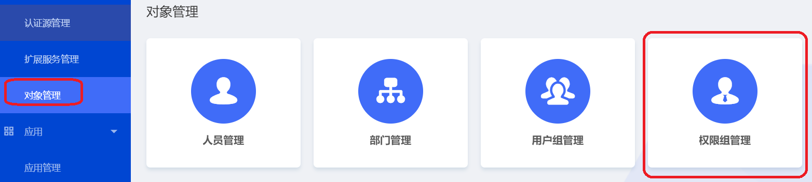

2. Click Add permissions group

    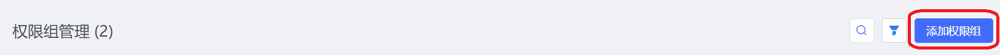

    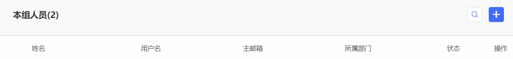

3. Enter the basic information, set the Permission Group Type to Custom, and click OK. For example:

    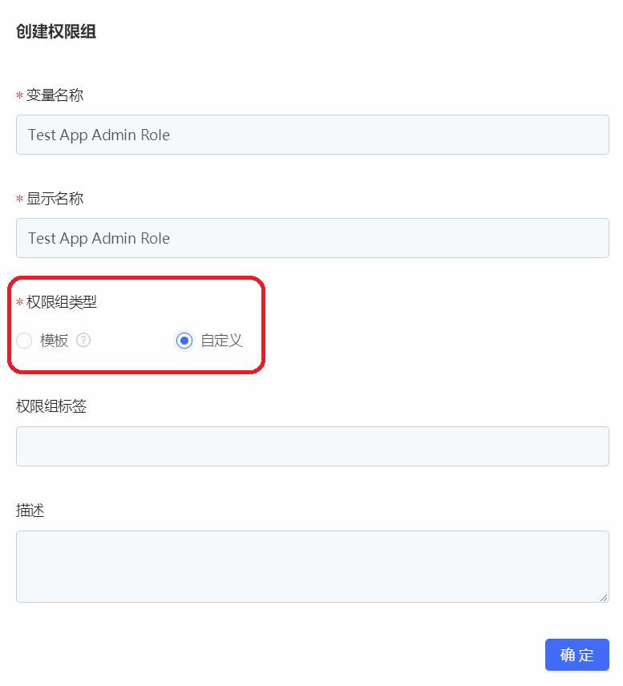

4. Go to the management interface and click "Add users"

    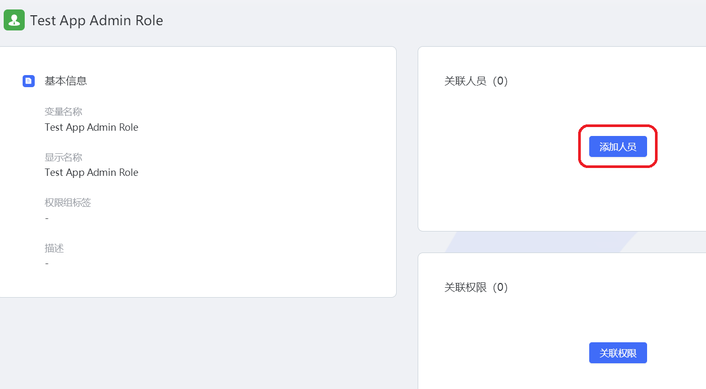

5. After selecting the corresponding users, click OK to confirm.

    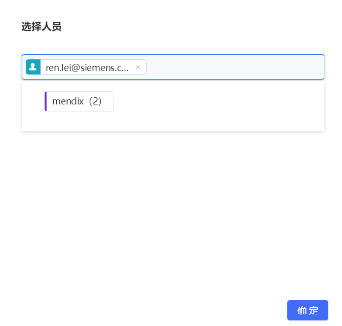

6. Click "Associate Permissions"

    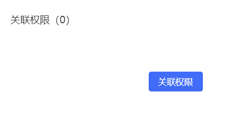

7. Select the API created in Section 3.4.1

    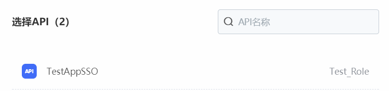

8. Select permissions and confirm

    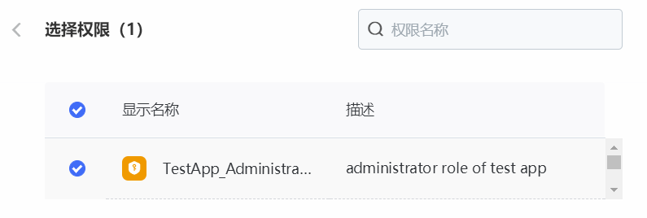

    If you have more than one permission, add each permission group separately and associate them with people and permissions.

    At this point, the Yufu end is configured. For example, you have completed:

  - *Create Administrator and User permissions and assign the appropriate permissions to the appropriate people*

    

    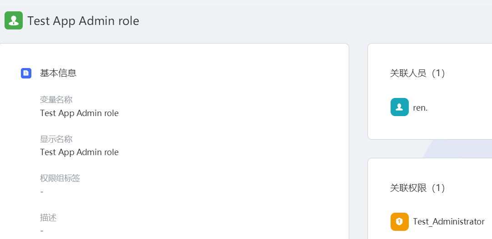

    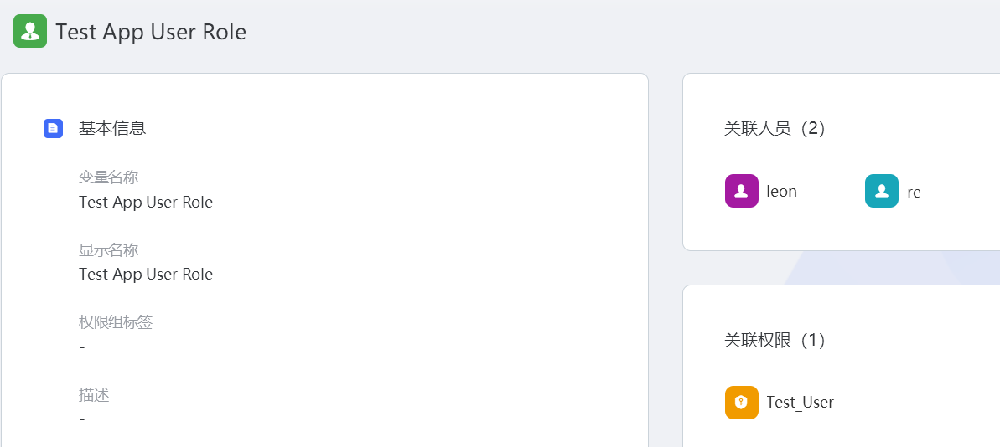

## 4 Mendix configuration
    
### 4.1 Downloading the QianfanSSO module
        
1. Download the QianfanSSO module at the following address

    [https://mendix-cdn-prod-1305133312.cos.ap-shanghai.myqcloud.com/Qianfansso/QianfanSSO.mpk](https://mendix-cdn-prod-1305133312.cos.ap-shanghai.myqcloud.com/qianfansso/QianFanSSO.mpk)

### 4.2 Importing the QianfanSSO module

1. Open an existing app project with Studio Pro, if you don't have one, create a new app project first. Right-click on the project to select "Import module package"

    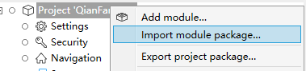

2. Select the QianfanSSO.mpk file you just downloaded and click on impport

    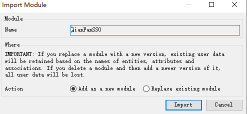

### 4.3 Configuring the QianfanSSO module

1. Click "Settings" - "Runtime" - "After Startup" to select "QianfanSSO.QianfanSSO\_AfterStartup"

    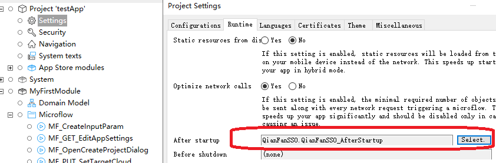

2. For local testing, please click "Configurations" - "Server" to replace the default URL with

    `http://127.0.0.1:8080`

    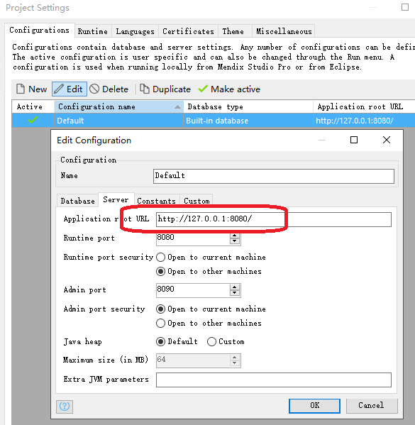

3. Expand the QianfanSSO module and enter the Configuration folder

    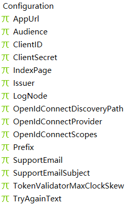

4. Assign the Client ID and the Client Secret values saved in section 3.3.1 to the corresponding constants (“ClientID” and “ClientSecret”)

5. In the constant “OpenIdConnectProvider”, assign the Well-known URL from section 3.3.1 after removing the segment `.well-known/openid-configuration`.

    For example: 'https://xxx.cig.tencentcs.com/sso/tn-a1be8dd15d05/ai-32234954/oidc`

6. In the constant “Issuer”, assign the issuer from the Well-known URL from section 3.3.1

    For example: `https://xxx.cig.tencentcs.com`

7.  In the constant “Audience”, assign the API unique identifier:

    For example: `TEST_Administrator`

    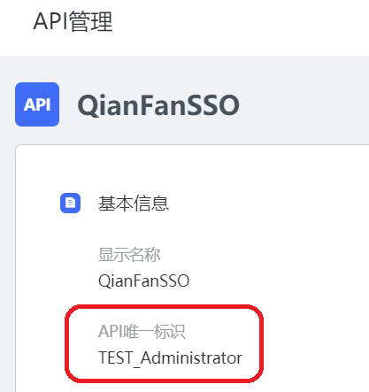

8. In the constant “Prefix”, assign the first half of the permission name (including the underscore) from in section 3.5.1

    For example:

   

9. With the above example, the “Prefix” should be set to `TestApp_`

### 4.4 Configure the login page

1. Click on "Project" - "Show Project Directory in Explorer"

    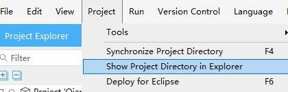

2. Go to the theme folder and replace the existing "login.html" file with the following file, which contains the login page with Qianfan Yufu SSO content

    [https://mendix-cdn-prod-1305133312.cos.ap-shanghai.myqcloud.com/Qianfansso/login.html](https://mendix-cdn-prod-1305133312.cos.ap-shanghai.myqcloud.com/qianfansso/login.html)

3. Download the Qianfan Yufu logo file “yufu.png”

    [https://mendix-cdn-prod-1305133312.cos.ap-shanghai.myqcloud.com/Qianfansso/yufu.png](https://mendix-cdn-prod-1305133312.cos.ap-shanghai.myqcloud.com/qianfansso/yufu.png)

4. Click on "Synchronize Project Directory" in Studio Pro

    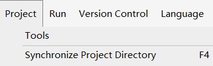

### 4.5 Configure the logout page

1. Add a button ("Button") to the page.

2. Set the "On Click" event to "Call a microflow", select "QianfanSSO.QianfanSSO\_Logout" and set the "Caption" to "Logout"

    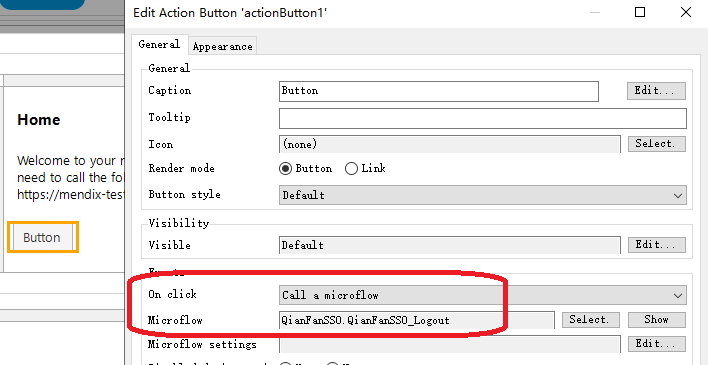

### 4.6 Role settings

1. Open Security and set the "Security Level" to "Production"

2. Make sure that under "User roles" the role names are consistent with the part of the permission names after the underscore, as set in section 1.5.2. For example:

    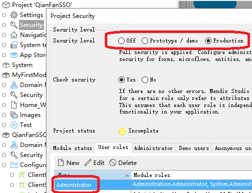

3. Click on the corresponding role and click "Edit" to make sure that the corresponding permissions in "QianfanSSO" are checked

    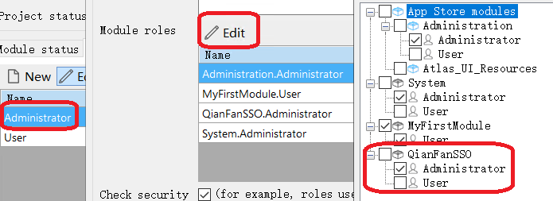

### 4.7 Sign in for verification

1. After saving the configuration, click "Run Locally" and click "View" after success

    

2. Open the login screen below and click "Qianfan IDaaS Account"

    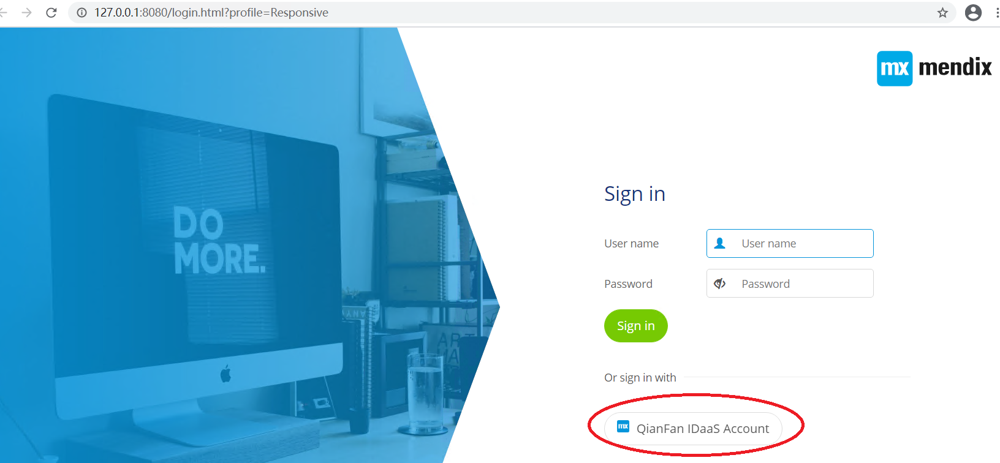

3. On the Yufu login interface, log in using your Yufu account

    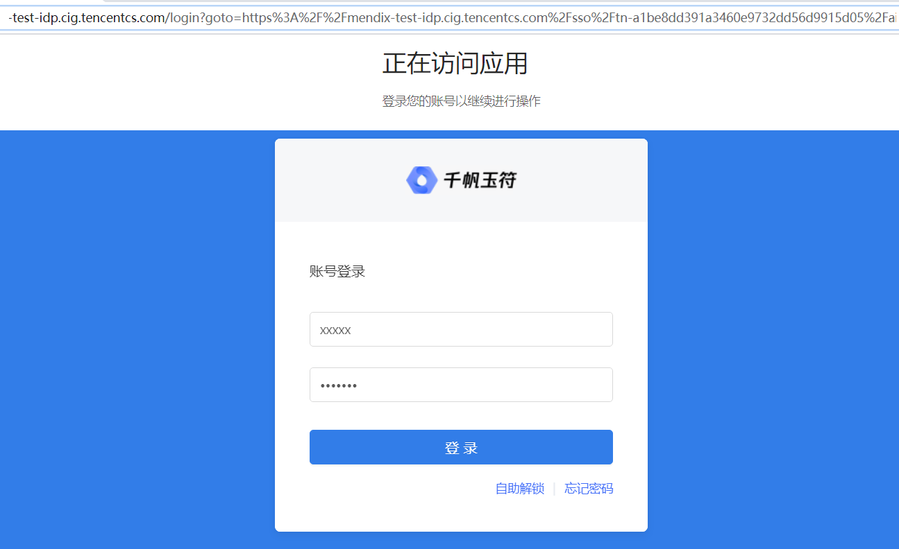

    The app jumps back to the app page

    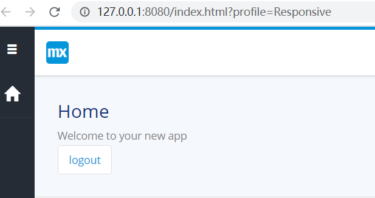

4. Click "logout" to log out and return to the login screen

    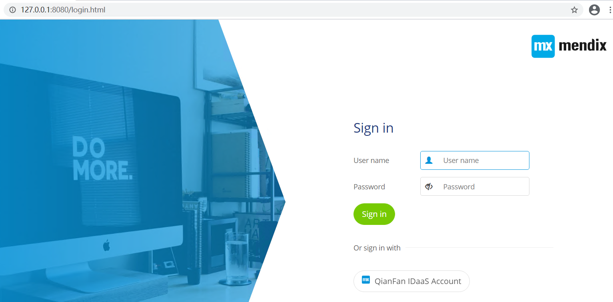

### 4.8 Cloud verification

1. After the local test passes, go to the App deployment page via Environment in the Mendix platform

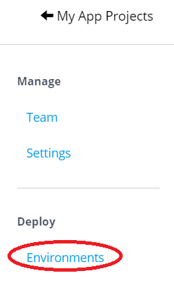

2. Click the Add Environment button

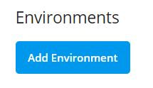

3. For "Purpose" select "Production" and enters the purchased subscription secret

4. Select the appropriate plan and click "Create Environment"

    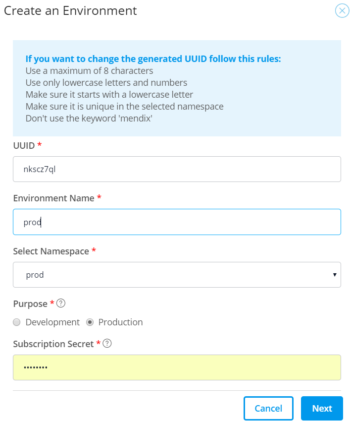

5. Click create Package to select the version for Build

    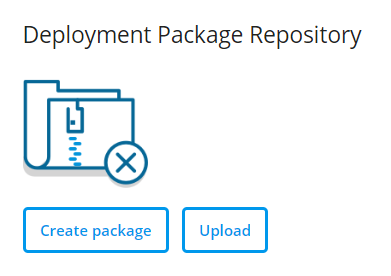

6. Select the .mda file that should be deployed, and click "Deploy"

    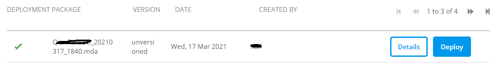

7. Save the Url and click "Transport"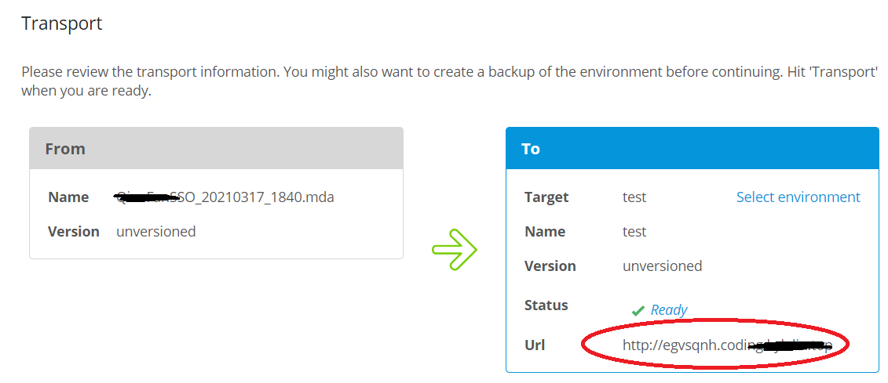

8. Click on the "Constant" tab to assign the new Url to the "AppUrl" constant

    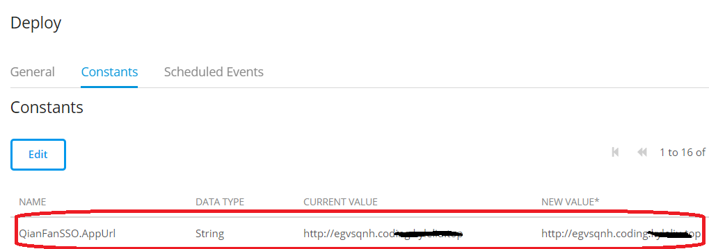

9. Finally click on "Apply Changes"

    Check that Deployment and Environment status are normal

    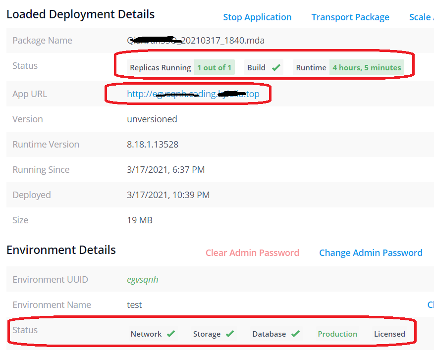

10. Go to the Qianfan Yufu Management page and add a callback URI as following: **{App URL} + "/qianfan/callback"**

    For example:

    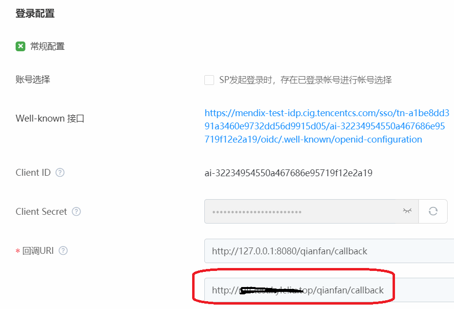

11. Since the App URL is a temporary url, please use the Cluster CLB IP in the email you received when you purchased Mendix and update your local hostfile:

    * On Windows：`C:\Windows\System32\drivers\etc\hosts`

    * On Linux：/etc/hosts

12. Update the IP for the App URL

    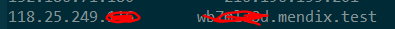

13. Finally, visit the "App Url" and click "Qianfan IDaaS Account" to access the app

    

