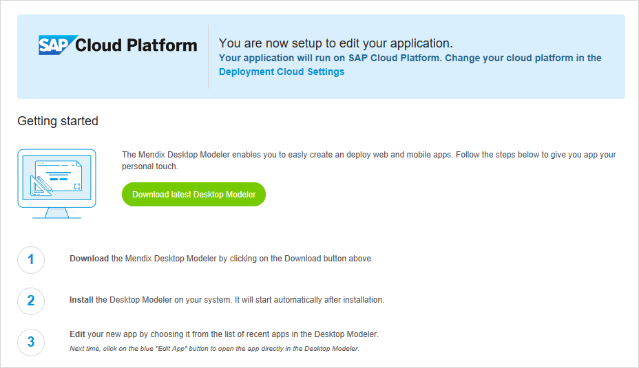

## 1 Introduction

This category describes the options for managing your deployments on SAP Cloud Platform using the Mendix Developer Portal.

## 2 Set Up SAP Cloud Platform

Before you can manage your SAP Cloud Platform using the Developer Portal, you will need to authorize it first.

When selecting SAP Cloud Platform using the Cloud settings or when you have created an application based on an SAP Starter App, you will be prompted with an SAP Cloud Platform login screen.

### 2.1 Region

At first login, you need to select the region of you SAP Cloud Platform. Make sure that you have enough quota on this region to run a Mendix application when you select a region.

See also:


After successful login, the header would show:



This action will grant the Deployment Portal access to manage you SAP Cloud Platform Account. The Developer Portal will only receive an Access Token. It will not store your credentials.

After authorization, the Developer Portal will automatically create a Development environment for the application on SAP Cloud Platform.

## 3 Create Package from Team Server

At any time, it is possible to create a new deployment package from the project.

1. Click **Create package from Team Server** and start the wizard.
2.  Select the branch you want to use from the Team Server.

    

3.  Select the revision of the branch you like to build.

    

4.  Define the tag details of the build.

    

5.  Click **Build this revision** to build the package.

    

## 4 Create a new Environment

You need to create at least one environment for each Mendix application. This is done for you when creating an application from an SAP Starter App. When you switch between clouds this is something you need to do yourself.

1. Click **Add Environment** to start the wizard.
2.  Select the **Domain**, **Organization**, and **Space** of your app. The domain the URL will determine the application's URL. The URL of the application will be this:

    ```
    {appname}-{environment name}.{domain}
    ```
  
    This is an example URL:

    ```
    https://myapp-development.cfapps.eu10.ondemand.com
    ```

    

3. Click **Next**.
4. Enter the name of the environment. This could be something like Test, Acceptance, Production, etc.
5. The memory of the app can be set. This can always be changed on a later stage within SAP Cloud Platform directly.
6. By setting the environment to development mode, the application can be run in prototype mode or without security. This is not recommended for Acceptance and Production environments.
7. Select the database you would like to use. Be aware that even if a specific database is part of the Marketplace it could still be unavailable because of limitations by the quota of your Space or Organization.   
8. Select **File Store Enabled**. This is optional. If your application makes use of FileDocument or Image entities this option is required.
9.  The **Subscription Secret** is required. This secret is sent to the account admin of your subscription. By entering the subscription secret, your application will be unlocked to run as production. Without a valid subscription, your app will restart every 1-2 hours and has a limitation of 6 named users.

    

10. Click **Next** to create the environment and finish the setup.

    

A second environment is created. It is now possible to transport applications between environments.


### 4.1 Environment Details

The environment details page contains two tabs.

#### 4.1.1 General

This tab contains information on how the application is deployed on SAP Cloud Platform.

Settings you can change:

* Admin password
* Subscription secret
* Development mode
* Delete an environment

**IMPORTANT: When you delete an environment in the current release, the resources allocated on SAP Cloud Platform will not be deleted, you will need to do this manually.**

You need to restart your app after changing one of these settings.


#### 4.1.2 Model Options

This tab contains the application constants and lets you enable or disable the scheduled events.

You need to restart your app after changing one of these settings.


## 5 Related Content

* [Deploy a Mendix App on SAP Cloud Platform](/deployment/sap-cloud-platform/deploy-a-mendix-app-to-sap-cloud-platform)
