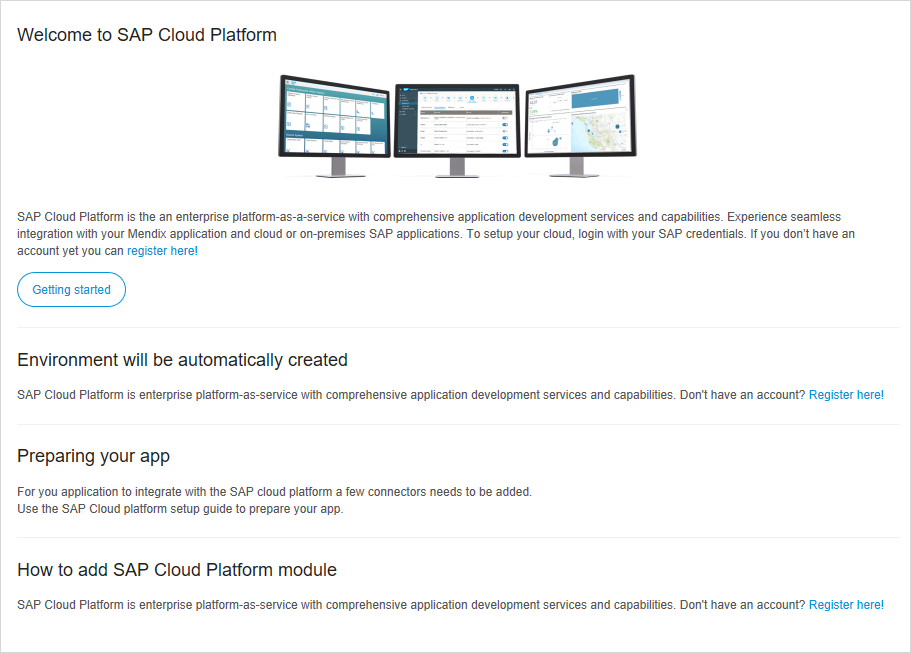
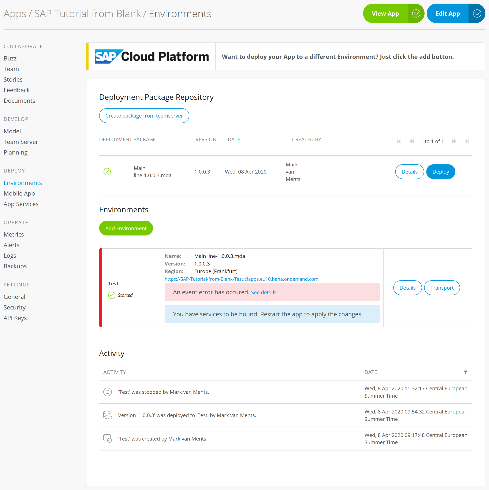
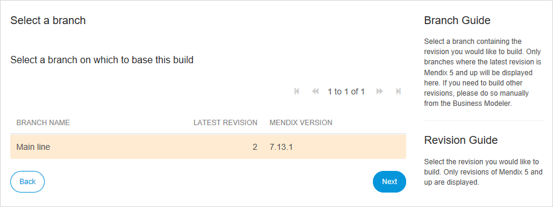
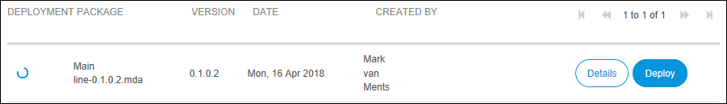
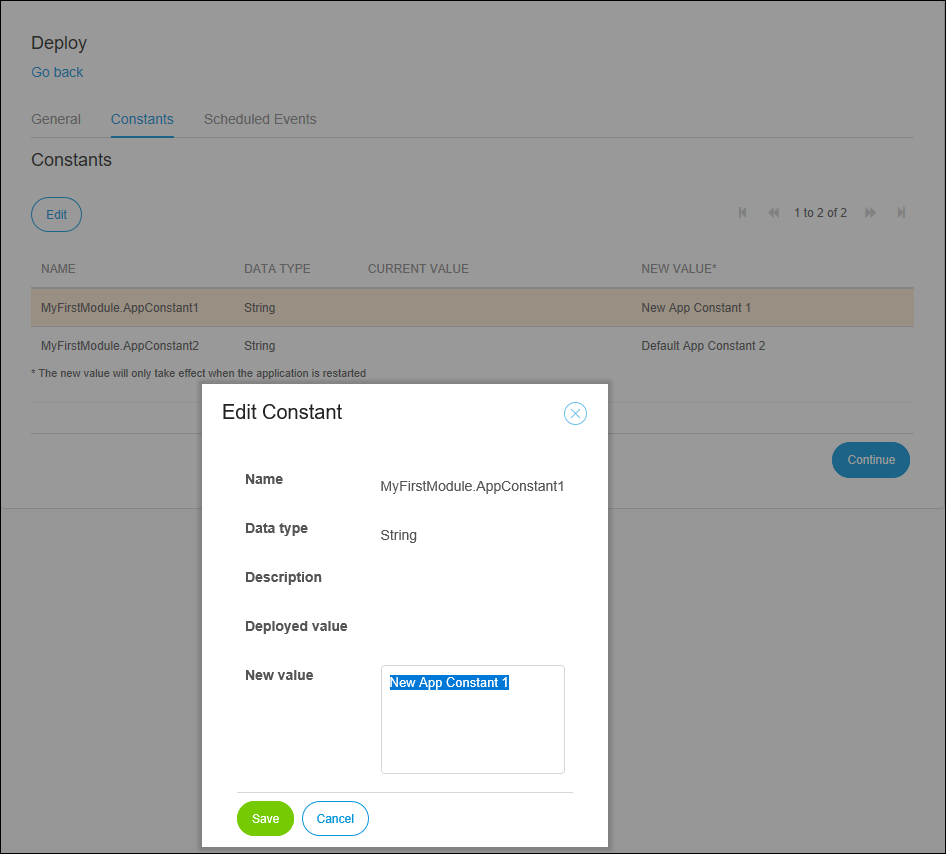
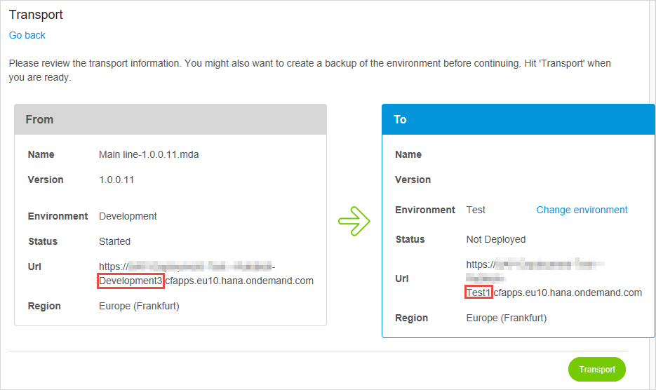
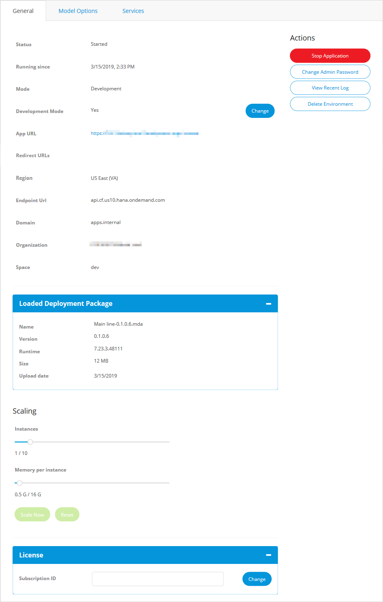
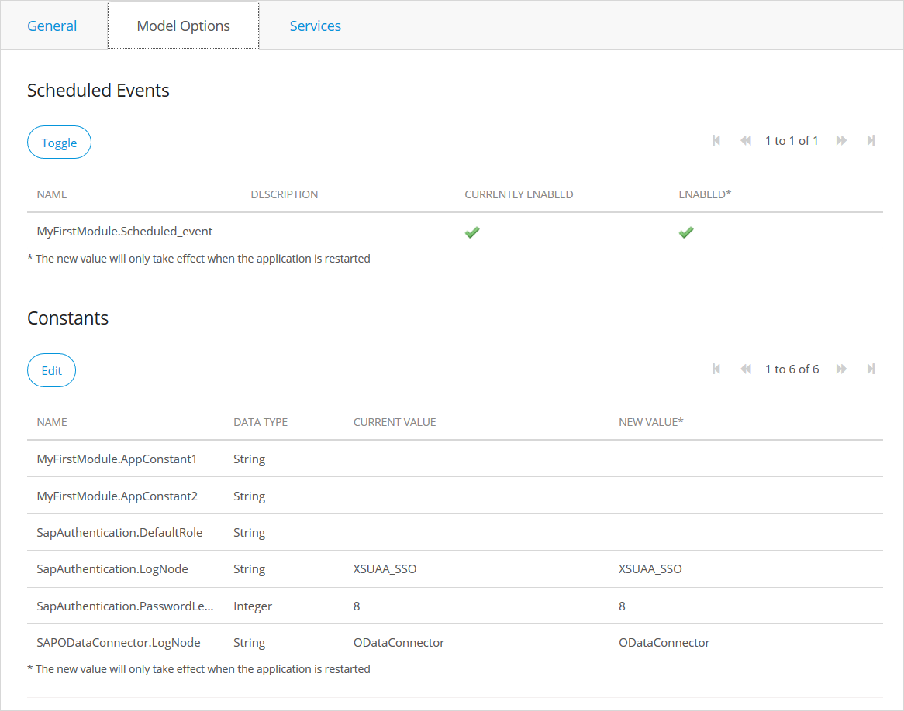
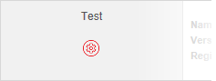
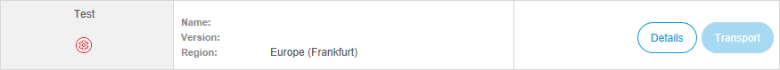

## 1 Introduction

As an SAP developer, you want to deploy your Mendix app on the SAP Cloud Platform. This document explains how you can create environments, deploy to the SAP Cloud Platform, and manage these deployments using the Mendix Developer Portal.

This document describes two ways of managing the SAP Cloud Platform:

* Initial setup of the environment when creating a new app: see section [2 Set Up SAP Cloud Platform for the First Time](#FirstTime)
* Create a new environment for an existing app: see section [3 Create a New Environment](#NewEnvironment)

## 2 Set Up SAP Cloud Platform for the First Time<a name='FirstTime'></a>

Before you can manage your SAP Cloud Platform using the Developer Portal, you will need to set it up. There are two circumstances under which you will have to set up the SAP Cloud Platform for the first time.

1. You have an existing app which has never been deployed on the SAP Cloud Platform and you want to change the cloud settings. See section [2.1 Change Cloud Settings](#ChangeCloudSettings).

2. You are creating a new app from an SAP starter app. See section [2.2 New SAP App](#NewSAPApp).

### 2.1 Change Cloud Settings<a name='ChangeCloudSettings'></a>

In this scenario, you have an existing app which is running in another environment: for instance, on the Mendix Cloud. To change this, go to the Cloud Settings tab of the General Settings in the Development Portal.


Click **Set up SAP Cloud** and you will be taken to the SAP Cloud Platform welcome page.



Click **Getting Started** and then continue with section [2.3 Set Up Region](#SetUpRegion).

### 2.2 New SAP App<a name='NewSAPApp'></a>

In this scenario, you choose a Mendix starter app from the **SAP Apps** tab.


Select the starter app you want and give it a name.

Once the app has been created you can continue with section [2.3 Set Up Region](#SetUpRegion).

### 2.3 Set Up Region<a name='SetUpRegion'></a>

You are now prompted with an SAP Cloud Platform login screen. Select the region where your SAP Cloud Platform is located.

Make sure that you have enough quota in this region for your organization to run a Mendix app. You will need enough quota to create:

* a database
* a route
* a binding to XSUAA


If you have already logged on to SAP and your SAP session has not expired, you will only have to choose the region. If you do not have a current SAP session you will be asked for your SAP credentials as well. Providing your credentials will grant the Deployment Portal access to manage your SAP Cloud Platform account.

You may be asked to provide your credentials in one of two ways:

1. You will be taken to the SAP authentication page to enter your credentials. In this case, your SAP username (email address) must be the same as your Mendix username.

2. The Developer Portal will ask for your credentials which it will then use to obtain an access token from SAP. The Developer Portal will then use the access token. It will not store your credentials. *This method is being deprecated*.

{}
If you have issues using SAP authentication, please refer to the reference [SAP Single Sign On](/refguide/sap/sap-single-sign-on).
{}

You will now be asked to provide the final details for the SAP Cloud Platform development environment.


You will be able to choose a Domain, Organization, and Space which is configured for you in this region.

If you do not choose a Custom database, you will still be able to choose from a range of different Postgres databases. Please ensure that the database you choose is supported by your quota plan for this region and organization.

If you select **Yes** for **Custom database?**, you will be asked for the Name and the Plan.

After the environment has been created successfully, you will see the following page:


Your development environment is now configured and you can now develop your app.

## 3 Create a New Environment<a name='NewEnvironment'></a>

You can create several environments for your app. For example, you may have created a development environment, but you may want environments for test, acceptance, production, and so forth. Additionally, when you switch from another cloud you need to create at least one environment for your Mendix application.

This is done from the **Environments** page of the Developer Portal:



1. Click **Add Environment** to start the wizard.

    

2.  Select the region where you want your app to be deployed.

    

    If no session is active for that region, or the current session does not have access to that region, you will be asked for your SAP credentials for that region.

3.  Select the **Domain**, **Organization**, and **Space** of your app. The URL of the domain will form part of the application's URL. The URL of the application will be this:

    ```
    {appname}-{environment name}.{domain}
    ```
  
    This is an example URL:

    ```http
    https://myapp-development.cfapps.eu10.ondemand.com
    ```

    

4.  Click **Next**.

5.  Enter the name of the environment. This can be anything you choose: for example Test, Acceptance, or Production.

    

6.  Set the size of the memory that the app needs in order to run. This can also be changed later.

7.  Set **Development Mode** to Yes if you want the application to run with the Mendix security level of Prototype/demo, or Off (no security). This is not recommended for acceptance or production environments.

8.  Select the database you would like to use. Be aware that even if a specific database is part of the Marketplace it could still be unavailable because of limitations imposed by the quota of your Organization.

    If you choose **Custom database** you will need to enter a name for the database and the plan.

    

9.  Select **File Store Enabled** if your application makes use of FileDocument or Image objects. Other sorts of object do not need File Store to be enabled.

10. Set a **Subscription Secret** (required). This secret is associated with your Mendix production license. By entering the subscription secret, your application will run in this environment as production. If the subscription secret is invalid, your app will still run, but will restart every 1-2 hours and have a limitation of six named users.

    {}If you do not have a subscription secret, create a support ticket with Mendix Support and they will send you one.{}

11. Click **Next** to create the environment and finish the setup.

    

An environment is created; with more than one environment it is possible to transport your application between environments (see section [6 Transport App Between Environments](#TransportApp)).


## 4 Create Package from Team Server

At any time, you can create a new deployment package from a committed version of the project. If you are working with the Desktop Modeler you will first have to commit the project.

{}
You can also deploy your app (the steps in sections 4 and 5.1 of this How-To) automatically from the Desktop Modeler. However, you will then have less control over the deployment.

If you click **Run** in the Desktop Modeler this will automatically:

* commit the project
* generate a deployment package
* deploy the deployment package to the first available environment (this will replace any app which is currently running in this environment)
{}

1. Go to the **Environments** page of the Developer Portal.

    

2. Click **Create package from Team Server** to start the wizard.

3.  Select the branch on the Team server which you want to use.

    

4.  Select the revision of the branch you want to build.

    

5.  Add a version number and Tag description as required. The revision number will be added to the version number automatically.

    

6.  Click **Build this revision** to build the package.

    

When the package is ready to be deployed, a green tick will be shown next to the deployment package. To deploy your package, see section [5 Deploy Package](#DeployPackage).

## 5 Deploy Package<a name='DeployPackage'></a>

### 5.1 Deploy to an Environment

1.  A green tick indicates that the build has finished. Click **Deploy** to deploy the package to SAP Cloud Portal.

    

2.  Change the deployment environment if required.

    

3.  Click **Transport** to deploy the package to the SAP environment. This will replace any current app deployed to this environment. If the app is already running, you will be asked to stop it so that your new app can be deployed.

### 5.2 Configure the Application<a name='ConfigureTheApplication'></a>

1. You will see confirmation of the package which has been transported.

    

2. Change any constants in the Constants tab: select the constant you want to edit and then click **Edit**.

    

3. Toggle any scheduled events in the Scheduled Events tab: select the scheduled event you want to enable or disable and click **Toggle**.

    

4. Click **Continue** to continue to the Start Application confirmation page.

5. Click **Start Application** to start the application on the SAP Cloud Portal.

    

6. When the application has been started you will receive a confirmation message. Click **OK** and you will be taken to the Environment Details page for the selected environment. See section [7 Environment Details](#EnvironmentDetails).

    

## 6 Transport App Between Environments<a name='TransportApp'></a>

1. Click **Transport** on the source environment you want to transport to another environment. Environments without deployed apps will have the transport button grayed out and cannot be transported.

    

2.  Change the deployment environment if required by clicking **Change environment**.

    

3.  Click **Transport** to deploy the package to the SAP environment. This will replace any current app deployed to this environment. If the app is already running, you will be asked to stop it so that your new app can be deployed.

When the app has been transported you will be on the page **Configure the Application**. This has the same options as the **Deploy** pages which are described in section [5.2 Configure the Application](#ConfigureTheApplication).

## 7 Environment Details<a name='EnvironmentDetails'></a>

The environment details page contains two tabs: General and Model Options. Open the environment details by clicking **Details** on an environment on the Environments page of the Development Portal. You will also be taken to this page when you successfully deploy or transport your app.


{}If you make changes to your app which you want be applied next time the app is deployed you must make them here.

Changes made to the app in the SAP Cloud Platform cockpit are only temporary and can be overwritten by the values in the Mendix Developer Portal next time the app is deployed.{}

### 7.1 General Tab

This tab contains information on how the application is deployed on SAP Cloud Platform.



Most of this page shows information about the app, but there are several options which allow you to change the app.

#### 7.1.1 Start/Stop Application

If the application is running, click **Stop Application** and confirm when asked to stop the application.

The button will change to **Start Application** which you can click to (re)start the application.

{}
You may need to use this option to stop and start your app after changing one of the settings on this page.
{}

#### 7.1.2 Change Admin Password

Click **Change Admin Password** to change the password for the administrator account (by default, MxAdmin) in your Mendix app.

#### 7.1.3 View Recent Log

Click **View Recent Log** to see recent events written to the log.

#### 7.1.4 Delete Environment

**Delete Environment** enables you to delete the environment and, optionally, all its resources: including the app.

You will be asked to confirm that this environment should be removed. You will also be asked to confirm that the resources associated with the environment should also be removed. Note that the default is NOT to remove the resources.


{}
If you do not select **Remove resources** in this dialog, the resources will be left in the SAP Cloud Portal. In this case, they can only be removed individually from within the SAP Cloud Platform Cockpit.
{}

#### 7.1.5 Change Development Mode

Click **Change** to change the Development Mode toggle. Set it to Yes if you want the application to run with only prototype security, or completely without security. This is not recommended for acceptance or production environments.

#### 7.1.6 Scaling

If the app is started or stopped (that is, the environment has been created successfully and the app has been deployed without errors) then options to scale the app are available.

Use the **Instances** slider to change the number of instances of the app which can run. This allows you to scale the app horizontally to support a large numbers of users, or to improve the app's resilience by allowing it to continue to run if there are any issues with one of the instances.

Use the **Memory per instance** slider to change the amount of memory allocated to each instance of the app ("user's current memory").

Click **Scale Now** to apply the new settings. If the application is running, it will be stopped and restarted to apply the settings. If it is stopped, the new settings will be used the next time the application is started.

Click **Reset** to return the values to what they were before the sliders were moved.

#### 7.1.7 Change License Subscription ID

Click **Change** to change the subscription secret which is the code which registers your production Mendix license to this environment.

### 7.2 Model Options Tab

This tab displays the application constants and allows you to edit them. It also lets you enable or disable scheduled events.



{}
You need to restart your app if you change any of these options.
{}

#### 7.2.1 Scheduled Events

You can see the status of each scheduled event. CURRENTLY ENABLED shows the status in the running app. ENABLED shows that status that will be applied the next time the app is restarted.

To change the state of a scheduled event, select it, then click **Toggle** to change the ENABLED flag.

#### 7.2.2 Constants

You can see the value of all the constants used by the app. CURRENT VALUE is the value in the running app. NEW VALUE is the value which will be used the next time the app is restarted.

To change a value, select the constant you want to change and click **Edit**.

## 8 Issues

### 8.1 Environment is not Created

If you add an environment and it fails to be created it will be shown with a red symbol next to it on the Environments page:



This could be caused by exceeding your organization quota limit for a service which you are trying to create, or for some other reason. To find the exact cause, do the following:

1. Click **Details** next to the failed environment.

    

2. Click **Details** on the error message at the top of the page.

    

A more detailed description of the reason why the environment creation failed will be displayed.


### 8.2 Deleting an App

Note that if you are the last person to leave a Mendix app you can delete the app. However, this will not delete the app or resources on SAP Cloud Platform. You can leave the app by going to the **General** page of the Developer Portal and clicking **Leave app**.


If you are the last member of the app development team, you will be asked if you want to delete the app.


{}
This will not stop the app and delete the deployment of the app in the SAP Cloud Portal.

If you want to delete your app and all its resources, delete the environment and resources first before you leave the app via the Mendix Developer Portal.
{}

You can still delete the app and its resources from the SAP Cloud Platform Cockpit, but you will then have to remove all the resources individually.

## 9 Related Content

* [SAP Single Sign On](/refguide/sap/sap-single-sign-on)
