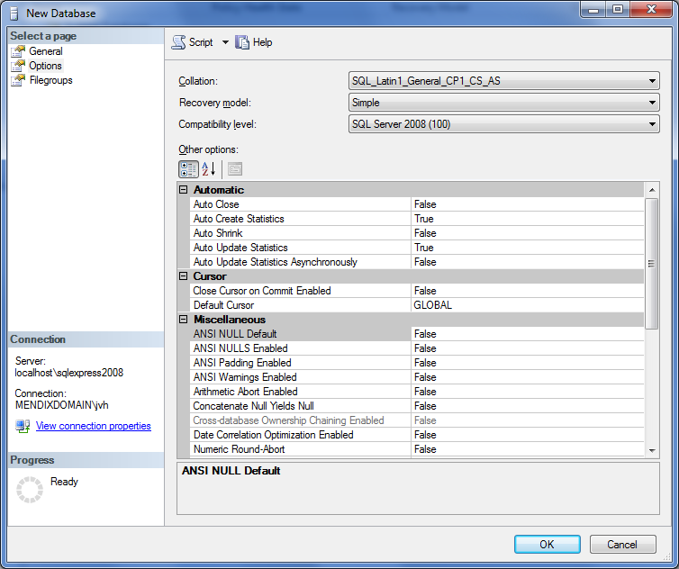

## 1 Introduction

This how-to will teach you how to manually set up a new SQL Server database.

{}
You only need to follow these steps if the database user used by Mendix does not have enough permission to create the database for you.

Some of these steps are only required for specific versions of SQL Server or Mendix.
{}

## 2 Set Up a New Database

When setting up a new database for Mendix, most of the settings can be left to the default configuration. When looking at the general settings, you only need to set up the database name. Set up the database files according to the Microsoft SQL Server best practices (for details, see [SQL Server Installation Best Practices](https://www.mssqltips.com/sqlservertip/4891/sql-server-installation-best-practices/)).


In the database options, the default properties need to be evaluated. When choosing a collation, pay attention to the type of collation you are going to use. Mendix uses UTF-8 for all data evaluation. Depending on your exact locale, you will most likely want to choose one of the `SQL_Latin1_General_` collations. The exact encoding will depend on your OS. For an *en_US* installation, this will be `CP1`.

The last two options identify how sorting and uniqueness is interpreted. For example, the collation option `_CS_` indicates that the collation sorting style will be case-sensitive. For more information on collations and case sensitivity, see  [Case-Sensitive Database Behavior](/refguide/case-sensitive-database-behavior) and the Microsoft documentation [Windows Collation Name](https://docs.microsoft.com/en-us/sql/t-sql/statements/windows-collation-name-transact-sql).

As a recovery model, Mendix only requires the **Simple** mode. The functionality offered in the **Full** recovery model option is not used by Mendix; usage of this recovery model will not hurt Mendix, but it could increase the data usage of all the transactions and might slow down any rollbacks in case of an error.



After the database is created, the Mendix Runtime can initiate the initial setup and prepare all the tables and functions for usage by the platform. Some of these queries require `sysadmin` privileges. The `sysadmin` role can be temporarily assigned to the user, or these queries can be executed by the administrator. Other queries need privileges which are implicitly assigned to the `db_owner` role. If the user used by the Mendix Runtime does not have enough permissions for any of these queries, you can run them manually – see below for more information.

## 3 Configuring the Read Committed Snapshot Isolation Level

Mendix apps using SQL Server use the **Read Committed Snapshot** feature for their database. This feature allows read operations to continue even if the record has been updated by a concurrent transaction, improving concurrency. For more information, see the [Transaction Locking and Row Versioning Guide](https://docs.microsoft.com/en-us/sql/relational-databases/sql-server-transaction-locking-and-row-versioning-guide?view=sql-server-ver15).

{}
You only need to follow these steps if the database user used by the Mendix Runtime does not have enough permission to issue the `ALTER DATABASE` command (usually the `sysadmin` role).
{}

The database schema needs to be configured so that the **Read Committed Snapshot** feature is enabled. This can be achieved by executing the following command on the database:

```
ALTER DATABASE [MySchema] SET READ_COMMITTED_SNAPSHOT ON;
```
{}
You need to replace `MySchema` with the name of your schema.
{}

## 4 Configuring the necessary SQL Server extensions

{}
You do not have to configure these extensions for Mendix version 8.0.0 and above.

For Mendix version 7, you only need to perform these steps if the following are true:

* your SQL server version is older than SQL Server 2014
* the database user used by Mendix does not have permission to issue the commands in this section
{}

### 4.1 Installing SQL Server Extensions

For the correct functioning of Mendix, some SQL Server extensions need to be installed. This can be achieved with the following command, which requires a `sysadmin` or administrator role. Remember to set the file path to the correct location of your Mendix installation:

```
CREATE ASSEMBLY [Mendix.SqlServerExtensions] FROM "D:\MyFolder\Mendix\server\runtime\lib\Mendix.SqlServerExtensions.dll" WITH PERMISSION_SET = SAFE;
```

The permission above requires CLR to be enabled on the SQL Server instance. CLR can be enabled using this query:

```
EXEC sp_configure 'clr enabled' , '1';
RECONFIGURE;
```

### 4.2 Queries to Be Executed with the `db_owner` or `db_ddladmin` Database Role

#### 4.2.1 Create Function mx_toLocalDateTime

If you are not working in the same timezone as UTC, you need to enable CLR and this function. Without timezone support in the platform, development of your functionality will be much more difficult. A function needs to be created for timezone handling. Also, for this function, Common Language Runtime (CLR) needs to be enabled on the SQL Server instance (see above). 

You can create the timezone handling function using the following command:

```
CREATE FUNCTION [dbo].[mx_toLocalDateTime] (@utcDateTime datetime, @dstTimeZone nvarchar(50)) RETURNS datetime AS EXTERNAL NAME [Mendix.SqlServerExtensions].[Mendix.SqlServerExtensions.DateTimeLocalizer].[ConvertToLocalDateTime];
```

#### 4.2.2 Create Procedure usp_nextsequencevalue

{}
This is normally executed automatically by the Mendix Runtime so long as the database user used by Mendix has permission to create procedures.
{}

```
CREATE PROCEDURE [dbo].[usp_nextsequencevalue]
@SeqName nvarchar(128)
AS
BEGIN
DECLARE @NewSeqVal bigintSET NOCOUNT ON
UPDATE [mendixsystem$sequence]
SET @NewSeqVal = [current_value] = [current_value] + 1
WHERE [name] = @SeqName
RETURN @NewSeqVal
END;
```

## 5 Read More

* [How to Activate a Mendix License on Microsoft Windows](activate-a-mendix-license-on-microsoft-windows)
* [How to Set Up the Database User](setting-up-the-database-user)
* [How to Share the Development Database](/howto/collaboration-requirements-management/sharing-the-development-database)
* [How to Restore a SQL Server Database](restoring-a-sql-server-database)
* [How to Troubleshoot](troubleshooting-iis)
* [How to Troubleshoot an SQL Server](troubleshooting-sql-server)
* [How to Set Up Mendix SQL Maintenance Plans](mendix-sql-maintenance-plans)
