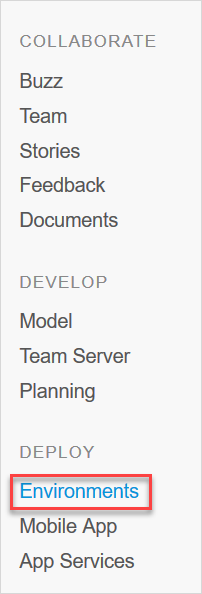
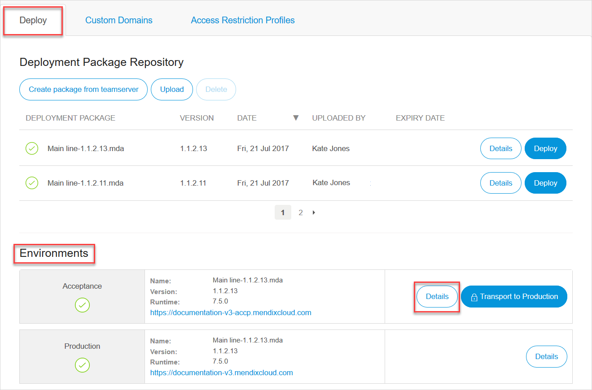
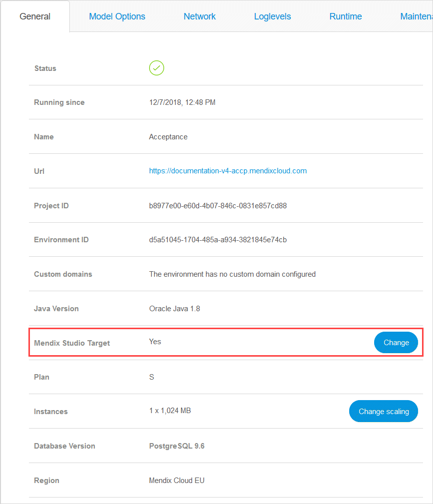

We have modified the [Deploy to Licensed Cloud Node](/refguide/project-menu#deploy) flow in Mendix Studio Pro. When **Deploy to Licensed Cloud Node** is selected in Mendix Studio Pro, your application will automatically be deployed to the *Mendix Studios Target* environment of your licensed node. This deployment will include a restart of that environment. It is now only possible to deploy Mendix Cloud v4 applications which have a [Mendix Studios Target](/developerportal/deploy/studio-deployment-settings#target) set. Please note that you will get an error message if you deploy from Studio Pro when no **Mendix Studios Target** is set.

## 1 Introduction

If you have a licensed app in Mendix Cloud v4, you need to select a target environment where Mendix Studio and Mendix Studio Pro will deploy your app when you click **Run**. For more information on licensed apps and environments, see [Mendix Cloud](mendix-cloud-deploy) and [Environments](environments). 

{}
By default the target environment is not selected. Thus, when you try to publish, you will get a warning message in Studio, or an error message in Studio Pro. For more information, see [Previewing & Publishing Your App](/studio/publishing-app) in the *Studio Guide*.

When you deploy from Mendix Studio Pro, the deployment will also restart the target environment.
For more information, see [Run Menu](/refguide/run-menu) in the *Studio Pro Guide*.
{}

## 2 Selecting the Studio Deployment Environment 

To select the environment for Studio, do the following:

1.  Open **Deploy** > **Environments** in the left menu bar in the Developer Portal.

    

2.  In the **Deploy** tab > **Environments** section, select the environment that you want to select for Studio deployment by clicking **Details**. 

    

3.  In the **General** tab, select **Mendix Studios Target** and click **Change**:

      

    {} Only a [Technical Contact](/developerportal/company-app-roles/technical-contact) can see the **Change** button and click it. 
    {}

4. In the **Select Studio Target** dialog box, click the drop-down menu and select the environment. 
5. Click **Save**.

You have selected the environment for Studio. 

## 3 Read More

*   [Previewing & Publishing Your App](/studio/publishing-app)
*   [Mendix Cloud](mendix-cloud-deploy)
*   [Environments](environments)
