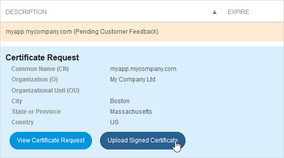
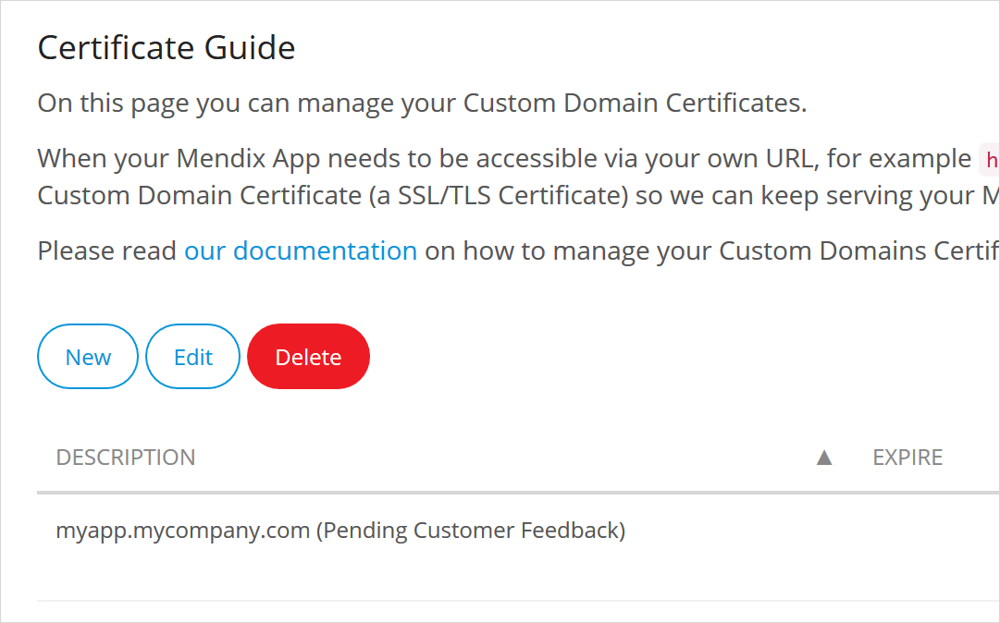
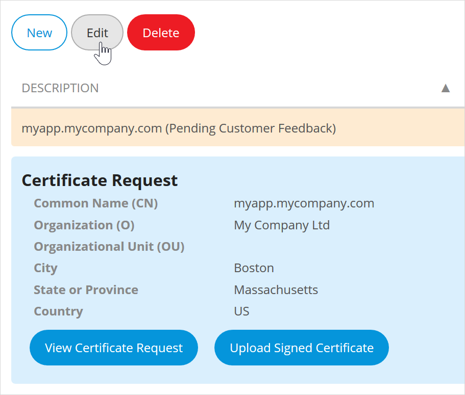

## 1 Introduction

When running Mendix on Tencent, you can add custom domains such as `https://myapp.mycompany.com/` to your environments. This how-to walks you through the process.

{}
This option is provided for licensed apps. You cannot add custom domains to Free Apps.

This documentation is describing certificates for *incoming* connections. For information on setting up certificates for *outgoing* connections, see [Certificates](certificates).
{}

{}
You may not immediately see changes which affect DNS routing. This is because of DNS caching, where changes are not visible until the cache is updated.
{}

**This how-to will teach you how to do the following:**

* Generate a certificate request for your custom domain
* Upload a custom domain certificate
* Renew a custom domain certificate
* Configure a custom domain for your environment

## 2 Prerequisites

### 2.1 General Prerequisites

Before starting this how-to, you will need to have the following prerequisites:

* a basic knowledge of DNS (Domain Name System)
* the correct permissions to your licensed node (for more information, see [Node Permissions](/developerportal/deploy/node-permissions))
* if you are going to use HTTPS to connect to your app:
    * a basic knowledge of SSL/TLS certificates:
        * What is an SSL/TLS certificate and what it is used for?
        * What is an intermediate certificate chain and what it is used for?
        * What is an SSL/TLS private key and what it is used for?
        * What is a certificate request and what it is used for?
    * a basic knowledge of certificate authorities (like GeoTrust, Thawte, Verisign, RapidSSL, GoDaddy, Comodo)

### 2.2 Create and Configure a CNAME Record{#DNS}

Before configuring your custom domain in the Developer Portal, you will need to configure a DNS record for your custom domain with your domain registrar or DNS provider.

Create a CNAME (Canonical Name) record and point it to `[YOUR-CUSTOM-DOMAIN].cname.mendix.net.`. For example, if your custom domain is `myapp.mycompany.com`, create a CNAME record pointing to `myapp.mycompany.com.cname.mendix.net.` so that Mendix can direct your custom domain to your Mendix app.

{}

It is not possible to create a CNAME record for an apex/naked domain (meaning, a domain without a subdomain, like `mycompany.com`). If you want to use a custom apex/naked domain you should redirect it to a subdomain (for example, `subdomain.mycompany.com`) and create a CNAME for the subdomain instead.

{}

## 3 Adding Custom Domains

To add a custom domains, follow these steps:

1. Go to the [Developer Portal](https://apps.mendix.tencent-cloud.com/).

2. Open the **Environments Details** page for your app.

3. Click **Edit** next to the **App URL**

    

{}

Make sure you have configured a CNAME record for your custom domain with your domain registrar/DNS provider (for details, see [Create and Configure a CNAME Record](#DNS)), above.

{}

## 4 Adding Certificates for Connecting Via HTTPS

If you want users to connect to your app using HTTPS connections, you have to provide a custom domain certificate (an SSL/TLS certificate). If you already have a signed SSL/TLS certificate, continue with [Uploading Your Own Custom Domain Certificate](#Uploading), below.

Custom domain certificates (or just "certificates") are managed at the *application* level while custom domains are managed per *environment*.

You can have more than one certificate for an application. For example when your certificate expires, you can upload a new certificate next to your old certificate.

You can choose which certificate to use when you configure a custom domain for an environment (test, acceptance, or production).

### 4.1 Obtaining a New Signed Certificate

If you do not have an SSL/TLS certificate you can order one from a certificate authority (like GeoTrust, Thawte, Verisign, RapidSSL, GoDaddy, or Comodo). To get a signed SSL/TLS certificate from a certificate authority, you need to provide a *certificate signing request (CSR)*. A private SSL/TLS key and a CSR tied to that key can be created in the Developer Portal for you.

#### 4.1.1 Generating a Certificate Request for your Custom Domain{#Generating}

To create a CSR and an RSA (Rivest–Shamir–Adleman) encryption key, follow these steps:

1.  Click **New**.

2.  Click **Create a Certificate Request**.

    

2.  Fill in the required fields.

4.  Click **Generate**.

    

    An SSL/TLS private key and a certificate request is generated. The certificate request will be shown in PEM (Privacy-Enhanced Mail) format.

    

    {}The SSL/TLS private key will be stored in our secure keystore. It will not be available for download in order to keep it secure.{}

You can now go to your certificate authority to get a signed SSL/TLS certificate.

#### 4.1.2 Uploading a Signed Certificate{#Upload}

Once you have a signed SSL/TLS certificate, you can upload it by following these steps:

1. Select the *custom domain certificate* you want to upload.

2. Click **Upload Signed Certificate**. 

    

3. Add a **Description** of your certificate.

4. Paste the signed **TLS Certificate** (in PEM format).

5. Paste an **Intermediate Certificate Chain**. This is optional, but most browsers will required it. The intermediate certificate chain is provided by your certificate authority.

    

You can now configure your custom domain. See [Configuring a Custom Domain](#Configuring), below.

### 4.2 Uploading Your Own Custom Domain Certificate{#Uploading}

To upload a custom domain certificate, you need to have the following things prepared:

* An SSL/TLS certificate that is self-signed, or signed by your certificate authority
* An SSL/TLS private key

To enable TLS and upload the custom domain certificate, follow these steps:

1. Click the **TLS** tab on the *Environment Details* page for your app.

2. Select **Custom TLS Configuration**.

3. Select **Yes** for **Enable TLS?**.

4. Upload files containing the following:

    1. the **TLS Private Key** 
    2. the signed **TLS Certificate**

    

5. Click **Save** to save your new custom domain certificate. It will be uploaded to the Developer Portal automatically.

You can now configure your custom domain. See [Configuring a Custom Domain](#Configuring), below.

You can add as many certificates as you need. Each certificate will be listed with the description you gave it. Make sure you give them meaningful names, so you can identify them easily.

### 4.3 Renewing a Custom Domain Certificate

Custom domain certificates have an expiry date. There are two methods for renewing a custom domain certificate that is about to expire:

* Create a new custom domain certificate (recommended)

* Update an existing custom domain certificate

#### 4.3.1 Method 1: Creating a New Custom Domain Certificate (Recommended)

You can handle an expiring domain certificate by replacing it with a new one. You can do this in one of two ways:

* generate a new certificate request (for more information, see [Generating a Certificate Request for Your Custom Domain](#Generating))

* upload a new custom domain certificate (for more information, see [Uploading Your Own Custom Domain Certificate](#Uploading))

You can now select the new certificate for your custom domain (for more information, see [Configuring a Custom Domain](#Configuring)), below.

#### 4.3.2 Method 2: Renewing by Updating an Existing Custom Domain Certificate

You can also edit an existing custom domain certificate.

{}
For this you will need access to the certificate request that you created for the current certificate.
{}

## 5 Configuring a Custom Domain{#Configuring}

To configure a custom domain for your application environment, follow these steps:

1. Click **Environments**.

2. Click **Details** for the environment you want to configure.

    

3. Go to the **Network** tab.

    

4. Under **Custom Domains**, you can manage your custom domains.

5. Click **Create** to create a new custom domain (or **Edit** to edit an existing one).

6. Type the **Domain name** (for example *myapp.mycompany.com*).

7. If you are using HTTPS for your connections, select a **Certificate** from the drop-down list of uploaded certificates.

8. Click **Save** to save your custom domain. It will be configured for your application environment automatically.

    
    
{}

Make sure you have configured a CNAME record for your custom domain with your domain registrar/DNS provider (for details, see [Create and Configure a CNAME Record](#DNS)), above.

{}

## 6 Frequently Asked Questions

### 6.1 Can I Create a `*.mycompany.com` Wildcard Certificate?

Yes. However, when you create the certificate request via the Mendix Developer Portal, you will only be able to use the wildcard certificate for the environments of a single application.

If you have your own custom domain certificate, you can upload it to all of your apps and use it for all the environments of all of your apps.

You can select the same wildcard certificate per environment by using it with different subdomains. For example, `test.mycompany.com`, `accp.mycompany.com`, and `app.mycompany.com`.

### 6.2 How Do I Construct an Intermediate Certificate Chain Properly?

Your certificate is signed by the certificate authority (CA). They sign your certificate with their intermediate certificate, rather than directly with the root certificate. Their intermediate certificate is signed with their own root certificate.

To reach the root certificate, you have to link your certificate via the intermediate certificate chain, which is usually just one intermediate certificate. Occasionally a CA requires more than one intermediate certificate. You do not need to provide the root certificate, as every web browser has it in its trusted keystore.

### 6.3 How Do I Get my SAML Metadata or CommunityCommons.GetApplicationUrl to Use the Custom URL?

For certain use cases, it is important for the Mendix runtime to know the public URL of your applications. This is most commonly needed when your app generates links back to itself. To tell the runtime where it lives, set the ApplicationRootUrl [custom runtime setting](/refguide/custom-settings#general). To set the custom runtime setting, follow the instructions in the [Custom Runtime Settings](environments-details#custom-runtime-settings) section of *Environment Details*.

## 7 Read More

* [Certificates](certificates)
