{}
 For the Simplified Chinese translation, click [中文译文](https://cdn.mendix.tencent-cloud.com/documentation/developerportal/tencent-deploy.pdf).
{}

{}
The Mendix Platform on Tencent Cloud is branded as **Siemens Low-Code Platform**.
{}

## 1 Introduction

To deploy apps to Tencent, you will first have to purchase your cloud resources. You can then manage these resources from within the Mendix Developer Portal as described below in [Cluster and Namespace Management](#cluster-namespace).

Once the cluster has been registered, and a namespace created, team members with *Deploy App* rights can create environments and deploy an app.

This document explains how to use the Mendix Developer Portal to manage your clusters and namespaces, and deploy an app.

## 2 Prerequisites for Deploying an App

To deploy an app to Tencent, you need the following:

* A Mendix account set up with your Tencent ID

* A cluster and namespace purchased from Tencent (see [Cluster and Namespace Management](#cluster-namespace), below)

* Mendix Studio Pro China Edition

    * You will be able to download Mendix Studio Pro, as part of your initial sign up:
       
    You can also get a copy from the **Get Studio Pro** option in the **Switch to** menu at the top left of **App & Team Management**.

* A Mendix app created with Studio Pro

## 3 Cluster and Namespace Management{#cluster-namespace}

### 3.1 Cluster Overview {#overview}

Go to the Cluster Manager page by clicking the **Switch to** menu and selecting **Cluster Manager**.

If you have not got any Tencent clusters, you will first have to purchase one. You will see this page: click **[Go To Tencent Cloud Portal](https://cloud.tencent.com/solution/slp) "Siemens Low-Code Platform on Tencent Cloud"** to go to Tencent and purchase the necessary resources.

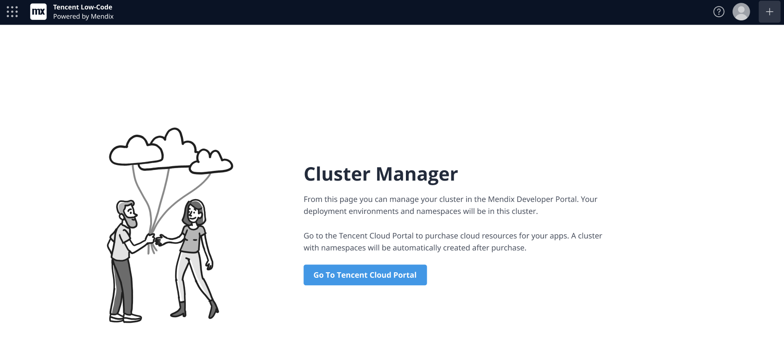

When you have one or more clusters, you can see a summary of them with all their namespaces and an indication of the namespace status and how long it has been running (Uptime).

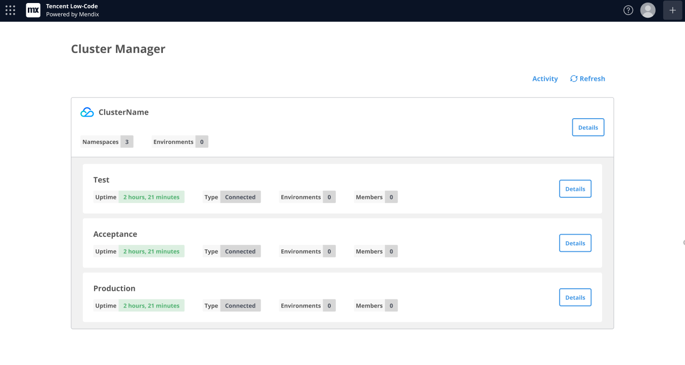

Each cluster resource you purchase from Tencent automatically contains a number of *namespaces* and you will run your Mendix app inside one of these namespaces. The namespaces are designed to hold separate test, acceptance, and production versions of your app so that resource sharing between the versions is minimized.

You can also see the activities logged for all you clusters by clicking **Activity** at the top of the page. This shows the following:

* When a cluster has been added
* When a cluster description is added
* When name of the cluster is changed
* When cluster description is changed

The cluster overview will refresh automatically, but you can force a refresh by clicking **Refresh** at the top of the page.

### 3.2 Cluster Details

Click **Details** next to the cluster name to see information about the entire cluster.

In the first tab you can see the **Namespaces** in the cluster and their current status. This duplicates the information you can see in the cluster overview.

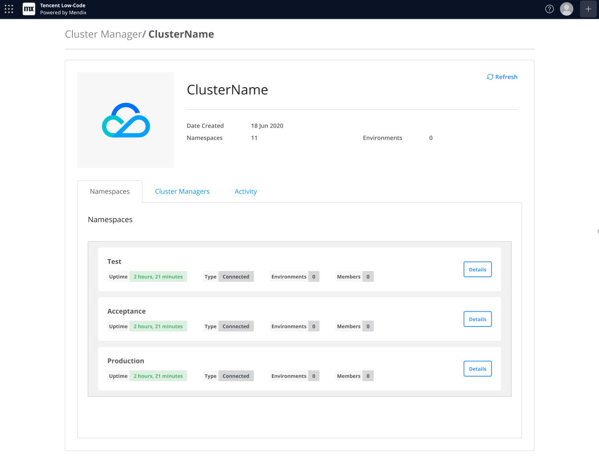

There are two other tabs:

* **Cluster Managers** – where you can see other people who have access to the cluster and can manage them
* **Activity** – where you can see the following actions on the entire cluster

#### 3.2.1 Cluster Managers

The **Cluster Managers** tab will show you all the cluster managers for this cluster. The **STATUS** indicates whether the user has accepted an invitation.

Click **Invite Cluster Manager** to invite another Tencent user to manage this cluster. You will need to know the other person's Tencent ID to invite them.

Click **Invite** to confirm the invitation

{}
When you invite a cluster manager, the user will have most of the access which the original cluster manager had, such as the abilities to add a member, change the permissions of the cluster member, and delete another cluster manager. 

The only limitations are that:

* an added cluster manager will not be able to operate on or manage the environments created in the namespaces which are already in the cluster — they need to be added as a member of the namespace if they want to manage environments in the namespaces
* cluster managers who are added to the cluster cannot remove the cluster manager who purchased the cluster resources
{}

#### 3.2.2 Activity

The **Activity** tab shows all the activity for this cluster. It shows the same information as for the activities in the [Cluster Overview](#overview) but only for the currently displayed cluster.

### 3.3 Namespace Management

If you are a member of a namespace, you can also manage a namespace in the cluster.

Click the **Details** button for the namespace you want to manage.

On the namespace management page, there are a number of tabs which allow you to manage aspects of your namespace :

* Apps
* Members
* Operate

See the sections below for more information.

You can also see an activity log containing the following information for all namespaces within the cluster:

* When a namespace has been added
* When a namespace has been deleted
* When a cluster manager has been added
* When a cluster manager invitation is removed
* When a cluster manager accepts the invitation
* When a cluster manager is removed from the cluster
* When a new database plan is added in a namespace
* When a database plan is deactivated
* When a new storage plan is added in a namespace
* When a storage plan is deactivated
* When Metrics/Alerts/Logs/Backups URLs are added in the namespace
* When Metrics/Alerts/Logs/Backups URLs are removed from the namespace
* When Metrics/Alerts/Logs/Backups URLs are changed in the namespace
* When a user is invited as a namespace member
* When a user invitation for namespace member is removed
* When a user accepts the invitation as a namespace member
* When a user is removed as a namespace member
* When user's permission is changed in the namespace

#### 3.3.1 Apps

The **Apps** tab of namespace details lists all the apps which are deployed to this namespace.

If you are a team member of the app, click **Details** to go to the *Environment Details* page for that app.

{}
You can only see the environment details of an app if you are a member of the app team with the appropriate authorization.
{}

#### 3.3.2 Members

By default, the cluster manager, who created the cluster in Mendix, and anyone added as a cluster manager can invite and manage users of the cluster and its namespaces.

The following rights are available to the person who purchased the cluster resources, and members of a namespace with appropriate authorization:

* Set up operating URLs for the namespace
* View all environments in the namespace
* Manage own environments – user can create and manage an environment in any namespace in the cluster

The following actions require the appropriate access to the namespace **and** access to the app environment as a team member with appropriate authorization:

* Deploy App – user can deploy a new app to the environment or start and stop existing apps
* Scale App – user can change the number of replicas
* Edit App Constants
* Manage App Scheduled Events
* View App Logs
* View App Alerts
* View App Metrics
* Manage App Backups
* Manage Debugger
* Manage TLS configurations
* Manage Custom Runtime Settings
* Manage Log levels

The **Members** tab allows you to manage the list of members of the namespace and control what rights they have.

##### 3.3.2.1 Adding Members

You can invite additional members to the namespace, and configure their role depending on what they should be allowed to do.

1. The **Members** tab displays a list of current members (if any).

2. Click **Invite Member**.
   
    

3. Enter the **Tencent ID** of the person you want to invite.

4. Give them the rights they need. This can be:
   
    1. **Developer** – a standard set of rights needed by a developer, these are listed on the screen
    2. **Administrator** – a standard set of rights needed by an administrator, these are listed on the screen
    3. **Custom** – you can select a custom set of rights by checking the box next to each role you want to give to this person

5. Click **Invite** to send an invite to this person.
   
    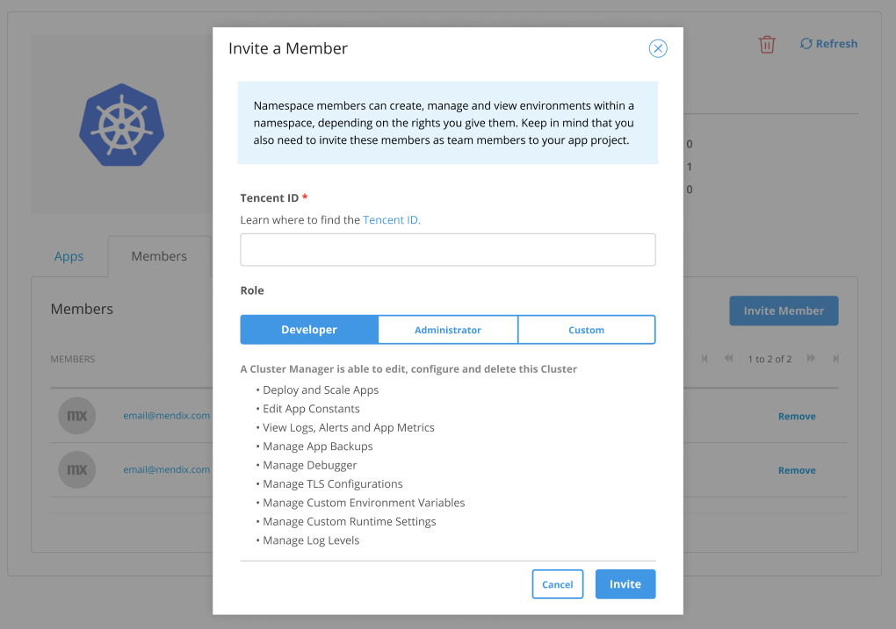

6. The next time the user signs in to the Mendix Developer Portal, they will be added to the namespace.

##### 3.3.2.2 Editing & Removing Members

You can remove existing members.

1. On the **Members** tab of the namespace details, click **Remove** next to the member you want to remove.
        
    

If you want to change the rights for an existing member, you will have to remove them and then add them again with the updated rights.

#### 3.3.3 Operate {#operate}

The **Operate** tab allows you to add a set of links which are used when users request a page from the Operate category for their app in the Developer Portal, as shown below.

The following pages can be configured:

* Metrics
* Alerts
* Logs
* Backups

The specification of these pages is optional.

Open the **Operate** tab, enter the URLs relevant to your namespace, and click **Save** for each one.

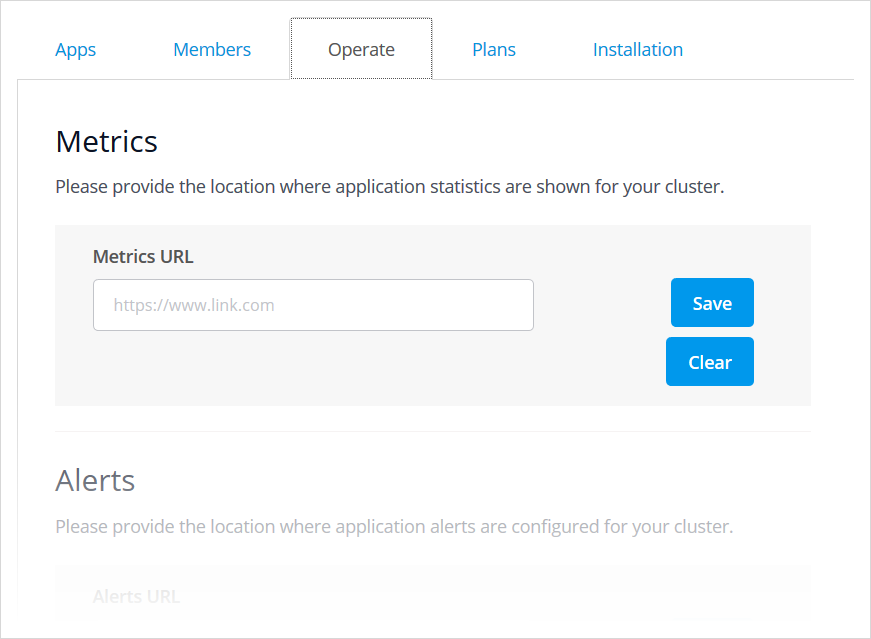

## 4 Deploying an App for the First Time

### 4.1 Creating an Environment{#create-environment}
When deploying your app for the first time, there will be no environments and no deployment packages available. The **Environments** page for your app in the Developer Portal will show you the current status.

First you need to create an environment:

1. Click **Create Environment**.

2. A **UUID** will be generated for you. This will be used when creating your environment to ensure that all the environment names in your namespace are unique.

    {}You can change the UUID if you wish, but do not reuse one which has already been used in this namespace, even if the environment it was used for has been deleted.{}

3. Enter **Environment Name**, the name for the environment. The environment name can only contain lowercase (latin) letters, numbers and dashes and must start and end with an alphanumeric character. You can have several environments for your app, for example test, acceptance, and production.

4. Use the drop-down **Select Namespace** to select an existing namespace. You will see all namespaces of which you are a member.

5. Select the **Purpose**.
   
    1. For development of the app, for example acceptance testing, choose **Development**.

    2. For production deployment, select **Production**. If you select **Production**, then you will be asked for the **Subscription Secret** which you received when you purchased Tencent resources.

        {}Your app can only be deployed to a production environment if security is set on. You will not receive an error if security is set off, but the deployment will appear to hang with a spinner being displayed.{}

6. Click **Next**.
   
    

7. Select **Core Resources**.

    For core resources, there are two sets of values. The **Request** value is the amount of core resources which are initially requested. The **Limit** value is the maximum amount of resource that the environment can use.

    There are three pre-defined sets of resources, **Small**, **Medium**, and **Large**. Choosing these will set the **CPU** and **Memory** values automatically.

    | **Name** | **CPU cores**: Limit | **Memory (Gb)**: Limit | **CPU cores**: Request | **Memory (Gb)**: Request |
    | --- | --- | --- | --- | --- |
    | Small | 1 | 0.5 | 0.1 | 0.5 |
    | Medium | 2 | 2 | 1 | 1 |
    | Large | 4 | 4 | 2 | 2 |
    | Custom | own choice | own choice | own choice | own choice |

    Alternatively, you can choose **Custom**, and enter your own requirements for **CPU** and **Memory**. Ensure that these values are the same or greater than the values for a *Small* environment, otherwise you may run into problems running your app.

8. Select a **Database plan** from the list of plans in the dropdown. This will have the format `db-plan-…` where the suffix reflects the environment.

9. Select a **Storage plan** from the list of plans in the dropdown. This will have the format `file-plan-…` where the suffix reflects the environment.
   
    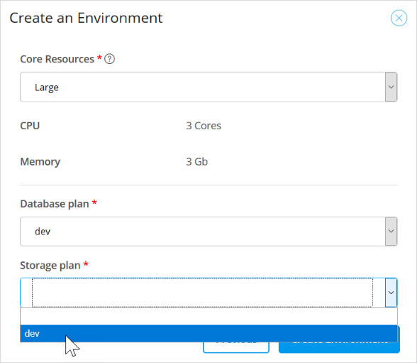

10. Click **Create Environment**.

11. You will see your new environment listed. An *in-progress* icon will be shows next to the resource plans until they have been provisioned.

    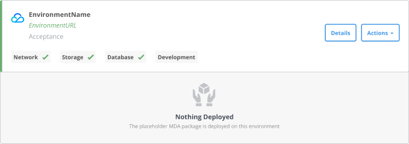

You will not be able to deploy to this environment until it has been fully prepared. This means that all the resource plans have been confirmed and that the placeholder app has been successfully deployed. See [Deploying the Deployment Package](#deploy-package), below, for instructions on how to check that the environment has been created successfully.

### 4.2 Creating a Deployment Package {#create-deployment-package}

Before you can deploy your app, you will need to create a deployment package. Ensure that you have committed the version of the app you want to deploy before continuing.

{}
There is a limit of 200MB on the size of a deployment package which can be deployed on the Tencent Cloud.
{}

1. On the **Environments** page for your app in the Developer Portal, click **Create Package**.
   
    

2. Select the branch which contains the commit for which you want to create a deployment package and click **Next**.
   
    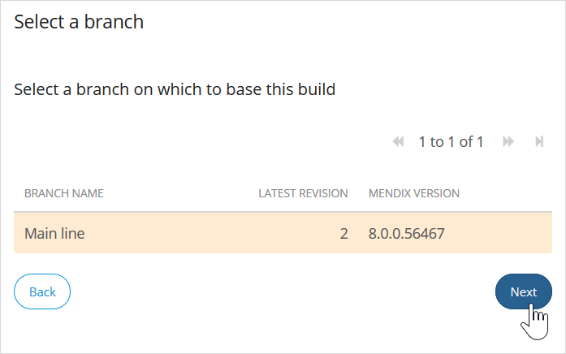

3. Select the revision/commit for which you want to create a deployment package and click **Next**.
   
    

4. Enter a **New version** and **Tag description** according to your own deployment procedure.

5. Select an environment in **Environment for Autodeploy** if you want to deploy and start your package immediately. You need to make sure that the environment is ready using the techniques described in [Deploying the Deployment Package](#deploy-package), below, where you can also see how to deploy a deployment package manually.

6. Click **Build this revision.**
   
    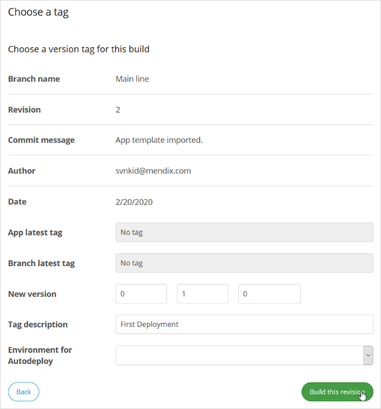

7. Confirm the information message and you will be returned to the **Environments** page.

{}
Alternatively, you can upload an existing MDA by clicking **Upload Package**.
{}

### 4.3 Deploying the Deployment Package{#deploy-package}

You can also deploy an existing deployment package to an environment without having to create a new one. This also allows you to specify constant values and control scheduled events before the app is started.

After creating an environment and deployment package (see [Creating an Environment](#create-environment) and [Creating a Deployment Package](#create-deployment-package), above) you will now have a deployment package and an environment. Check that there is a green tick next to the deployment package and the resources of the environment. If any of these have failed, try to create the environment or the deployment package again, and contact your cluster manager. If neither of these solves the problem. contact Tencent support using the **help** option in the [Tencent Cloud Console](https://console.cloud.tencent.com/).

You also need to check that the **PlaceholderMDA**, an initial app which is deployed by default to your environment, has successfully built and is running.

If everything has been created successfully, and the PlaceholderMDA has been built and is running, you can deploy the deployment package of your app by doing the following:

1. Click **Deploy** next to the deployment package you wish to deploy.

2. Confirm the **Target** environment (you can select a different one here if one is available).

3. Confirm that the **Status** is *Ready*.

4. Click **Transport**.
   
    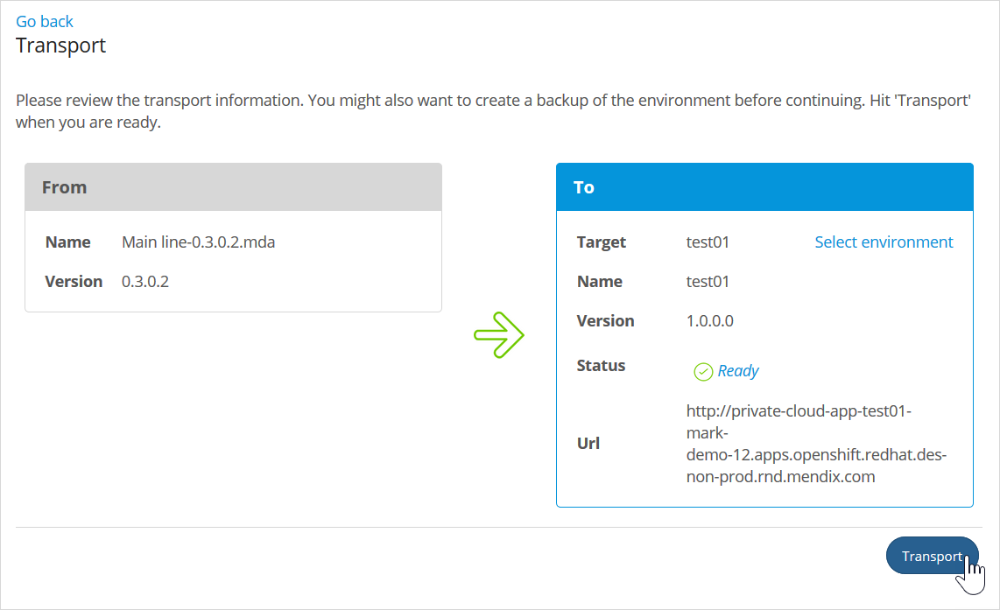

5. Change any constants in the **Constants** tab: select the constant you want to edit and then click **Edit**.

6. Toggle any scheduled events in the **Scheduled Events** tab: select the scheduled event you want to enable or disable and click **Toggle**.

7. Click **Continue** to continue to the Start Application confirmation page.
   
    

8. Click **Apply Changes** to deploy the application to the selected environment. The app will start automatically once the deployment is successful.

You will be taken to the Environment Details page for the selected environment. You can find information about managing your environment from this page in [Managing Your Environments from the Environment Details Page](#environment-details), below.

## 5 Environments Page

The **Environments** page of the Developer Portal contains three sections:

* Deployment Package Repository
* Environments
* Activity

### 5.1 Deployment Package Repository

This lists the deployment packages which have been created for this app.

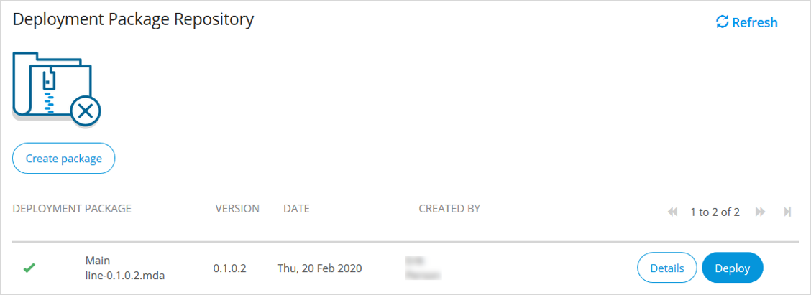

There are five buttons:

* Refresh
* Create Package
* Upload Package
* Details
* Deploy

These are described in more detail below.

#### 5.1.1 Refresh

Sometimes the page will not be automatically refreshed with the latest information. Click this button to update the information on the page.

{}
Using the browser refresh button will take you away from this environments page, so use this button instead.
{}

#### 5.1.2 Create Package

This creates a new package as described in [Creating a Deployment Package](#create-deployment-package), above.

#### 5.1.3 Upload Package

This allows you to upload an MDA package you have already created. The uploaded package is added to the list of packages for the app and can be deployed in the same way as a package created using **Create Package**.

#### 5.1.4 Details

This displays details of the deployment package.

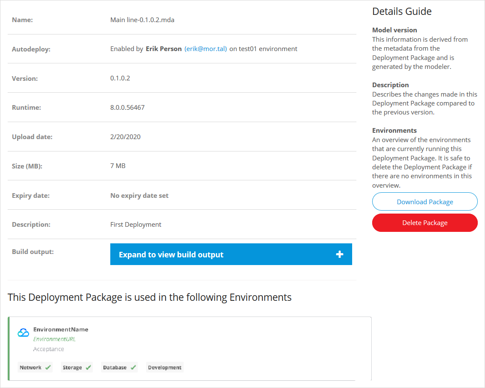

The information shows here is labeled to help you. The indicators in the environment description are described in the next section, [Environments](#environments), below.

There are three additional actions you can take while looking at the deployment package details:

* **Expand to view build output** – shows the output from the Mendix build
* **Download Package** – allows you to download the deployment package and save it locally
* **Delete Package** – deletes the deployment package – you will be asked to confirm this action

#### 5.1.5 Deploy

This deploys the package to an existing environment as described in [Deploying the Deployment Package](#deploy-package), above.

### 5.2 Environments {#environments}

This section shows all the environments created for this app.

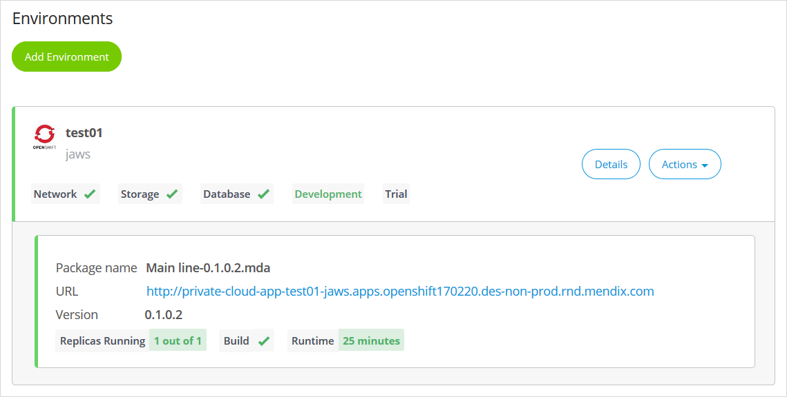

For each environment, you can see a summary of the status of the resources and details of the package which is running in the environment (if there is one).

You can perform the following actions:

* **Add Environment**
* View **Details**
* Perform **Actions**

These are described in more detail, below.

In addition, there are several indicators describing the status of the environment.

#### 5.2.1 Environment Status Indicators{#environment-status}

##### 5.2.1.1 Network

The **Network** indicator has the following values:

* Tick – the network is operational
* Cross – the network is not operational
* Spinner – the network is being provisioned

##### 5.2.1.2 Storage

The **Storage** indicator has the following values:

* Tick – storage is provisioned
* Cross – storage is not provisioned
* Spinner – storage is being provisioned

##### 5.2.1.3 Database

The **Database** indicator has the following values:

* Tick – the database is provisioned
* Cross – the database is not provisioned
* Spinner – the database is being provisioned

##### 5.2.1.4 Development

The word **Development** indicates that this environment is set up for development.

The word changes to **Production** if the environment is set up for production.

See [Creating an Environment](#create-environment), above, for more information.

#### 5.2.2 Add Environment

This adds a new environment as described in [Creating an Environment](#create-environment), above.

#### 5.2.3 Details

This opens the **Environment Details** page which is described in more detail in [Managing Your Environments from the Environment Details Page](#environment-details), below.

#### 5.2.4 Actions

This button contains a list of actions which you can perform quickly on the environment. Most of these actions will be disabled if the app is currently starting or stopping. These actions are:

* **Start Application** (only shown if app is stopped) – allows you to start a stopped application
* **Transport Package** – allows you to deploy the deployment package in the current environment to another environment within the app, or to redeploy it in the current environment
* **Environment Logs** – takes you to the log page defined by the cluster manager when they registered the namespace
* **Model Options** – allows you to change the running of scheduled events and the values of constants for your app by taking you to the **Model Options** tab of the **Environment Details** page
* **Stop Application** (only shown if at least one replica is running) — stops the application by reducing the number of replicas to zero
* **Delete Environment** – this deletes the environment (see [Current Limitations](#limitations), below, for additional details about what is deleted) — you will be asked to confirm this action

### 5.3 Activity

This section shows all the activities, such as creating environments and deploying apps, which have taken place in this environment. You can sort the activities in either descending or ascending date and time order.

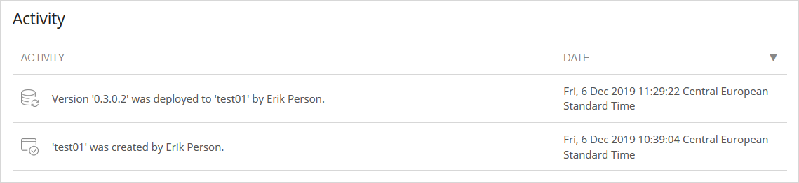

## 6 Managing Your Environments from the Environment Details Page{#environment-details}

Each environment you create has an **Environment Details** page which allows you to monitor and manage your environments. You can reach this by clicking the **Details** button next to the environment you want to manage.

If you have any outstanding changes to your environment the page will display a warning message. If you click **Apply Changes**, the environment will be stopped and restarted.

The environment details page consists of seven tabs:

* General
* Model Options
* Network
* Runtime
* Log Levels
* TLS
* Debugger

These tabs are described below.

### 6.1 General Tab

The general tab shows information about your running app.

Most of the information is self-explanatory, but the status information gives you a quick summary of the status of the environment and the app deployed there.

#### 6.1.1 Loaded Deployment Details > Status

This status shows you the following information – how many replicas are running, whether there was a successful build, and how long since the app was last started.

#### 6.1.2 Environment Details > Status

This shows you the status of the environment and is the same as the status shown on the Environments page and described in [Environment Status Indicators](#environment-status), above.

#### 6.1.3 Action Buttons

There are also buttons which allow you to perform various actions on your app and environment. These are described in the sections below.

##### 6.1.3.1 Stop/Start Application

If the app is not currently running (**Replicas Running** is set to *None*) you will see **Start** Application. Clicking this will immediately trigger the app to begin running by increasing the number of replicas.

If the app is currently running, clicking **Stop Application** immediately stops the application by reducing the number of replicas to zero.

##### 6.1.3.2 Transport Package

Allows you to deploy the deployment package in the current environment to another environment within the app, or to redeploy it in the current environment. See [Deploying the Deployment Package](#deploy-package), above, for more information.

##### 6.1.3.3 Scale Application

This allows you to scale your app by increasing the number of replicas.

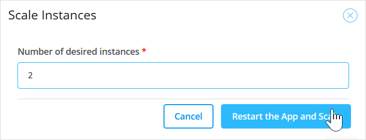

To apply the new value, click **Restart the App and Scale**. Because you restart your app, it will be unavailable for a short time.

##### 6.1.3.4 Clear Admin Password

This allows you to clear the password for the local admin user in your app to disable the user without having to clear it in Studio Pro and redeploy the app.

##### 6.1.3.5 Change Admin Password{#change-admin-password}

This allows you to change the password for the local admin user in your app without having to change it in Studio Pro and redeploy the app.

##### 6.1.3.6 Delete Environment

This deletes the environment — you will be asked to confirm this action.

If the cluster is standalone, or the Mendix Gateway Agent is not connected for some other reason, you can still delete the environment information in the Developer Portal. However, the actual environment will not be deleted and you will have to do this manually.

If the environment cannot be deleted, you will receive a warning, but can go ahead and remove it from the Developer Portal.

##### 6.1.3.7 Change Purpose

This enables you to change the purpose of your app environment. You can label an environment as one used for development of the app, for example acceptance testing. In this case choose **Development** and the app will be deployed as a Free App.

For production deployment, select **Production**. If you select **Production**, then you will be asked for the Subscription Secret which ensures that your app runs as a licensed app. For the differences between free/test apps and licensed apps, see the [Free App](mendix-cloud-deploy#free-app) section in *Mendix Cloud*.

{}
Your app can only be deployed to a production environment if security is set on. You will not receive an error if security is set off, but the deployment will appear to hang with a spinner being displayed.
{}

##### 6.1.3.8 Change Subscription Secret{#change-subscription-secret}

If you select Production as the **purpose** of the app environment, then you will need to use a Subscription Secret which ensures that your app runs as a licensed app. If you need to enter or change the subscription secret, then you can do that here.

Subscription secrets are obtained from Tencent.

### 6.2 Model Options Tab

The **Model Options** tab allows you to change the configuration of scheduled events and constants in your app.

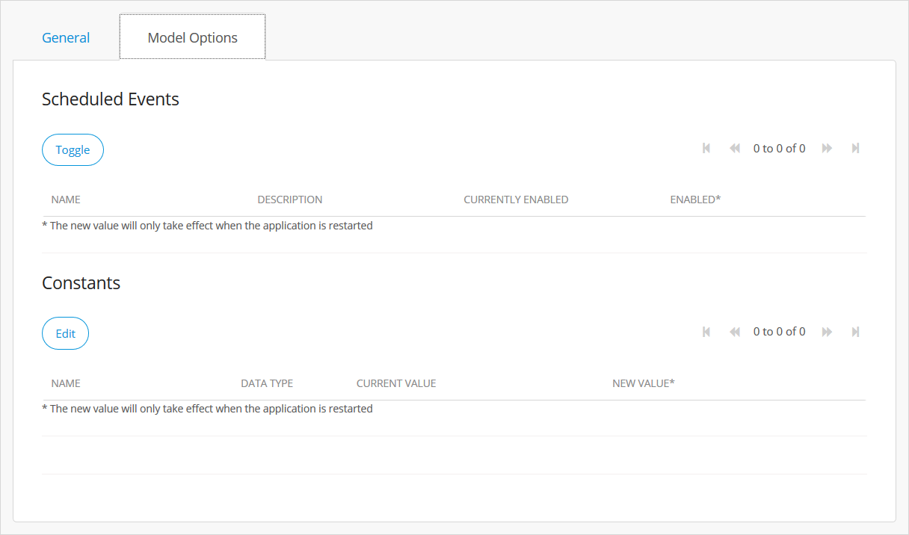

To toggle any scheduled events, select the scheduled event you want to enable or disable and click **Toggle**.

To change any constants, select the constant you want to edit and then click **Edit**.

### 6.3 Network Tab

On the **Network** tab, you add client certificates (in the PKCS12 format) or certificate authorities (in the PEM format) for outgoing connections. These will be used when your application initiates SSL/TLS connections.

### 6.4 Runtime Tab

On the **Runtime** tab, you can change various runtime settings for your app environment. For more details of these, see the [Runtime Tab](environments-details#runtime-tab) section of *Environment Details*.

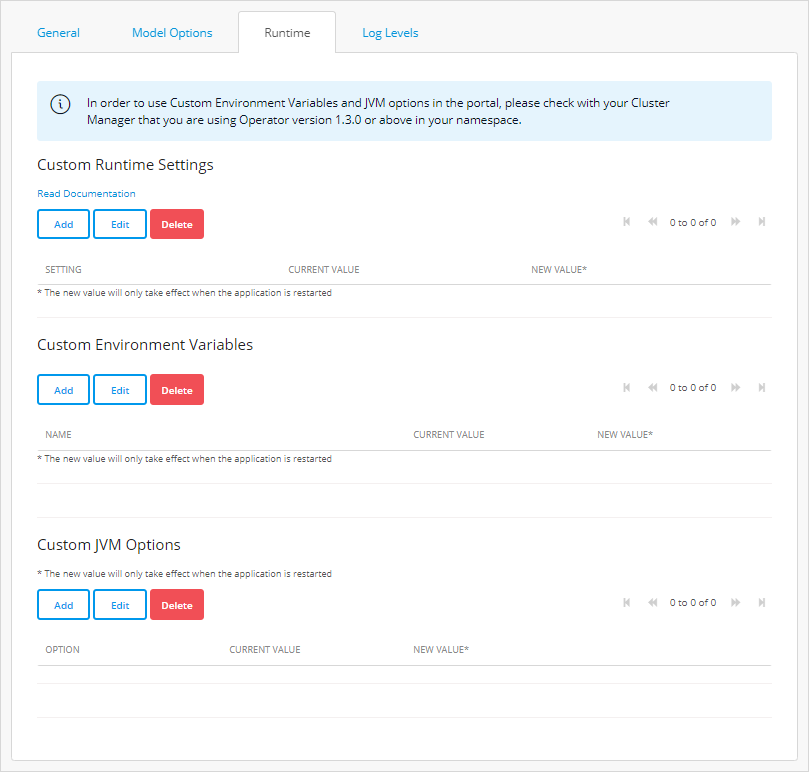

### 6.5 Log Levels Tab

On the **Log Levels** tab, you can change the log levels which are used for the log nodes in your app. For more details of these, see the [Log Levels Tab](environments-details#log-levels) section of *Environment Details*.

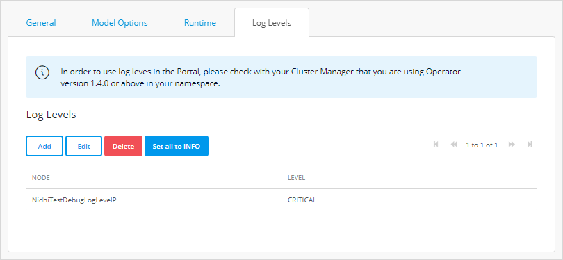

### 6.6 TLS

If you are using Mendix Operator version 1.5.0 or above, you can configure TLS for your environment from the Developer Portal.

In the TLS pane, you can choose whether to **Apply Default Configuration** or a **Custom TLS Configuration**. If you apply the default configuration, then the configuration made when you ran the configuration script for the namespace will be used.

{}
If you are using a version of Mendix Operator before 1.5.0, the settings in this tab will have no effect and the default configuration will be applied.
{}

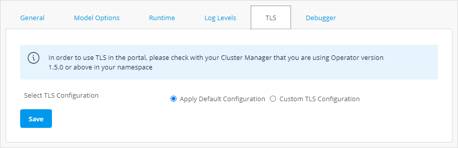

If you choose a custom TLS configuration, you will need to enter the following information:

* Enable TLS – is TLS enabled for this environment?

    

* Use existing TLS secret or add new tls private key and certificate?

    

* Existing Secret Name – if you choose an existing TLS secret then you will be asked to enter its name

* TLS Private Key File and TLS Certificate File – if you choose to add a new key you will need to upload these two files

    

Click **Save** to confirm your new configuration.

You will receive a warning that you have made some changes. Click **Apply Changes** to restart the app and apply the changes.

### 6.7 Debugger

On the **Debugger** tab you can set up and view the credentials you need to debug your app when it is running on Tencent.

## 7 Current Limitations{#limitations}

### 7.1 Reserved Names for Mendix Apps{#reserved-names}

All names beginning **mendix-** are reserved for use by the Tencent cluster.

### 7.2 Deleting Your App

Delete all environments before you delete an app. If you delete an app which has environments on Tencent, you will not be able to reach the environments through the Developer Portal.

### 7.3 App Security and Production

If you attempt to deploy an app with security not set to production into a production environment you will not get an error, however the deployment will appear to hang with **Replicas running** and **Runtime** showing a spinner.

### 7.4 ApplicationRootUrl Needs to be Set Manually

In some cases, your Mendix app will need to know its own URL - for example when using SSO or sending emails.

For this to work properly, you need to set the [ApplicationRootUrl](/refguide/custom-settings#general) **Custom Runtime Setting** in the **Runtime** tab to the app's URL.

To add this setting:

1. Copy the **App URL** value from the **General** tab.
2. Switch to the **Runtime** tab.
3. Add a **Custom Runtime Setting**: use `ApplicationRootUrl` as the **Setting** name and the URL you copied from **App URL** as the **New value**.

{}
If you change **App URL** in the **General** tab, you should update the `ApplicationRootUrl` value as well.
{}

## 8 Troubleshooting

This section covers an issue which can arise where Mendix cannot recover automatically and manual intervention may be required.

### 8.1 Status Reporting

Under some circumstances changes in the status of the environment and its apps will not be updated automatically. To ensure you are seeing the current status, you may need to click the **Refresh** button on the screen (not the browser page refresh button).

