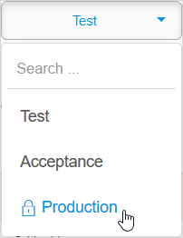
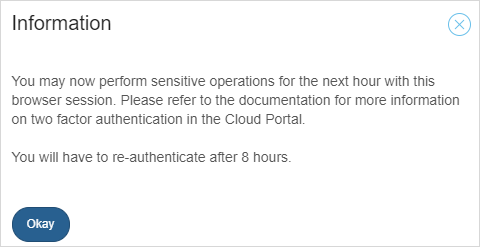
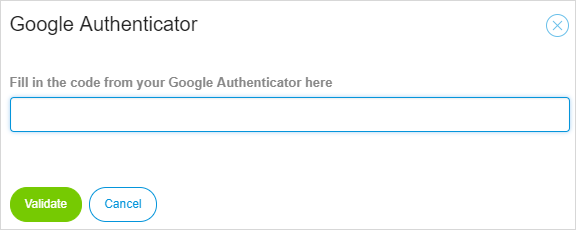

## 1 Introduction

In the **Deploy** and **Operate** categories of the [Developer Portal](http://home.mendix.com), there are several operations that require **Two-Factor Authentication** (2FA). In addition, Technical Contacts are required to use 2FA with their Mendix account when they access licensed cloud node details, specifically for transporting MDA files (deployment archives) to the production environment.

This document describes the purpose and the functionality of two-factor authentication.

## 2 The Purpose

2FA adds a second authentication mechanism in addition to your password. It is an extra layer of authentication to allow you to perform sensitive activities on Mendix Cloud nodes, such as deploying packages and handling production data. It means that you need to have access to your mobile phone as well as an active session in the Mendix Developer Portal.

Actions which require 2FA are indicated by a padlock symbol.

After successfully performing 2FA, your browser session is authorized for the next eight hours.

## 3 How It Works

There are two methods of performing 2FA. You can either ask Mendix to send an SMS containing an authentication code

### 3.1 SMS Authentication

### 3.2 Google Authenticator

Before performing an operation on the production environment, you will be required to provide the authentication code.

For more information, see [Google Authentication](https://www.google.com/landing/2step/#tab=how-it-protects).

## 4 Setting Up & Disabling

To transport your deployment package into the production environment, follow these steps:

1. In your app project, go to the **Deploy** tab.
3. Click **Deploy** below the package you want to deploy.
4. In the **Environments** section click **Transport to Production** for the deployment package you want to transfer from your test environment to acceptance and then to production.
5. Click **Use Google Authenticator** in the dialog box that opens. Note that the installation screens are different per smartphone type. The following steps are based on an Android phone.
6. Open the **Google Authenticator** app on your smartphone.
7. Select **Set up account** on the main page.
8. Select **Scan a barcode** or **Enter provided key**.
9. Scan the barcode or enter the six-digit time-based code.
10. Once Google Authenticator is set up you will be asked to confirm by entering the Google Authenticator code.

  

Your account is now secured with 2FA and ready to use. You will get a six-digit number that expires every minute. You will need to enter that number to validate your account every time you access production.

If you change your device or phone number, you must contact [Mendix Support](https://support.mendix.com/hc/en-us) to disable the authenticator on your Mendix account.

You can re-activate 2FA by triggering any action that requires 2FA on your production environment.

## 5 Changing the Authentication Method

After you have set up your authentication method, you cannot change the authentication method yourself. Only [Mendix Support](https://support.mendix.com) is able to disable the current authentication method. After the authentication method has been disabled, it can be set to a different method.

For example, if you want to change your authentication method from **SMS Authentication** to **Google Authentication**, submit a [Mendix support request](https://support.mendix.com/hc/en-us/requests/new) citing **Standard change: Reset Google authenticator**.

## 6 Technical Contact

Team members with **App Team – Deploy Permissions** are authorized to have node permissions. The Technical Contact can grant those members different permissions that can differ per environment. For example, you might want to limit the access of external developers to only the acceptance environment.

For more information, see [Node Permissions](node-permissions).

## 7 Read More

* [Deploy and Manage](/developerportal/deploy)
* [Settings](/developerportal/settings)
* [Technical Contact](/developerportal/company-app-roles/technical-contact)
