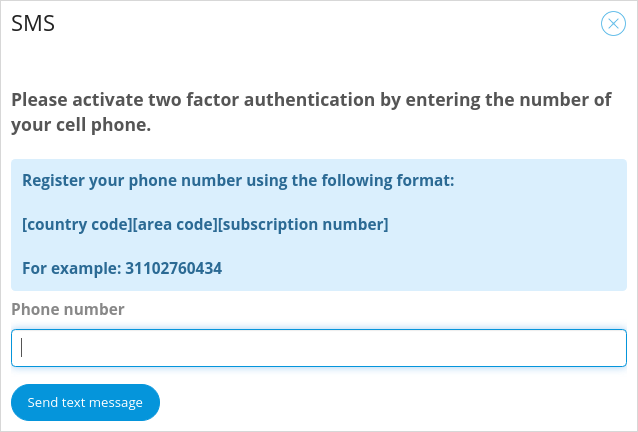
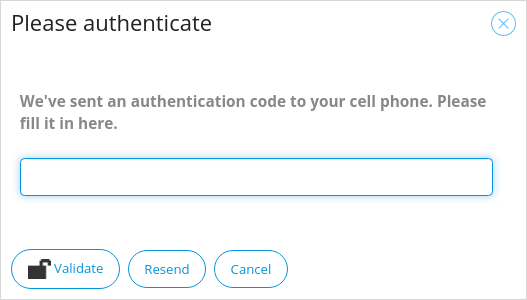
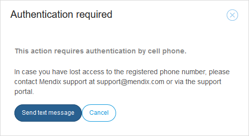

{}
 For the Simplified Chinese translation, click [中文译文](https://cdn.mendix.tencent-cloud.com/documentation/developerportal/two-factor-authentication.pdf).
{}

## 1 Introduction

When managing apps in the [Developer Portal](http://sprintr.home.mendix.com), there are several operations that require **Two-Factor Authentication** (2FA). In addition, Technical Contacts are required to use 2FA with their Mendix account when they access licensed cloud node details, specifically for transporting MDA files (deployment archives) to the production environment.

This document describes the purpose and the functionality of two-factor authentication.

## 2 The Purpose

2FA adds a second authentication mechanism in addition to your password. It is an extra layer of authentication to allow you to perform sensitive activities on Mendix Cloud nodes, such as deploying packages and handling production data. It means that you need to have access to your mobile phone as well as an active session in the Mendix Developer Portal.

Actions which require 2FA are indicated by a padlock symbol.

## 3 How It Works

There are two methods of performing 2FA. You can either ask Mendix to send an SMS containing an authentication code, or you can enable Google Authenticator.

Once it is set up, you will receive an authentication code via your chosen route and will need to provide this to the Developer Portal.

After successfully performing 2FA, your browser session is authorized for the next eight hours.

{}{}

To set it up, you first need to perform an action which required 2FA, such as **Transport to Production** on the **Environments** page of your app.

Choose one of the two options and follow the relevant instructions, below.

{}{}

### 3.1 SMS Authentication

For SMS authentication, you will need to have a phone number connected to a device which can receive SMS messages, such as a mobile phone.

If you have chosen the SMS option, the first time you need to perform 2FA you will be asked for the phone number to which SMS messages can be sent.

1. Click **Use SMS** in the dialog box that opens when you use 2FA for the first time.
2. Enter your phone number and click **Send text message**.

    {}{}

3. Enter the authentication code which is sent as an SMS to your device and click **Activate**.

    {}{}

In future you will need to ask Mendix to send a text message to your phone.

{}{}

You will need to enter the authentication code from the SMS message to unlock 2FA.

{}{}

### 3.2 Google Authenticator

For more information on how Google Authenticator works, see Google's own documentation on [Google Authentication](https://www.google.com/landing/2step/#tab=how-it-protects).

1. Click **Use Google Authenticator** in the dialog box that opens when you use 2FA for the first time.
2. Install and open the **Google Authenticator** app on your smartphone.
3. Select **Set up account** on the main page.
4. Select **Scan a barcode** or **Enter provided key**.
5. Scan the barcode or enter the six-digit time-based code.
6. Once Google Authenticator is set up you will be asked to confirm by entering the Google Authenticator code.

    {}{}

Your account is now secured with 2FA and ready to use.

In future, You will get a six-digit number that expires every minute. You will need to enter that number to validate your account every time you performing an operation on the production environment.

{}{}

## 4 Changing your Device or Phone Number

If you change your device or phone number, you must contact [Mendix Support](https://support.mendix.com/hc/en-us) to disable the authenticator on your Mendix account.

You can re-activate 2FA by triggering any action that requires 2FA on your production environment.

## 5 Changing the Authentication Method

After you have set up your authentication method, you cannot change the authentication method yourself. Only [Mendix Support](https://support.mendix.com) is able to disable the current authentication method. After the authentication method has been disabled, it can be set to a different method.

For example, if you want to change your authentication method from **SMS Authentication** to **Google Authentication**, submit a [Mendix support request](https://support.mendix.com/hc/en-us/requests/new) citing **Standard change: Reset Google authenticator**.

## 6 Technical Contact

Team members with **App Team – Deploy Permissions** are authorized to have node permissions. The Technical Contact can grant those members different permissions that can differ per environment. For example, you might want to limit the access of external developers to only the acceptance environment.

For more information, see [Node Permissions](node-permissions).

## 7 Read More

* [Deploy and Manage](/developerportal/deploy)
* [Settings](/developerportal/settings)
