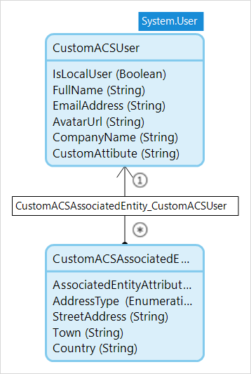
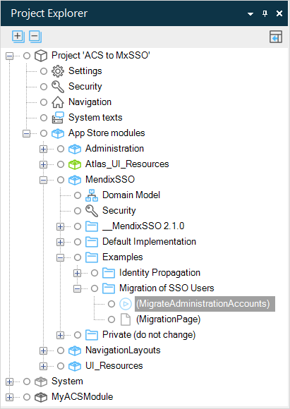

## 1 Introduction

The AppCloudServices implementation of single sign on (SSO) for Mendix has been deprecated. The [MendixSSO module](https://appstore.home.mendix.com/link/app/111349/) can replace this implementation completely. It comes with a default implementation of end-user administration which gives you all the tools you need to manage SSO as described in [Mendix Single Sign-on](mendix-sso).

MendixSSO has been designed to easily replace the AppCloudServices SSO. How to do this depends on how AppCloudServices was implemented in your app. There are two different situations:

* AppCloudServices was implemented with no additional customization
* The AppCloudServices domain model has been enhanced with additional attributes and/or associations

Dealing with these to situations is described in the two sections below.

## 2 Replacing a Standard Implementation of AppCloudServices with Mendix SSO

If you have an app which uses AppCloudServices in its default implementation then you can just replace the existing AppCloudServices App Store module, with the MendixSSO App Store module.

Perform the following steps to replace AppCloudServices with MendixSSO.

1. MendixSSO apps must be built using Mendix version 7.23.3 or above. If your app is built using Mendix version 7.23.2 or below, you need to upgrade it. Apps in a previous version 7 release of Mendix can be updated automatically by opening them in a new version of Studio Pro. Apps in version 6 of Mendix will need to be updated to version 7 first – see the instructions in [Moving from Modeler Version 6 to 7](/refguide7/moving-from-6-to-7).

2. Upgrade your UI to AtlasUI. MendixSSO pages are written using AtlasUI, so to make use of the default MendixSSO implementation, you need to upgrade your app. See the instructions in [How To Migrate Existing App Projects to Atlas UI](/howto/front-end/migrate-existing-projects-to-atlasui).

3. Import the MendixSSO module from the App Store, and implement it using the instructions in the [Setting Up Mendix Single Sign-On](mendix-sso#setting-up) section of *Mendix Single Sign-On*.

4. Delete the **AppCloudServices** module. You will also need to delete or exclude the **OnFirstLoginAppCloudUser** microflow which will have been added to your app.

5. If you had local end-users who had access to the app, these will still be available through the **Account** entity in the **Administration** App Store Module. You can continue to administer these end-users through the Administration module

    If you wish, you can copy the information about local end-users into the **MendixSSOUser** entity in the MendixSSO module. If you do this, you will need to use the same techniques as described for customized implementations in the next section.

6. Deploy your app to the Mendix Cloud.

{}
You have now upgraded your app to use the MendixSSO module. Because all the end-user information and credentials are held in their Mendix account, they are already known to the app and can continue to use it as before.
{}

## 3 Replacing a Customized Implementation of AppCloudServices with Mendix SSO

If you have modified the domain model for AppCloudServices (ACS) single sign-on, and you want to keep this information, then you will need to take some extra steps.

For example, say you have added an attribute, **CustomAttribute** to the end-user information which you are managing through the **CustomACSUser** entity. Additionally, you have associated the **CustomACSAssociatedEntity** entity which contains more information.

This is information which is not available from the Mendix Developer Portal, so if you just delete the AppCloudServices implementation, you will lose this extra information about the end-users. To keep it, you need to ensure that the information is copied across. This is described below.

### 3.1 Adding Mendix SSO to Your App

The first steps you need to take are the same as for a non-customized implementation:

1. MendixSSO apps must be built using Mendix version 7.23.3 or above. If your app is built using Mendix version 7.23.2 or below, you need to upgrade it. Apps in a previous version 7 release of Mendix can be updated automatically by opening them in a new version of Studio Pro. Apps in version 6 of Mendix will need to be updated to version 7 first – see the instructions in [Moving from Modeler Version 6 to 7](/refguide7/moving-from-6-to-7).

2. Upgrade your UI to AtlasUI. MendixSSO pages are written using AtlasUI, so to make use of the default MendixSSO implementation, you need to upgrade your app. See the instructions in [How To Migrate Existing App Projects to Atlas UI](/howto/front-end/migrate-existing-projects-to-atlasui).

3. Import the MendixSSO module from the App Store, and implement it using the instructions in the [Setting Up Mendix Single Sign-On](mendix-sso#setting-up) section of *Mendix Single Sign-On*.

### 3.2 Copying Data from AppCloudServices Users to Mendix SSO Users

#### 3.2.1 Creating the Domain Model

Now you need to set up a second, customized version of the Mendix SSO User entity which has the same modifications as the ACS implementation. You will also need to modify three microflows to ensure that this new entity is used.

1. Add a new module to your app project. In these examples it is called **CustomMendixSSO**.

2. Copy the **MendixSSOUser** entity from the **MendixSSO** module domain model, to the domain model of your new module. In these examples it is called **CustomMendixSSOUser**.

    {}You can also create an entity from scratch, provided is uses **System.User** as its generalization.{}

3. Copy the following microflows from **MendixSSO** to your new module:

    * AfterStartup_MendixSSO
    * CreateMendixSSOUser
    * UpdateMendixSSOUser
    
4. In the new MendixSSO module, add the custom attributes used in the ACS user entity and add associations to any related entities. Ensure that the associations have the correct type and direction.

    

5. In the original ACS SSO domain model, ensure that deleting the user will not delete the associated entities.

    

6. Update the **AfterStartup_MendixSSO** microflow in the new, customized, MendixSSO module to use the **CreateMendixSSOUser** and **UpdateMendixSSOUser** microflows from the customized MendixSSO module. Ensure that the created string variables contain the names of the microflows in the new module.

    

7. Update the **Create** action in the **CreateMendixSSOUser** microflow in your new module to use your new Mendix SSO user entity, not the original one. You will also need to update all the members which are set during the create.

    

8. Change the **End event** of the microflow to return an object of the correct type.

9. Change the **Retrieve** action in the **UpdateMendixSSOUser** microflow in your new module to use your new Mendix SSO user entity.

10. Change the **Change object** action to set the correct members of the object.

    

11. Change the **End event** of the microflow to return an object of the correct type.

12. Set the **After startup** microflow in the **Runtime** tab of **Project > Settings** to be the **AfterStartup_MendixSSO** microflow in your new module.

#### 3.2.2 Writing a Migration Microflow

Now the domain model is set up, and the app will use the custom module to save the end-user data. However, the data you want is still associated with the old, ACS, implementation. You need to copy the existing data across.

In the Mendix SSO module, there is an example of a microflow which you can update to copy your existing data to your customized Mendix SSO module.

Copy this microflow and page to your own module to avoid overwriting it when you upgrade the Mendix SSO module.

The microflow has the structure shown in the image below. The steps below explain the process, and describe what you will need to change in your own microflow.

1. **Retrieve** a list of all the System.User entities. Here, this is called **OldUserList**.
    * In the sample microflow in the module, this appears to be more complicated. This is because it is written to work on batches of users, retrieved using a custom range, rather than all users in a single pass. This improves performance. For more information on retrieving using custom ranges, see the [Retrieve from Database Properties](/refguide/retrieve#4-retrieve-from-database) section of *Retrieve*.

2. **Create** an empty **list** of MendixSSOUser objects (the modified users in your customized module). Here the list is called **MendixSSOUserList**.

3. **Loop** through each user in the list of System.User objects – here the object being processed is called **OldUser**.

4. Perform an **object type decision** based on the type of **OldUser**.

5. **Remove** the **OldUser** from the **OldUserList** if it is not one of the entity types you are processing. This means that it will not be deleted from the database later on.

6. If this *is* one of the entity types you are interested in, **Cast** the **OldUser** object to its specialization – if you need to process more than one type of user object you will need to use separate flows. Here, the specialization is called **CustomACSUser**.

7. **Generate Random Password**. MendixSSO end-users do not need a password to login as local users, but the password attribute is still required and validated in the Mendix model. Therefore you create the new **MendixSSOUser** object with a randomized password value. If an end-user still needs to sign in with username/password credentials they will have to reset their password.

8. **Create** a new customized **MendixSSOUser** object (from your customized module). This needs to have all the required members (attributes and associations) set:

    

    1. Attributes for the default implementation of Mendix SSO (**DisplayName**, for example) need to be selected from the ACS object.

    2. The **HasSSOEnabled** attribute is the _inverse_ of the ACS **IsLocalUser** attribute. Do not forget to add `not()`.

    3. Assign the appropriate value to any custom attributes which you have added to your MendixSSOUser entity. In this example **CustomAttibute**.

    4. Existing associations from **OldUser** are also set but you will need to add any additional attributes which are owned by **CustomMendixSSOUser**. Other associated objects are dealt with below.

9. If there are no associated entities which own associations to the **OldUser** or **CustomACSUser**, then you can flow straight to the last step in the loop (step 13).

10. **Retrieve** a list of all objects of an entity (in this case **CustomACSAssociatedEntity**) which are associated to this **OldUser**. To retrieve the correct objects, use the **XPath constraint** `[{association to ACS user} = $OldUser]`.

    

    {}If there are several entities associated with **CustomACSUser**, you will need to associate each entity separately{}

11. For each object in the retrieved list (in this case called **CustomACSAssociatedEntityList**), use a loop to add an association to the **NewUser** object using **Change object**.

    

12. **Commit** the list of associated entities.

13. Add **NewUser** to the **MendixSSOUserList** using **Change list**.

    After all the iterations of the loop, you now have a list of **CustomMendixSSOUser** objects which have the correct attribute and association values, but which has not been committed. You also have a list of **User** entities which contains only the users which you have processed.

14. Delete all the objects in **OldUserList**. This removes all the old users, so that the new users (which have the same name) will not be rejected because of the uniqueness constraint on the user **Name**.

15. **Commit** the list of new users (**MendixSSOUserList**).

Your custom Mendix SSO users now have the same values as the old customized ACS users.

### 3.3 Configuring Your App For the Customized Mendix SSO Module

Mendix SSO will now use your new entity to administer the end-users, and your custom data is now copied over to the Mendix SSO user entity/entities.

You will need to modify your app to add or update your user administration pages and microflows. You can use the default implementation in the Mendix SSO module as a model.
