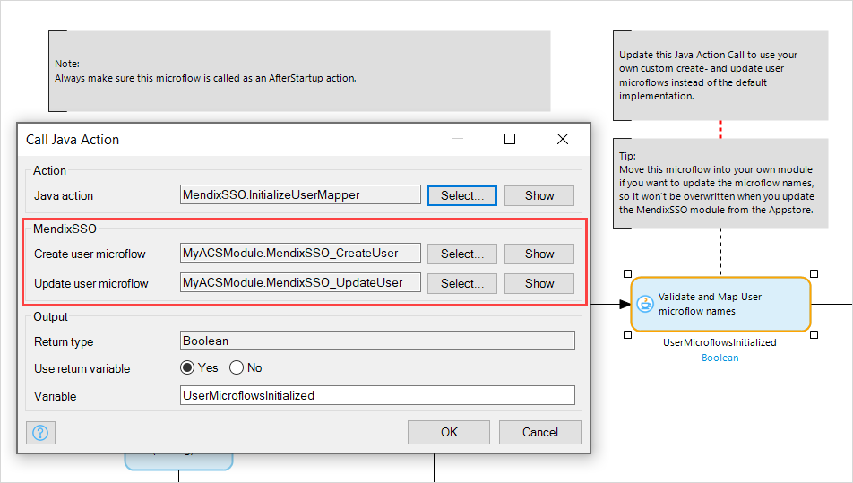
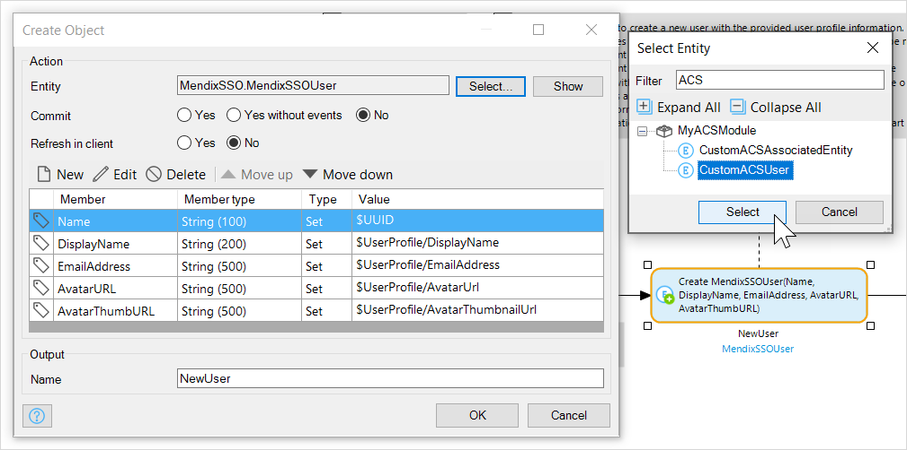

## 1 Introduction

The AppCloudServices implementation of single sign on (SSO) for Mendix has been deprecated. The [MendixSSO module](https://appstore.home.mendix.com/link/app/111349/) can replace this implementation completely. It comes with a default implementation of end-user administration which gives you all the tools you need to manage SSO as described in [Mendix Single Sign-on](mendix-sso).

MendixSSO has been designed to easily replace the AppCloudServices SSO. How to do this depends on how AppCloudServices was implemented in your app. There are two different situations:

* AppCloudServices was implemented with no additional customization
* The AppCloudServices domain model has been enhanced with additional attributes and/or associations

Dealing with these two situations is described in the two sections below.

## 2 Replacing a Standard Implementation of AppCloudServices with MendixSSO

If you have an app which uses AppCloudServices in its default implementation, you can just replace the existing AppCloudServices App Store module with the MendixSSO App Store module.

Perform the following steps to replace AppCloudServices with MendixSSO:

1. Ensure that your app is using Mendix version 7.23.3 or above.

    MendixSSO apps must be built using Mendix version 7.23.3 or above. If your app is built using Mendix version 7.23.2 or below, you need to upgrade it. Apps in a previous version 7 release of Mendix can be updated automatically by opening them in a new version of Studio Pro. Apps in version 6 of Mendix will need to be updated to version 7 first – see the instructions in [Moving from Modeler Version 6 to 7](/refguide7/moving-from-6-to-7).

2. Upgrade your UI to AtlasUI, if you are not currently using Atlas UI. MendixSSO pages are written using AtlasUI, so to make use of the default MendixSSO implementation, you need to upgrade your app. See the instructions in [How To Migrate Existing App Projects to Atlas UI](/howto/front-end/migrate-existing-projects-to-atlasui).

3. Import the MendixSSO module from the App Store, and implement it using the instructions in the [Setting Up Mendix Single Sign-On](mendix-sso#setting-up) section of *Mendix Single Sign-On*.

4. Delete the **AppCloudServices** module. You will also need to delete or exclude the **OnFirstLoginAppCloudUser** microflow which will have been added to your app.

    Note that there may still be JAR libraries in your project which were used by AppCloudServices but which are no longer needed by your app.

5. Add user administration functions, if required.

    By default, you can use the MendixSSO module to perform user administration of end-users signing on. You can include the default implementation supplied with the module by adding the relevant pages — which you can find in **MendixSSO** > **Default Implementation** > **Pages** — in the appropriate places within your app flow.
    
    If you had local end-users who had access to the app, these will still be available through the **Account** entity in the **Administration** App Store Module. You can continue to administer these end-users through the Administration module

    If you wish, you can copy the information about local end-users into the **MendixSSOUser** entity in the MendixSSO module. If you do this, you will need to use the same techniques as described for customized implementations in the next section.

6. Deploy your app to the Mendix Cloud.

{}
You have now upgraded your app to use the MendixSSO module. Because all the end-user information and credentials are held in their Mendix account, the end-users are already known to the app and can continue to use the app as before.
{}

## 3 Replacing a Customized Implementation of AppCloudServices with MendixSSO{#replacing-customized}

If you have modified the domain model for AppCloudServices (ACS) single sign-on, and you want to keep this information, then you will need to implement MendixSSO in a different way.

For example, say you have added an attribute, **CustomAttribute** to the end-user information which you are managing through the **CustomACSUser** entity. Additionally, you have associated the **CustomACSAssociatedEntity** entity which contains more information.

This is information which is not available from the Mendix Developer Portal, so if you just delete the AppCloudServices implementation, you will lose this extra information about the end-users. To keep it, you need to ensure that MendixSSO uses your existing entities, rather than using the default ones.This is described below.

### 3.1 Adding MendixSSO to Your App

The first steps you need to take are the same as for a non-customized implementation:

1. Ensure that your app is using Mendix version 7.23.3 or above.

    MendixSSO apps must be built using Mendix version 7.23.3 or above. If your app is built using Mendix version 7.23.2 or below, you need to upgrade it. Apps in a previous version 7 release of Mendix can be updated automatically by opening them in a new version of Studio Pro. Apps in version 6 of Mendix will need to be updated to version 7 first – see the instructions in [Moving from Modeler Version 6 to 7](/refguide7/moving-from-6-to-7).

2. Upgrade your UI to AtlasUI, if you are not currently using Atlas UI. MendixSSO pages are written using AtlasUI, so to make use of the default MendixSSO implementation, you need to upgrade your app. See the instructions in [How To Migrate Existing App Projects to Atlas UI](/howto/front-end/migrate-existing-projects-to-atlasui).

3. Import the MendixSSO module from the App Store, and implement it using the instructions in the [Setting Up Mendix Single Sign-On](mendix-sso#setting-up) section of *Mendix Single Sign-On*.

4. Delete the **AppCloudServices** module. You will also need to delete or exclude the **OnFirstLoginAppCloudUser** microflow which will have been added to your app.

    {}If you have customized the AppCloudServices module directly, rather than following best practice by applying customizations to your own module, you **must not** delete the AppCloudServices module (or you will lose your data). Instead, use the **Errors** pane and exclude from your module, one at a time, all documents which are causing errors.{}

5. If you have errors from pages which are based on the AppCloudMasterLayout (which you have now deleted from your app), you can change the layout for these pages to an Atlas UI layout, for example **Atlas_Default**.

    

### 3.2 Configuring MendixSSO to Use Your ACS Entity

By default, MendixSSO uses its own entities to store user information. However, it is designed to allow you to use your own custom entities instead. To do this, perform the following steps:

1. Move the **MOVE_THIS** folder from **MendixSSO** to existing module containing your customized user administration entity.

    This will move the following microflows:

    * MendixSSO_AfterStartup
    * MendixSSO_CreateUser
    * MendixSSO_UpdateUser

2. Update the **MendixSSO_AfterStartup** microflow in the customized user administration module to use the **MendixSSO_CreateUser** and **MendixSSO_UpdateUser** microflows in the same module. If you moved the folder from the **MendixSSO** module the names should have been updated automatically.

    

2. Update the **Create** action in the **MendixSSO_CreateUser** microflow in your user administration module to use the AppCloudServices user entity, not the one in the MendixSSO module.You will also need to update all the members which are set during the create.

    

3. Change the **End event** of the microflow to return an object of the correct type.

4.  Change the Parameter of the **MendixSSO_UpdateUser** microflow in the module to be your AppCloudServices user entity (in this example, **MyACSModule.CustomACSUser**) instead of MendixSSOUser.

5. Change the **Change object** action to set the correct members of the object.

    

6. Change the **End event** of the microflow to return an object of the correct type.

7. Set the **After startup** microflow in the **Runtime** tab of **Project > Settings** to be the **MendixSSO_AfterStartup** microflow in your user administration module.

## 4 Copying Data from AppCloudServices Users to MendixSSO Users

Since you can re-use your AppCloudServices entities with MendixSSO, there is no need to copy any data from existing entities to the new MendixSSO entities.

If you decide to re-implement user administration using MendixSSO rather than keep your existing user administration pages *and* you have additional data which is not available in the default MendixSSO implementation, then you will need to make your own customized version of MendixSSO and copy the existing data into it.

You will need to perform the following steps:

1. Set up a new domain model to support the data which is currently held in the ACS user entity. It is recommended that you do this in a new module which you use for user administration.

2. Set up MendixSSO to support the entity in this new module using the instruction in the [Replacing a Customized Implementation of AppCloudServices with MendixSSO](#replacing-customized) section, above.

3. Modify your app to add or update your user administration pages and microflows. You can use the default implementation in the MendixSSO module as a model.

    Having set up the the domain model, and ensuring that the app will use the custom module to save the end-user data, you need to copy the existing data across.

    In the MendixSSO module, there is an example of a microflow which you can update to copy your existing data to your customized MendixSSO module.

    

4. Copy this microflow (**MigrateAdministrationAccounts**) and the page which calls it (**MigrationPage**) to your own module to avoid overwriting them when you upgrade the MendixSSO module.

5. Update the example microflow to suit your own data structures. As each case will be different, this document is not able to cover the changes which you need to make in your specific circumstances.

    {}The sample microflow is written to work on batches of users, retrieved using a custom range, rather than all users in a single pass. This improves performance. For more information on retrieving using custom ranges, see the [Retrieve from Database Properties](/refguide/retrieve#from-database) section of *Retrieve*.{}

6. Backup your data, test your microflow and then run it.

{}
MendixSSO will now use your new entity to administer the end-users, and your custom MendixSSO users now have the same values as the old customized ACS users.
{}
