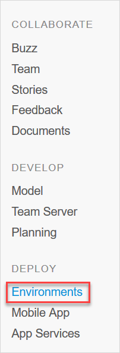
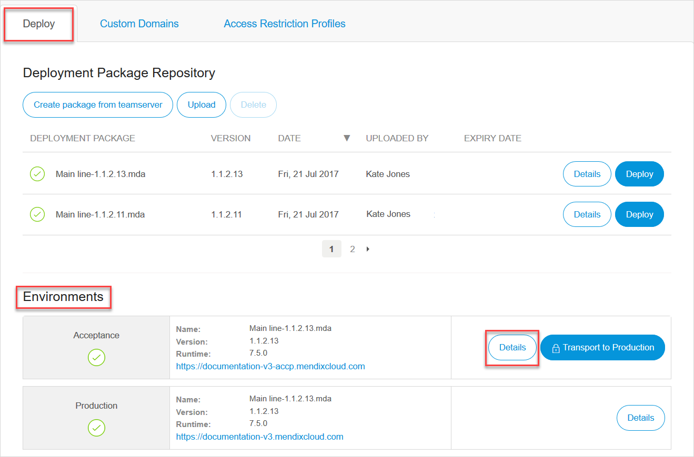
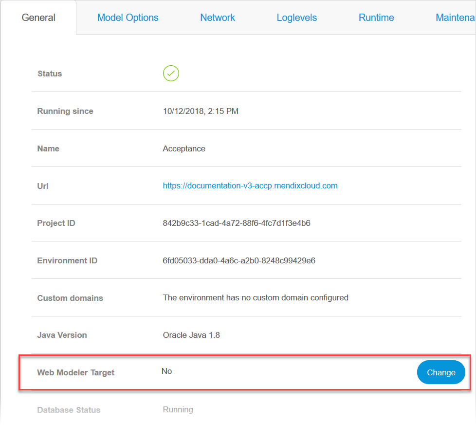

## 1 Introduction

If you have a licensed app, you need to select an environment for the Web Modeler separately. For more information on licensed apps and environments, see [Mendix Cloud](mendix-cloud-deploy) and [Environments](environments). 

{}

By default the environment is not selected for the Web Modeler. Thus, when you try to publish, you will get a warning message. For more information, see [Deploying Your App From the Web Modeler](/refguide/web-modeler/deployment-wm) in the *Web Modeler* category.

{}

## 2 Selecting Web Modeler Deployment Environment 

To select the environment for the Web Modeler, do the following:

1. Open **Deploy** > **Environments** in the left menu bar in the Developer Portal.

   

2. In the **Deploy** tab > **Environments** section, select the environment that you want to select for the Web Modeler deployment by clicking **Details**. 

   

3. In the **General** tab, select **Web Modeler Target** and click **Change**.

   

4. In the **Select Web Modeler Target** dialog window, click the drop-down menu and select the environment. 

5. Click **Save**.

You have selected the environment for the Web Modeler. 

## 3 Related Content

*   [Deploying Your App From the Web Modeler](/refguide/web-modeler/deployment-wm)
*   [Mendix Cloud](mendix-cloud-deploy)
*   [Environments](environments)
