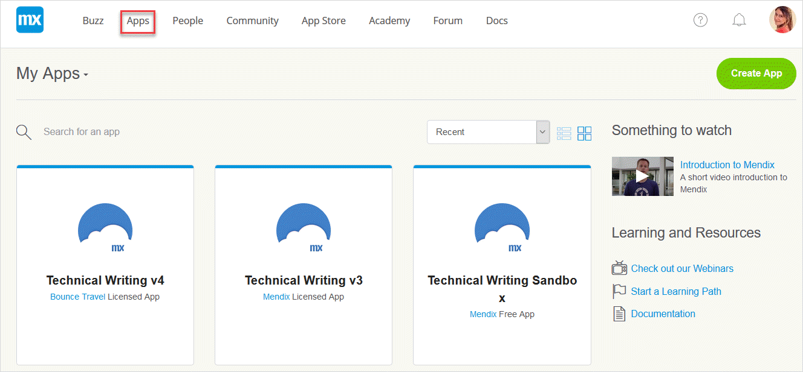
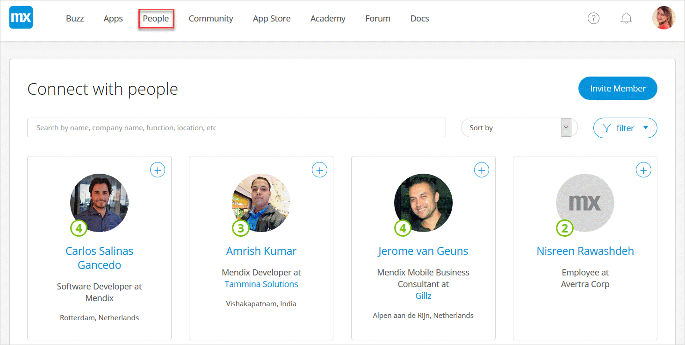

## 1 What Is the Developer Portal?

The key components of the entire Mendix Platform are the [Desktop Modeler](/refguide/desktop-modeler), [Web Modeler](/refguide/web-modeler/), and the [Developer Portal](http://home.mendix.com). The Developer Portal is where Mendix developers can collaborate, deploy, and manage their apps, company, and users. 

The Mendix Developer Portal takes a lightweight and social approach to enterprise project collaboration. The portal provides a unique combination of requirements management tools and social activity streams, offering a way to interact with colleagues, app project team members, and even external stakeholders involved in app projects.

As a collaboration tool that can be used across the enterprise, the Developer Portal breaks down walls between different departments and roles. All employees are part of the same private social network and share a wall that shows all the company **Buzz** conversations. These conversations can turned into app ideas, and ideas can be organized using a voting system and then converted into projects. The portal offers all the tools you expect from a social network, including two-way email integration. 

Besides operating as a powerful social platform, Mendix also provides tools for the Agile management of your projects. The social backlog management tools enable project team members and stakeholders to collaborate and create, refine, and prioritize user stories. Each user story has its own conversation thread, which is also published on the wall for an intuitive mix of company buzz and project activity streams. User stories can be estimated and planned in sprints. The planning overview gives team members and stakeholders the ability to monitor the progress of the current sprint using scrum boards and burn-down charts as well as to plan the sprints and releases that define the future of the project.

The Developer Portal can be used separately from other Mendix products, and the [Mendix Feedback Widget](../collaborate/use-feedback-widget) can be included in any web application. As a whole, the Mendix Platform offers an open, well-defined API, enabling third-party developers to create their own widgets, plugins, and any other innovative products they come up with.

The Developer Portal consists of the header items described below.

## 2 Buzz {#buzz}

In the company [Buzz](../collaborate/buzz), you can communicate with the users in your company:

## 3 Apps

In **Apps**, you can find your nodes, sandboxes, and company's apps:

After you select an app, you can collaborate, develop, deploy, and operate the app with your App Team:

## 4 People

In [People](../mendix-profile/#connections), you can view the other members of the Mendix community and also invite people to the Mendix Platform :

## 5 Related Content

* [Mendix Profile](../mendix-profile)
* [Company & App Roles](../company-app-roles/index)
