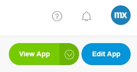

## 1 Introduction

The **Develop** category is focused around planning and developing your app. 

  

This category is divided into the three pages presented below.

## 2 Model

In the **Developer Portal**, you can open or edit the app anytime by clicking **View App** or **Edit App**.

The **Model** page is a separate page where you can open the model of your app. You can either open your model in the Desktop Modeler or in the Web Modeler.

For more details, see [Model](/developerportal/develop/model).

## 3 Team Server

Changes made through the Desktop Modeler are stored in the Mendix Team Server. This page provides an overview of the revisions committed by any of the team's members.

Here you can also find the Team Server URL (for example, `https://teamserver.sprintr.com/<your AppID>`).

For more information, see [Team Server](/refguide/team-server).

## 4 Planning

The **Planning** page provides an overview of the progression of the **Stories** in the **Collaborate** category. This page has three tabs, which are described below.

For more details, see [Planning](/developerportal/develop/planning).

### 4.1 Sprint Status Tab

Under this tab, there is a Kanban overview of the **Stories** in the current sprint. You can **Mark current Sprint as completed** and change the story status to **To-do**, **Running**, or **Done**. All the changes made on this page are directly passed on to the **Stories** page and vice versa. 

### 4.2 Burndown Chart Tab

shis tab graphically shows the progress of the current sprint. Under **Sprint History** you can view the burndown charts of the completed Sprints.

### 4.3 Release Plan Tab

Under this tab, you will get an overview of all the sprints. You can edit the sprints and click **Plan Something** to plan the following:

* **Sprint**
* **Release**
* **Other**

All the changes made on this page are directly passed on to the **Stories** page and vice versa. 

## 4 Related Content

* [Stories](/developerportal/collaborate/stories)
