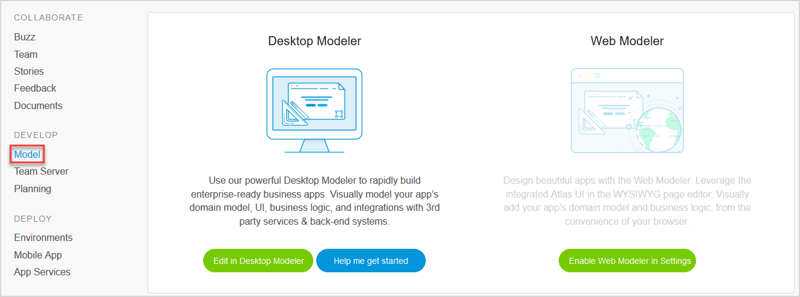

## 1 Introduction

On the **Model** page of the Developer Portal, you have options for opening up your app project in Mendix Studio or Mendix Studio Pro:

## 2 Mendix Studio Pro

In [Studio Pro](/refguide), you can visually model your app’s domain model, UI, logic, and integrations with third-party services and back-end systems. Use the power of Studio Pro to rapidly build enterprise-ready apps.

Click **Edit in Studio Pro** to open your app project in Studio Pro.

### 2.1 Getting Started

If you need some help with Studio Pro, click **Help me get started**. A page will open with steps to to start developing your new app:

1. Download the latest version of [Mendix Studio Pro](https://appstore.home.mendix.com/link/modelers/) by clicking **Download latest Studio Pro**.
2. Install Studio Pro on your computer. It will automatically start after the installation is completed.
3. Edit your new app by selecting it from the list of **Recent Apps** on the **My Apps** page in Studio Pro.

The **What's next?** section at the bottom of the page presents the following options:

* **Show me the basics** includes a link to the [Start with a Blank App](https://gettingstarted.mendixcloud.com/link/path/2) learning path in the Mendix Academy, where you will learn some fundamental information about how to model with Mendix
* **I've got a question** includes links to the Mendix [Forum](https://forum.mendixcloud.com) and the [Documentation](https://docs.mendix.com/), where you can browse information, search for specific details, and ask questions to the Mendix community
* **I'm ready to get serious** includes a link to the [Become a Rapid Developer](https://gettingstarted.mendixcloud.com/link/path/31) learning path, which will teach you how to create apps and prepare you to get certified as a Mendix Rapid Developer!

## 3  Mendix Studio

With [Studio](/studio), you can design beautiful apps by leveraging the integrated Atlas UI in the WYSIWYG page editor. You can visually add your app’s domain model and business logic, all from the convenience of your web browser.

Click **Edit in Studio** to open the app in Studio. Note that this is for Atlas UI-based apps only. If you need to enable Studio for your app project, click **Enable Studio in Settings**, which will take you to the [General Settings](../settings/general-settings) page of your app project to do this.

## 4 Read More

* [Team Server Overview](team-server)
* [Plan App Development](planning-development)
