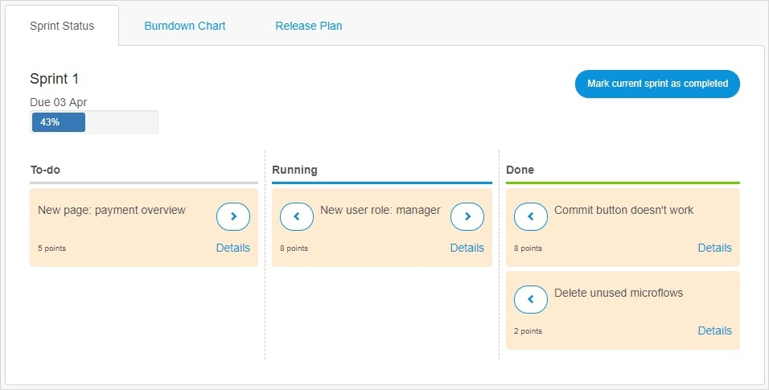
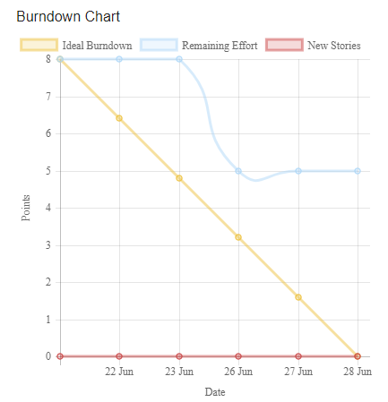

## 1 Introduction

The **Planning** page provides an overview of the progression of the **Stories** in the **Collaborate** category. This page has three tabs, which are described below.

## 2 Sprint Status Tab

Under this tab, there is a Kanban overview of the **Stories** in the current sprint. You can change the story status to the following:

* **To-do**
* **Running**
* **Done**

There is also a percentage bar of the stories that are done and the deadline date of the current sprint. You can mark the current sprint as completed only when all stories have the **Done** status.

{}

All the changes made on this page are directly passed on to the **Stories** page and vice versa.

{}

## 3 Burndown Chart Tab

This tab graphically shows the progress of the current sprint:

* **Ideal Burndown** – shows the expected progress if the sprint is completed at a consistent rate
* **Remaining Effort** – shows the amount of story points that still have to be completed
* **New Stories** – shows the amount of new story points added on a specific day

Under **Sprint History**, you can view the burndown charts of the completed sprints.

## 4 Release Plan Tab

Under this tab, you will get an overview of all the sprints. You can edit the sprints and click **Plan Something** to plan the following:

* Sprint
* Release
* Other

You can click **Edit** to make changes in a specific sprint/release (for example, to rename, change the date, or the duration of the sprint).

{}

All the changes made on this page are directly passed on to the **Stories** page and vice versa.

{}

## 5 Related Content

* [How to Manage Sprints and Stories](/developerportal/howto/managing-your-application-requirements-with-mendix)
* [Roles Within the Company and Apps](/developerportal/general/roles)
* [Stories](/developerportal/collaborate/stories)
