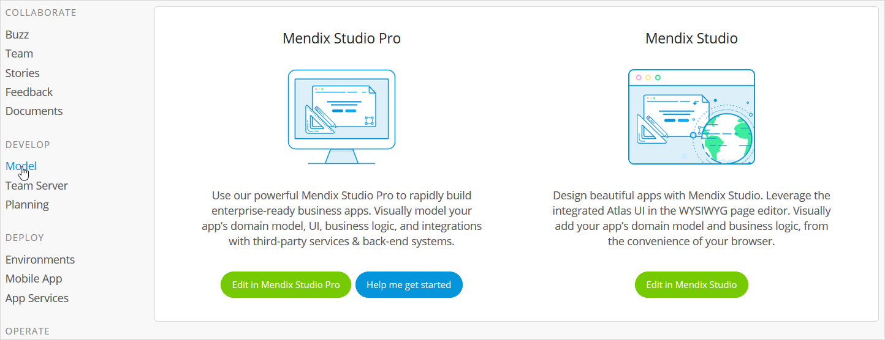

## 1 Introduction

On the **Model** page of the Developer Portal, you will have options for opening up your app project in the Desktop Modeler and the Web Modeler:

## 2 Desktop Modeler

Use the powerful Mendix Desktop Modeler to rapidly build enterprise-ready apps. In the Desktop Modeler, you can visually model your app’s domain model, UI, logic, and integrations with third-party services and back-end systems. 

Click **Edit in Desktop Modeler** to open your app in the Desktop Modeler.

### 2.1 Help with Getting Started

If you need some help with the Desktop Modeler, click **Help me get started**. A page will open describing the steps you can take to quickly start developing your new app:

1. Download the Mendix Desktop Modeler by clicking **Download latest Desktop Modeler**.
2. Install the Desktop Modeler on your computer. The Modeler will automatically start after the installation is completed.
3. Edit your new app by selecting it from the list of **Recent Apps** on the **My Apps** page in the Desktop Modeler.

The **What's next?** section at the bottom of the page presents the following options:

* **Show me the basics** includes a link to the [Start with a Blank App learning path](https://gettingstarted.mendixcloud.com/link/path/2), where you will learn some fundamental information about how to model with Mendix
* **I've got a question** includes links to the Mendix [Forum](https://gettingstarted.mendixcloud.com/index3.html) and the [Documentation](https://docs.mendix.com/), where you can browse information, search for specific details, and ask questions to the Mendix community
* **I'm ready to get serious** includes a link to the [Become a Rapid Developer learning path](https://gettingstarted.mendixcloud.com/link/path/10), which will teach you how to create apps and prepare you to get certified as a Mendix Rapid Developer!

## 3  Web Modeler

With the Web Modeler, you can design beautiful apps by leveraging the integrated Atlas UI in the WYSIWYG page editor. You can visually add your app’s domain model and business logic, all from the convenience of your web browser.

Click **Edit in Web Modeler** to open the app in the Web Modeler (for Atlas UI-based apps only). If you need to enable the Web Modeler for your app project, click **Enable Web Modeler in Settings**, which will take you to the [General Settings](../settings/general-settings) page of your app project to do this.

## 4 Related Content