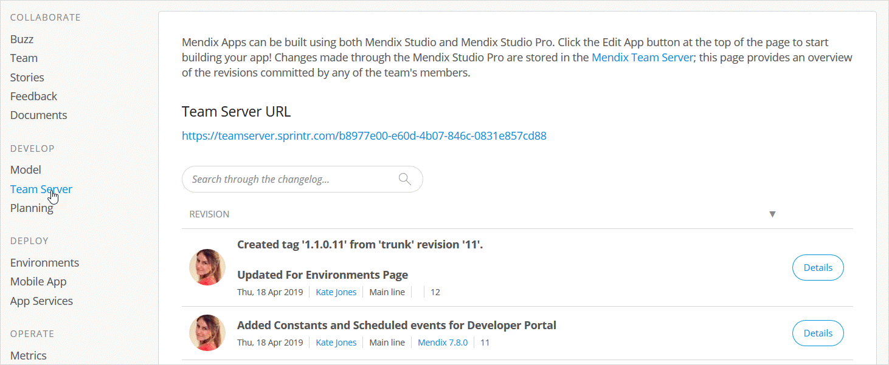
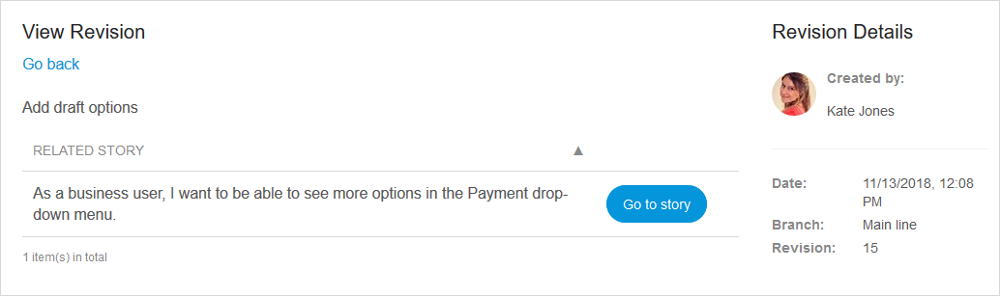
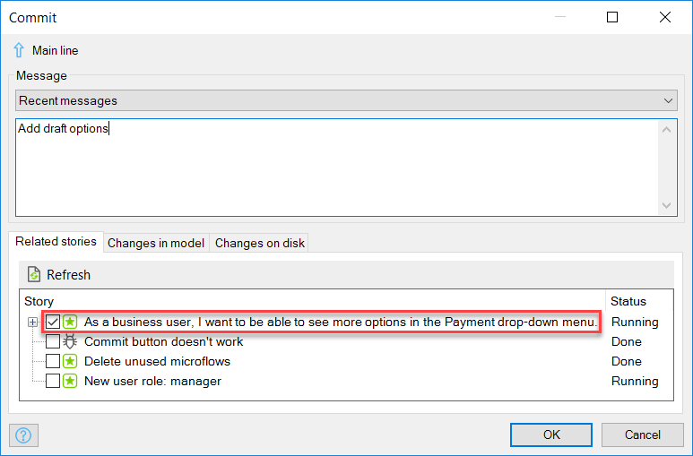

## 1 Introduction

On the **Team Server** page of the Developer Portal, an overview is presented of the changes and revisions made to the app project in the Desktop Modeler:

Here you can also find the **Team Server URL**, which takes the following form: `https://teamserver.sprintr.com/<your AppID>/`.

{}
You may have to add the final slash in the URL manually to follow the link.
{}

## 2 Revision Summary

In each revision, you can see the following information:

* The message in the revision commit
* The date of the revision commit
* The name of the App Team member who committed the revision
* The branch to which the revision was committed
* The Mendix Desktop Modeler version used
* The revision number

## 3 Revision Details

When you click **Details** for a revision, it is possible to see the stories related to that revision:

Related stories will only appear if you select them in the **Commit** dialog box of the Desktop Modeler when committing:

## 4 Related Content

* [Stories](/developerportal/collaborate/stories)
* [Company & App Roles](/developerportal/company-app-roles/index)
