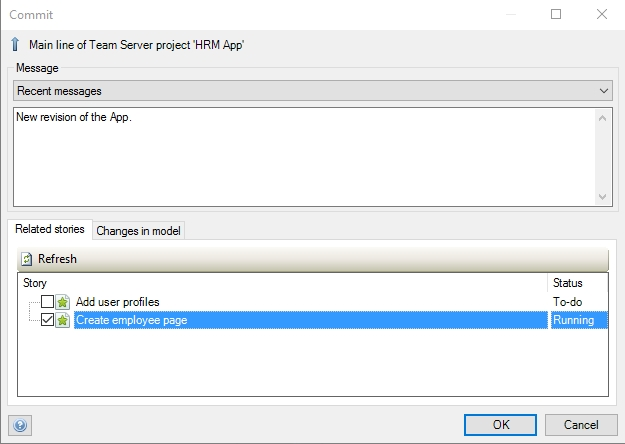

## 1 Introduction

Changes made through the Desktop Modeler are stored in the Mendix **Team Server**. This page provides an overview of the revisions committed by any of the team's members.

## 2 Revision

In a revision, you can see the following information:

* The date of the committed revision
* The team member that committed the revision
* The branch to which the revision was committed
* The Mendix Modeler version
* The revision number

### 2.1 Details

When you click **Details** for a revision, the following extra information is presented about that revision:

* The message in the revision commit
* The related stories

**Related Stories** will only appear if you select them in the commit dialog box of the Desktop Modeler.

## 3 Related Content

* [Stories](/developerportal/collaborate/stories)
* [Company & App Roles](/developerportal/company-app-roles/index)
* [Stories](/developerportal/collaborate/stories)
