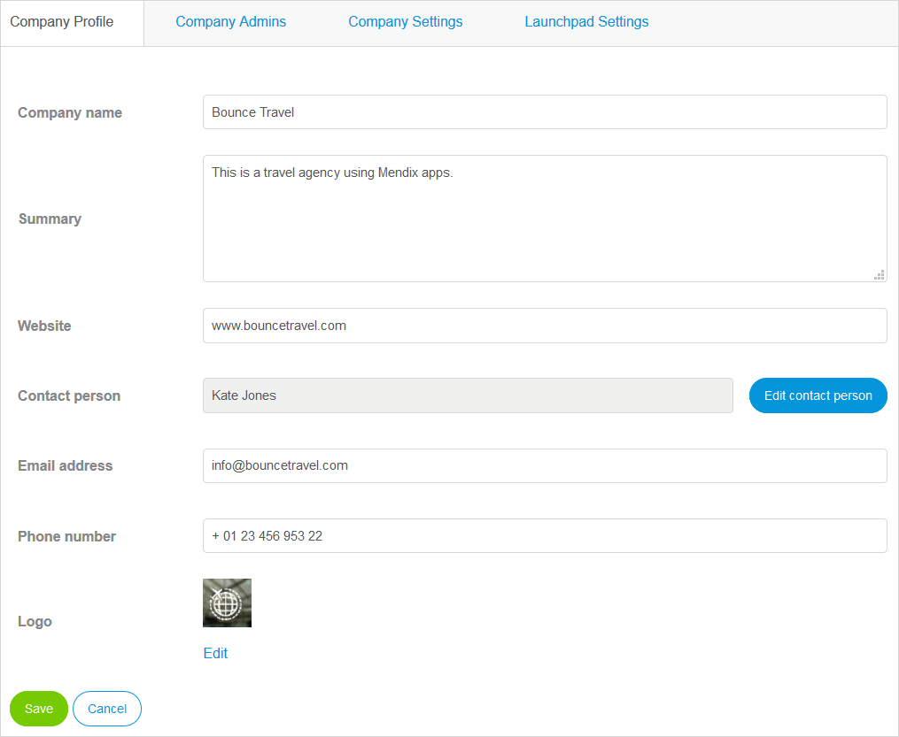

## 1 Introduction

{}
You must be a Company Admin to access this page and these settings.
{}

There are four tabs on the **Company ** page with settings to manage:

## 2 Company Profile Tab

You can edit various company details on the **Company Profile** tab, such as **Company name**, **Contact person**, and **Logo**.

## 3 Company Admins Tab

On the **Company Admins** tab, you can add, edit, or remove a Company Admin.

For more information, see [How to Manage Company & App Roles](/developerportal/general/change-roles).

## 4 Company Settings Tab{#company-settings}

On the **Company Settings** tab, you can change the password expiration settings (number of days). To do this, set the password expiration (in days) and click **Save**. Note that a value of zero or lower indicates that passwords never expire.

You can also view the company email domains. This is important for verifying the domains of Mendix users assigned to your company. If the domain list contains incorrect domains or does not contain some of your company's email domains, contact [Mendix Support](mailto:support@mendix.com).

## 5 Launchpad Settings Tab

On the **Launchpad Settings** tab, you can select the background image for the [Mendix launchpad](https://home.mendix.com/home/).

## 6 Related Content

* [Company Admin Settings](companyadmin-settings)
* [Users](nodes)
* [Apps](apps)
* [Nodes](nodes)
