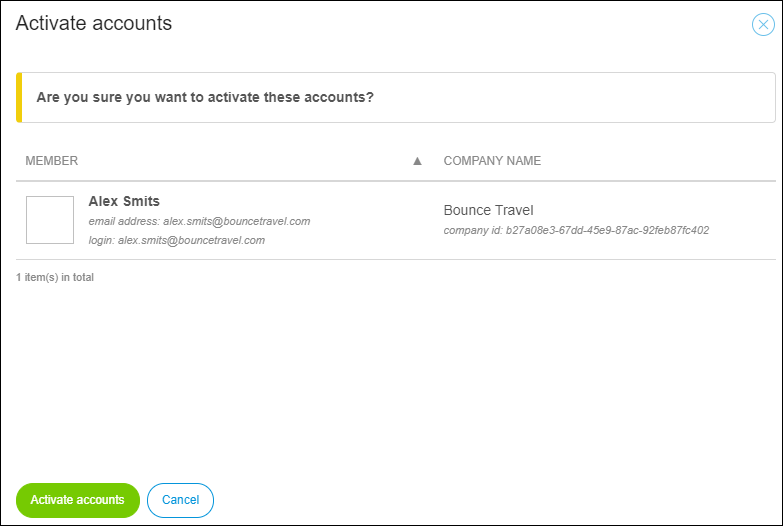

## 1 Introduction

For security reasons, deactivating the Mendix profile of an employee leaving your company is recommended.

If the employee returns to your company, the Mendix profile can be activated again. 

**This how-to will teach you how to do the following:**

* Deactivate users
* Activate users

## 2 Prerequisites

Before starting this how-to, make sure you have completed the following prerequisites:

* Have the **Company Admin** role in your Mendix company (for more information, see [Company Admin](/developerportal/companyadmin))

## 3 Company Admin Settings

To manage the users in your company, follow these steps:

1. Go to the [Developer Portal](http://home.mendix.com).
2.  Click your avatar in the top-right corner of the screen:

    

3. Click **Company Admin**.
4. Click **Users** in the left navigation panel.

### 3.1 Deactivating Users

To deactivate a user, follow these steps:

1.  On the **Users** page of the **Company Admin** settings, select the check boxes of the the users that you want to activate or deactivate, and click **Activate / Deactivate user**.

    

2.  In the pop-up window that appears, click **Deactivate member(s)**:

    

The deactivated user will become inactive and will imidiately dissapear from the list. If you click **Filter** and select **Inactive**, you will see the deactivated users.

You can only deactivate a user. It is not possible to delete a user completely.

   

### 3.2 Activating Users

Follow these steps to activate an inactive user:    

1.  On the **Users** page of the **Company Admin settings** click **Filter**.
2.  Click **Inactive**. The list with company users will be extended with inactive deactivated users.

    

3.  Select the inactive user and click **Activate / Deactivate user**.
4.  In the pop-up window that appears, click **Activate accounts**.         

    

## 4 Related Content

* [How to Activate or Deactivate Your Mendix Account](/howtogeneral/support/how-to-activate-or-deactivate-your-mendix-account)
