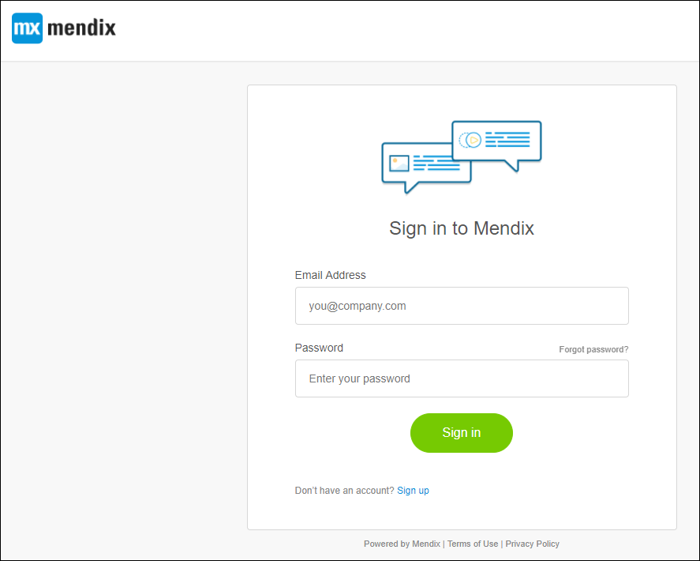
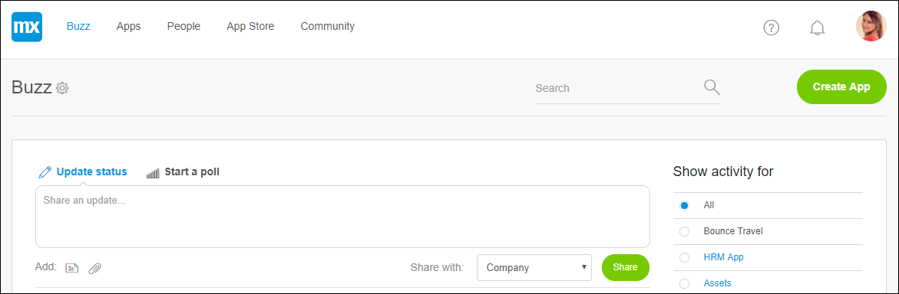
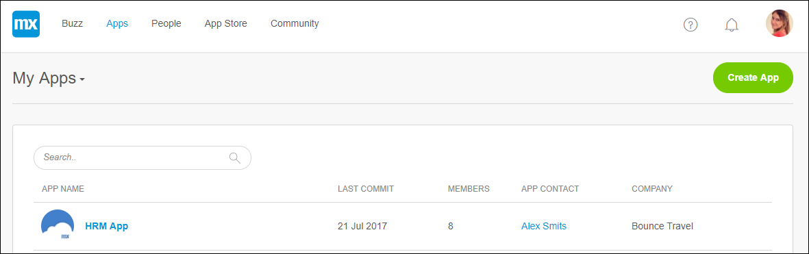
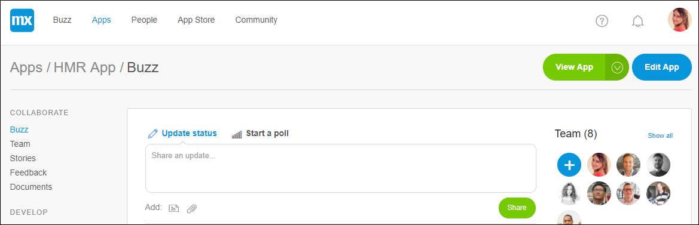
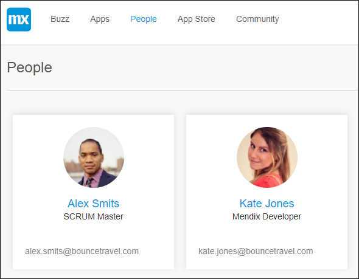
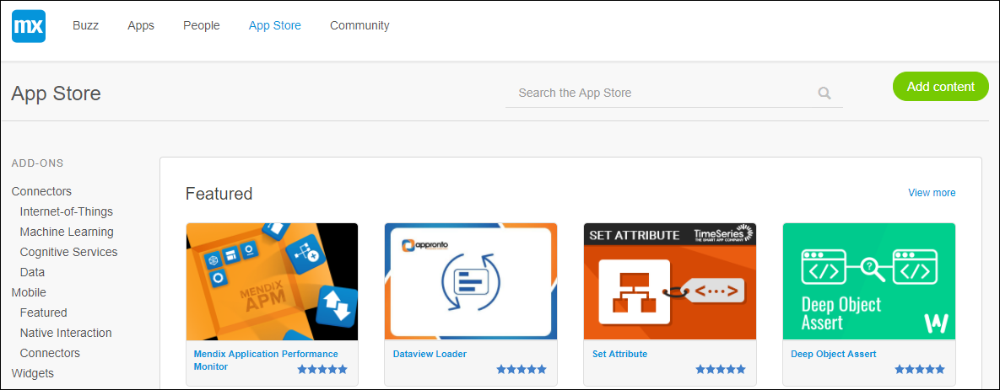
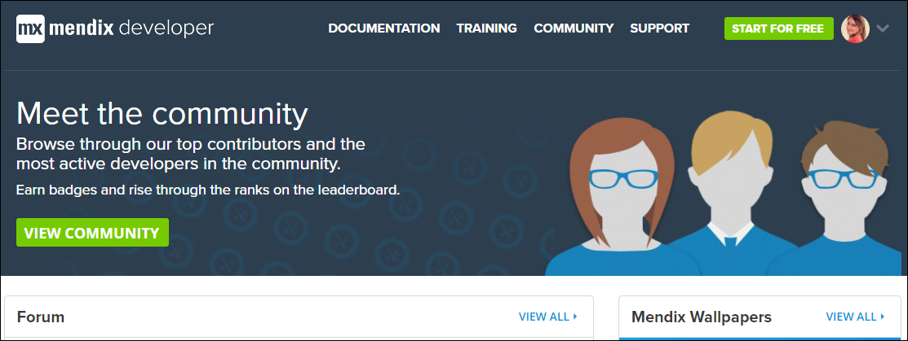

## 1 Developer Portal

The Developer Portal [home.mendix.com](http://home.mendix.com) is a platform for Mendix Developers to collaborate, deploy and manage their apps, company and users. 

  

The Developer exists of the following parts:

### 1.1 Buzz

In the company **Buzz** you can communicate with the users of your company.

  
  
### 1.2 Apps

In **Apps** you can find your nodes, sandboxes and company's apps.

  

If you select an app can collaborate, develop, deploy and operate the app with your App Team.

  
  
### 1.3 People

In **People** you can view the other members of your company.

  
  
### 1.4 App Store

The **App Store** has modules, widgets, themes, connectors etc. to extend your app.

  
  
### 1.5 Community  

In **Community** you can find documentation, forums, trainings, support and many more.

  

## 2 Documents in This Category

* [Mendix Profile](mendixprofile)
* [Roles Within the Company and Apps](roles)
* [Three Ways to Leave Your App](leave-app)
* [Two-Factor Authentication](twofactor-authenticator)
