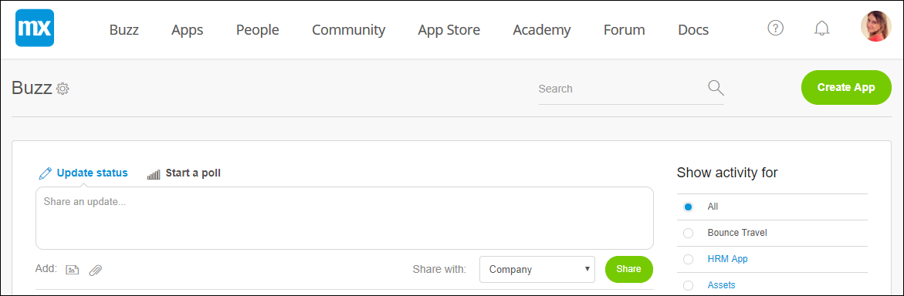
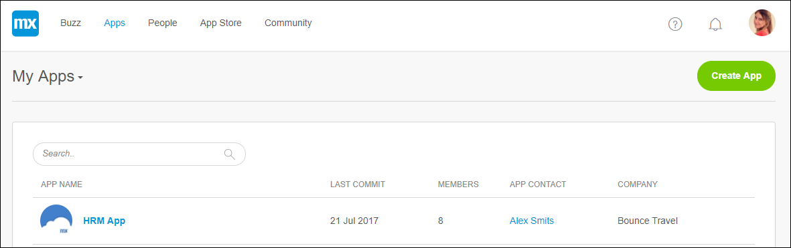
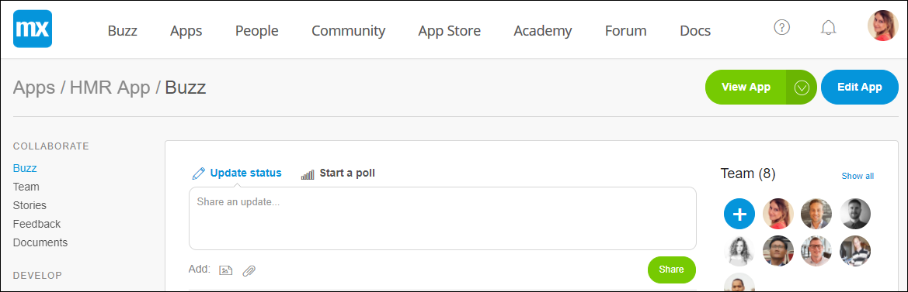
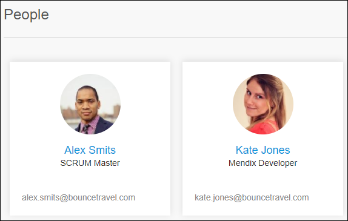

## 1 Introduction to the Developer Portal

The [Developer Portal](http://home.mendix.com) is the platform for Mendix developers to collaborate, deploy, and manage their apps, company, and users. 

The Developer Portal consists of the header items described below.

### 1.1 Buzz {#buzz}

In the company **Buzz**, you can communicate with the users in your company.

### 1.2 Apps

In **Apps**, you can find your nodes, sandboxes, and company's apps.

After you select an app, you can collaborate, develop, deploy, and operate the app with your App Team.

### 1.3 People

In **People**, you can view the other members of the Mendix community and also invite people to the Mendix Platform :

## 2 Documents in This Category

* [Mendix Profile](mendix-profile)
* [Roles Within the Company and Apps](roles)
* [Technical Contact](technical-contact)
* [Three Ways to Leave Your App](leave-app)
* [Two-Factor Authentication](twofactor-authenticator)
