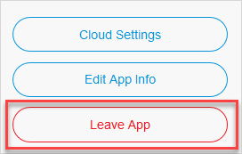
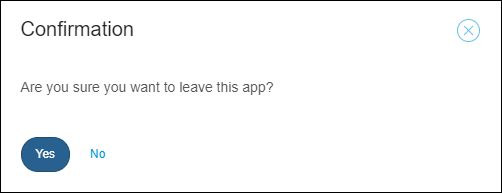
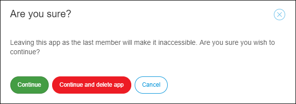

## 1 Introduction

You can create a new app in one click and leave it just as easily if you are not using it anymore. However, if you are thinking about leaving an app, consider whether you may want to use that app later for any reason.

There are three ways to leave an app, which are described below.

## 2 Leaving, Deleting, or Deactivating Your App

If you want to leave, delete, or deactivate your app, follow these steps:

1. Go to the [Developer Portal](http://home.mendix.com).
2. Click **Apps** in the top navigation panel and select the app that you want to leave.
3. Click **General** under the **Settings** category.
4. Click **Leave app**.

        

### 2.1 Leaving the App with Team Members

You can only leave an app when you are NOT the **Technical Contact**.

After leaving, the app will still exist in the company and it will be available for other team members.

If you want to return to the app team, other team members can add you again by inviting you to the app.

    

### 2.2 Leaving the App Without Team Members

You can leave an app if you are the only team member of the app and still keep the app in the company. This way, the app will be deactivated.

Because the app will still exist within the company, only the **Company Admin** can activate the app and invite members to it.

To leave and deactivate the app, click **Continue**

   

To activate the app as a Company Admin, follow these steps:

1. In the [Developer Portal](http://home.mendix.com), go to the **Company Admin** Portal.
2. In the **Apps** tab, select the app that must be activated and click **Activate**.

### 2.3 Leaving and Deleting the App Without Team Members

You can leave and delete an app when you are the only member in the app. This is irreversible. The app will be deleted from the company.

To leave and delete the app, click **Continue and delete app**.

    

## 3 Related Content

* [Apps](/developerportal/general/apps)
* [Company Admin Overview](/developerportal/general/companyadmin-overview)
* [How to Deactivate and Activate Users](/developerportal/howto/deactivate-users)
* [How to Delete, Deactivate, and Activate Apps](/developerportal/howto/delete-apps)
* [General](/developerportal/settings/general-settings)
* [How to Manage Company Roles and App Roles](/developerportal/howto/change-roles)
* [Roles Within the Company and Apps](roles)
* [Settings](/developerportal/settings)
