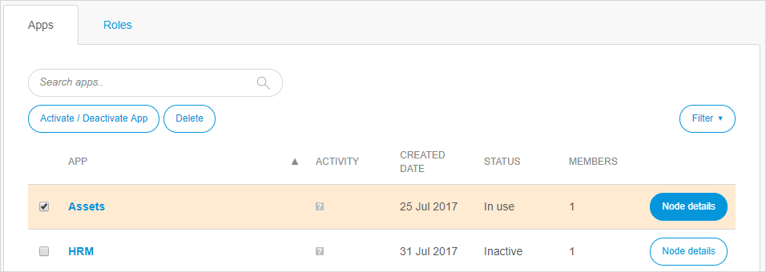

## 1 Introduction

You can create a new app project in one click and leave the app project just as easily when you are not using it anymore. However, if you are thinking about leaving an app, consider carefully whether you may want to use that app later for any reason.

Your ability to delete, deactivate, and activate an app depends on your App Team role:

* A **SCRUM Master** is allowed to deactivate and delete an app (even when there are still App Team members for the app)
* A custom role with the **App Settings** permission is also allowed to deactivate and delete an app (even when there are still App Team members for the app)
* A **Company Admin** is allowed to deactivate, delete, and activate all the company's apps (with or without App Team members for the app)

For more information on roles, see [Roles Within the Company and Apps](/developerportal/general/company-app-roles).

**This how-to will teach you how to do the following:**

* Leave an app (as a SCRUM Master)
* Delete an app (as a SCRUM Master)
* Deactivate an app (as a SCRUM Master and Company Admin)
* Activate an app (as a Company Admin)

## 2 Prerequisites

Before starting this how-to, make sure you have completed the following prerequisites:

* To delete or deactivate an app, have the **SCRUM Master** role on your App Team (or a custom role with the **App Settings** permission)
* To activate an app, have the **Company Admin** role in your company

## 3 Leaving & Deleting an App

There are some important points to understand when you want to leave and/or delete an app:

* You cannot delete or deactivate an app if you are the **Technical Contact** of the app
* Only Free Apps can be deleted
* App deletion cannot be undone, which means that ALL DATA WILL BE LOST, including all files on the [Team Server](/refguide/team-server) and all data in the Free App [node](node) (if applicable)

If you want to leave and delete your app, follow these steps:

1. Go to the [Developer Portal](http://home.mendix.com), click **Apps** in the top menu bar, and select the app that you want to leave.

2. In the app's sidebar menu, select **Settings** > **General**.

3. In the upper-right corner of that page, click **Leave app**:

   

4. Confirm leaving the app by clicking **Yes** (the pop-up window states the app will be deactivated if you are the only/last member of the App Team):

   

  * If you leave an app project that still has App Team members, the app will still exist in the company and it will be available for other team members. If you want to return to the App Team, other team members can invite you again to the app.

5. If the app will be made inaccessible upon your leaving, a final confirmation is necessary:

  * Click **Continue** to just leave your app 
    * If you are the only App Team member of the app project, clicking **Continue** allows you to leave the app project and deactivates the app (note that because the app will still exist in the company, only the Company Admin can activate the app and invite members to it – see the [Deactivating & Activating an App](#deactivating) section below for details)

  * Click **Continue and delete app** to leave and fully delete the app from your company

   

## 4 Deactivating & Activating an App {#deactivating}

There are some important points to understand when you want to deactivate or activate an app:

* Only Free Apps can be deactivated
* A deactivated app still exists in the company, but it is invisible to regular users (because only a Company Admin can activate an inactive app)
* Licensed apps with a node can only be offboarded by Mendix Support (to offboard an app, you must submit a [Mendix Support](https://support.mendix.com/hc/en-us) request)

To deactivate or activate an app as a Company Admin, follow these steps:

1. Go to the [Developer Portal](http://home.mendix.com).

2. Click your avatar in the top-right corner of the screen and select **Company Admin**:

  

3. Select **Apps** from the sidebar menu to see the apps for deactivating/activating.

4. Select one of these actions to perform:

	* To deactivate an active app, select an app with a **Status** of **In Use** and click **Activate / Deactivate App**
	* To activate an inactive app, select an app with a **Status** of **Inactive** and click **Activate / Deactivate App**

  

5. In the pop-up window that appears, confirm you choice (by clicking either **Deactivate apps** or **Activate apps**, according to the scenario).

## 5 Related Content

* [Apps](/developerportal/general/apps)
* [Company Admin Overview](/developerportal/general/companyadmin-overview)
* [General](/developerportal/settings/general-settings)
* [How to Manage Company Roles and App Roles](/developerportal/howto/change-roles)
* [Roles Within the Company and Apps](company-app-roles)
* [Settings](/developerportal/settings)
