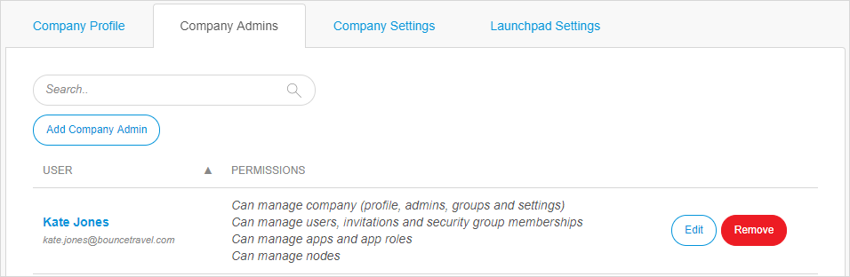
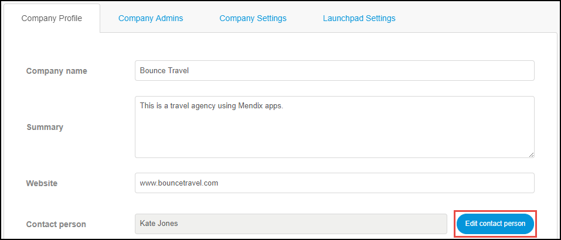

## 1 Introduction

Within the company, it is important to keep the roles of Mendix users up to date. Some roles have important privileges that cannot be used for unintended purposes.

When the Mendix company and app roles as well as the contact information are implemented and maintained correctly, there is better internal communication and operational processes. 

**This how-to will teach you how to do the following:**

* Add a Company Admin
* Change the Company Contact, App Contact, and Technical Contact
* Edit App Team roles

## 2 Prerequisites

Before starting this how-to, make sure you have completed the prerequisites described below:

* To add extra Company Admins, you need to be a **Company Admin**
* To change the App Contact, you need to have a **SCRUM Master** role or possess the App Team **Settings** permission 
* To change the Technical Contact, you need to be a **Technical Contact **

## 3 Adding a Company Admin

A company can have multiple Company Admins to manage the company's settings, users, apps, and nodes. 

When you are a Company Admin, you can add extra Company Admins by following these steps:

1.  Go to the [Developer Portal](http://home.mendix.com), click your avatar in the top-right corner of the screen and select **Company Admin**:

	

2.  Select the **Company Admins** tab:

	

3. Click **Add Company Admin**.
4.  Select the users that should be changed into Company Admins, then select the permissions:

    * **Can manage Company** – can manage all the settings of the company
    * **Can manage Users** – can manage only the **Users** page of the company settings
    * **Can manage Apps** – can manage only the **Apps** page of the company settings
    * **Can manage Nodes** – can manage only the **Nodes** page of the company settings

	

5. Click **Add**.

## 4 Changing the Company Contact {#change-company-contact}

A company can have multiple Company Admins to manage the company's settings, users, apps, and nodes. Because there can be multiple Company Admins, one Company Admin must be the **Contact person** regarding the company operations.

The Company Admin can change the Company Contact by following these steps:

1. Go to the **Company Profile** tab and click **Edit contact person**:

    

2. Select the user that will be the new **Contact person** and click **Select**. The change will be automatically saved. 

## 5 Changing the App Contact {#change-app-contact}

An app intended for other company users always has a contact person to address questions regarding the app.

You can change the App Contact by following these steps:

1. Go to the [Developer Portal](http://home.mendix.com), click **Apps** in the top navigation panel, and select the app for which you want to change the App Contact.
2. Click **General** under the **Settings** category.
3. Click **Edit App Info** in the top-right corner.

    {}
    {}

4. Below **App Contact**, select a new App Contact from the drop-down menu.
5. Click **Save**.    

## 6 Changing the Technical Contact {#change-technical-contact}

A node can have only one Technical Contact to manage the node's environments, deployment repositories, backups, alerts, etc. 

You can change the Technical Contact by following these steps:

1. Go to the [Developer Portal](http://home.mendix.com) and click **Apps** in the top navigation panel.
2. Click **My Apps**, and in the drop-down list, click **Nodes**.

    

3. Select the node for which you want to change the Technical Contact.
4. Click **Security** under the **Settings** category.
5. Select the **Node Permissions** tab.
6. Below the name of the new Technical Contact, click **Change to Technical Contact**. The Technical Contact will be changed for all environments. The change will be automatically saved.

          

## 7 Editing App Team Roles {#edit-app-team-roles}

It is possible to change or add new App Team roles for a specific app or at the company level for all company apps. This depends on your role:

* 	As a SCRUM Master, you can edit roles for the specific app of which you are the SCRUM Master by selecting **Team** > **Manage Team**, clicking **Role settings,** then making your edits or clicking **New role** to create a custom new App Team role for that app

	

*  As a [Company Admin](companyadmin-settings), you can edit roles at the company level by clicking **Role settings** on the [Roles Tab](apps#roles-tab) of your Company Admin's [Apps](apps) page to edit the roles (the changes will affect every app created in the company after the change)

	

## 8 Related Content

* [Company & App Roles Overview](/developerportal/general/company-app-roles)
* [Company Admin Settings](/developerportal/general/companyadmin-settings)
* [How to Leave & Delete an App](../settings/leave-delete-app)
* [How to Deactivate & Activate an App](../general/deactivate-activate-app)
* [Security – Node Permissions](/developerportal/settings/node-permissions)
* [Technical Contact](/developerportal/general/technical-contact)

