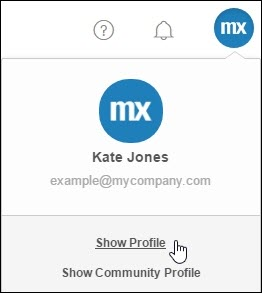
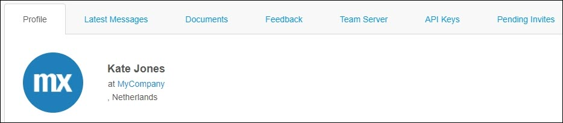
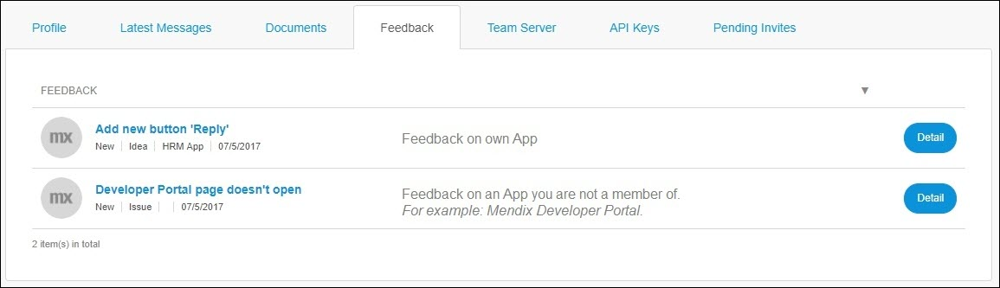
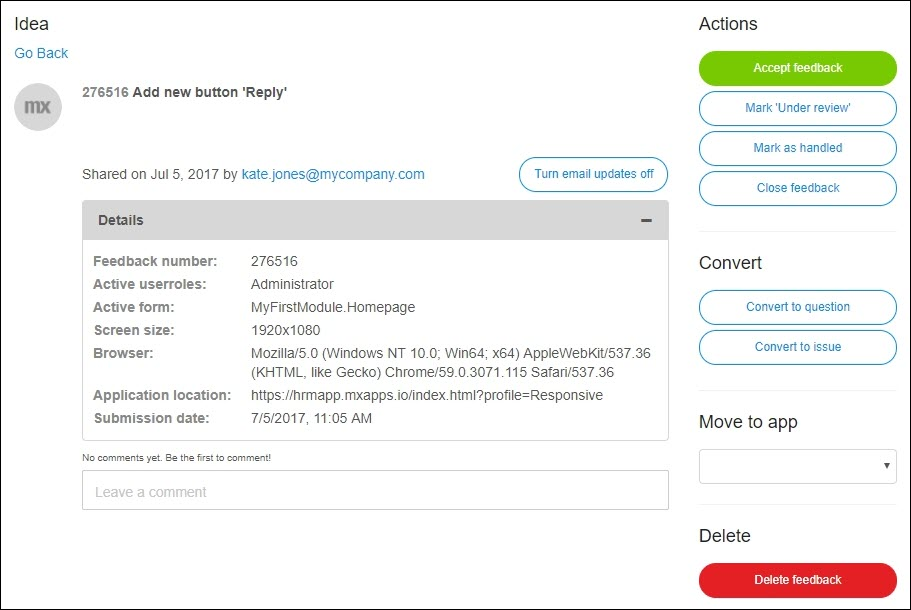
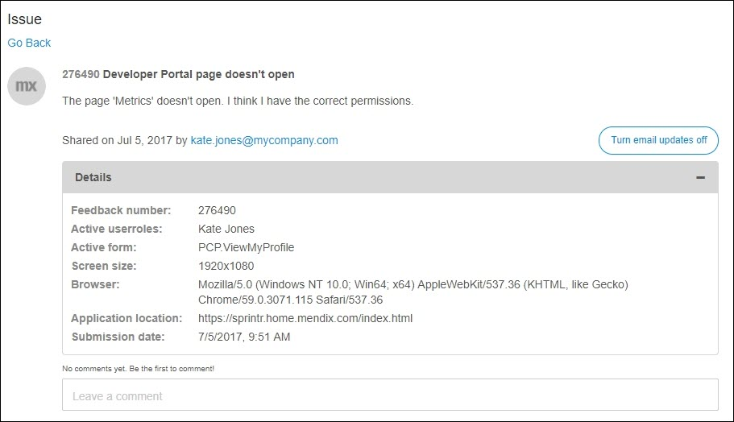

## 1 Show Profile

To view your own profile in the **Developer Portal**, simply click your avatar in the top-right corner of the navigation panel, then select **Show Profile**.

Here you can manage the following tabs:

* **Profile**
* **Latest Messages**
* **Documents**
* **Feedback**
* **Team Server**
* **API Keys**
* **Pending Invites**

### 1.1 Profile

In this tab, you can view the following information:

* **Summary**
* **Department**
* **Birthday**
* **Phone number**
* **Email**
* **OpenID** – an identifier generated by Mendix to uniquely identify a user

### 1.2 Latest Messages

In this tab, you will get an overview of all the notifications from the **Buzz** of which you are a part. For example, when your colleague has done the following:

* Created an app, sprint, or story
* Added a file or comment
* Joined a new app team 

### 1.3 Documents

In this tab, you will get an overview of all the documents that you have shared within different apps in the Developer Portal.

### 1.4 Feedback

In this tab, you can view your provided feedback on the following:

* Apps of which you are a team member
* Your company's apps of which you are *not* a team member
* External apps (for example on Mendix).

If you click **Details** for the feedback on an app of which you are a member, you can manage it:

If you click **Details** for the feedback on an app of which you are *not* a member, you cannot manage it:

### 1.5 Team Server

Changes made through the Desktop Modeler are stored in the Mendix Team Server. This tab provides an overview of the revisions you have committed.

### 1.6 API Keys

In this tab, you can view and create API keys that can be used by external applications to connect to the APIs of the Developer Portal on behalf of your user account. These keys allow you to execute operations (or have them executed on your behalf) that require authentication but for which you do not want to pass your actual password. An example of this is to use an API key to perform scripted operations on your application model with the Platform SDK.

For more information, see [Mendix Platform SDK](/apidocs-mxsdk/mxsdk).

### 1.7 Pending Invites

In this tab, you can view your sent and received invitations.

There are two types of invitations:

* Project invitation – an invitation to join the development team to work on an app
* App invitation – an invitation to join the app as a user

## 2 Edit Profile

In the right-top corner of your profile page, click **Edit** to manage your profile. You can edit your avatar and manage the following:

* General information
* Information about your work status
* Some contact info that will come in handy
* Your password

### 2.1 General

In this section, you can change the following details about you:

* Full name
* Email
* Email notifications
* Date of birth

### 2.2 Information About Your Work Status

In this section, you can change the following details about you:

* Job title
* Department
* Location
* Country

### 2.3 Some Contact Info Will come in Handy

In this section, you can change the following details about you:

* Phone number
* Website URL
* Twitter name
* LinkedIn URL
* Skype name

### 2.4 Change Password

Here you can change your password. By default, you are requested to change your password every 90 days. Only the **Company Admin** is allowed to change the expiration period.
 
These are the password requirements:

* At least eight characters long
* Constructed with at least one of each of:
    * uppercase letter
    * lowercase letter
    * number
    * special character (such as `!` `+` `@`)

## 3 Related Content

* [Company Admin](/developerportal/companyadmin)
* [How to Deactivate and Activate Users](/developerportal/howto/deactivate-users)
* [Feedback](/developerportal/collaborate/feedback)
* [How to Manage Company Roles and App Roles](/developerportal/howto/change-roles)
* [Mendix Platform SDK](/apidocs-mxsdk/mxsdk)
* [How to Provide Feedback on Mendix](/developerportal/howto/feedback-mendix)
* [Roles Within the Company and Apps](/developerportal/general/roles)
* [How to Use the Mendix Feedback Widget](/developerportal/howto/gathering-user-feedback)
