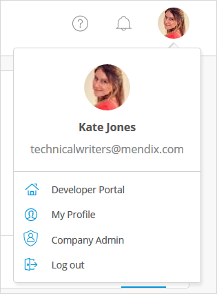
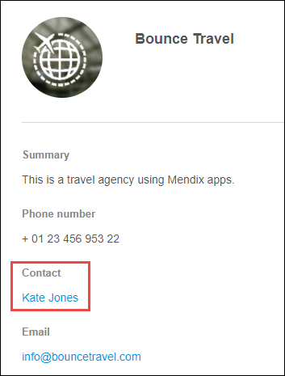
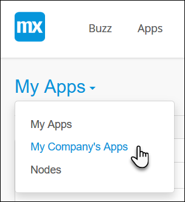
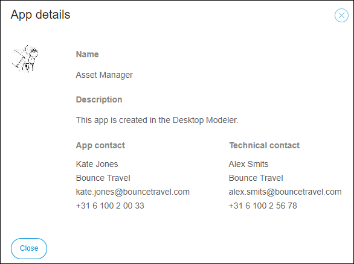
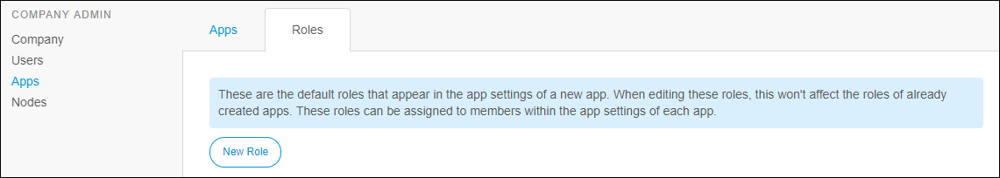
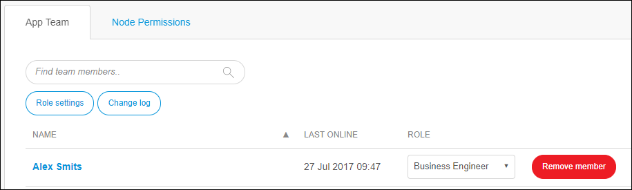

## 1 Introduction

In order to use Mendix, you must sign up to create an account. With this signup you create a MxID, and this ID will be linked to a company. If the company already exists, you will join the company. If it is a new company, a new company will be created and you will automatically join it.

To make changes to the roles, see [How to Manage Company Roles and App Roles](/developerportal/howto/change-roles).

The roles defined within a company and the company's apps are described below.

## 2 Company Roles

Everyone with the same email domain will be automatically placed in the same company. For example, all the users that sign up with an email address with the `@bouncetravel.com` emaildomain will automatically join the company named *Bounce Travel*.

Within the company there are three roles, which are described below.

### 2.1 Company Admin

The Company Admin is a Regular User with additional privileges. A Company Admin role is a super role that is allowed to manage all the settings of the company, including the settings of apps, nodes, and users. A company can have multiple Company Admins, but Regular Users cannot see who has the Company Admin role.

These are the permissions of a Company Admin:

* Can manage company (profile, admins, groups and settings)
* Can manage users, invitations, and security group memberships
* Can manage apps and app roles
* Can manage nodes

 

For more details, see [Company Admin Overview](/developerportal/general/companyadmin-overview).

### 2.2 Company Contact

Because a company can have multiple Company Admins and Regular Users cannot see who has the the Company Admin role, making one of the Company Admins the Company Contact is recommended. The Company Contact is visible to Regular Users and with the Company Admin role, the Company Contact will be able to perform company operations on behalf of all Company Admins.

To view the Company Contact, follow these steps:

1. Go to the [Developer Portal](http://home.mendix.com).
2. In the top-right corner, click your avatar:

    

3. Click **My Profile**.
4. Below your name, click your the name of your company:

    

5. Below **Contact**, you will see the Company Contact:

    

### 2.3 Regular Users

Regular Users are all company members. Regular Users can join the company, start building apps, and view other apps made within the company. 

Under **My Company's Apps** in the [Developer Portal](http://home.mendix.com), the Regular Users can view the apps made within the company by clicking.

The Regular Users cannot join the apps by themselves. If they want to join an app that they are not a member of, they have to ask any Team Member (with an *invite* permission) of the app to send an invitation. Because the Team Members are not visible , contact the the App Contact to send the invitation is recommended. Therefore, it is important that the App Contact has the correct permissions to manage the app (for example, the Scrum Master role).

 

## 3 App Roles

As a Regular User you can view apps made within the company by clicking **My Company's Apps** in the [Developer Portal](http://home.mendix.com). If you select a specific app, you will see two responsible roles for the app. You can contact them with questions related to the app.

 

If you are a Team Member of an app, you can view the app roles in **Settings** > **General**.

 

The app roles are described below.

### 3.1 App Contact

The App Contact is visible to Regular Users and is the go-to person for questions related to the app. If you build your own app, you will automatically become the App Contact and you will have a **Scrum Master** role within the **App Team** roles.

If the App Contact changes, it is recommended to provide the new App Contact with the App Team Scrum Master role. The App Contact will be the contact person for Regular Users and will be able to perform app operations on behalf of all Scrum Masters.

### 3.2 Technical Contact

The Technical Contact manages the technical deployment settings of the app. The Technical Contact can be responsible for different deployment platforms: Mendix Cloud node, on-premises, other plaforms such as MxBlue, Azure etc. 

With an app hosted in the Mendix Cloud, the Technical Contact is the first contact for App Team members regarding the **Node Permissions** and node operations.

Only the Technical Contact is allowed to do the following:

* Manage users with node permissions
* Make adjustments to environments (resize/new environments etc.)
* Manage licenses (renewals/activation/upgrades)
* Configure alert settings

For more information, see [Technical Contact](/developerportal/general/technical-contact).

## 4 Team Member Roles

Within an App Team, there are six predefined roles that can be provisioned to App Team members. Company Admins can also create new team roles within the company.

The App Team roles have access to different permission areas based on the following:

* Who can edit the backlog and current sprint
* Who can edit the app model
* Who has access to node information
* Who can change the app settings

{}

Note that the **Node Permissions** must be provisioned by the **Technical Contact**.

{}

The predefined roles can be changed in two places:

*	As a Company Admin, you can change them, and the changes will effect every app created after the change

 

*	As a Scrum Master, you can change them for the specific app of which you are the Scrum Master

 

These are the predefined App Team roles:

Role | Explanation
------------ | -------------
Application Operator | A member who does not actively develop the app, but is responsible for operations on the app's cloud node.
Business Engineer | A member of the App Team who contributes to the development of the app.
End-user | A user of the app who should have insight into the backlog but doesn't actively participate in development (for example, a stakeholder).
Product Owner | The product owner of the Scrum team who is responsible for managing the app's backlog.
SCRUM Master | The Scrum Master of the Agile App Team. In addition to contributing to development, the Scrum Master manages all the settings within the app. If you create a new app, you will automatically become the Scrum Master.

For more information, see [Settings](/developerportal/settings) and [Security – Node Permissions](/developerportal/settings/node-permissions).

## 5 Related Content

* [Mendix Profile](mendix-profile)
* [Company Admin Overview](/developerportal/general/companyadmin-overview)
* [How to Deactivate and Activate Users](/developerportal/howto/deactivate-users)
* [How to Delete, Deactivate, and Activate Apps](/developerportal/howto/delete-apps)
* [How to Manage Company Roles and App Roles](/developerportal/howto/change-roles)
* [Settings](/developerportal/settings)
* [Technical Contact](technical-contact)
