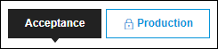
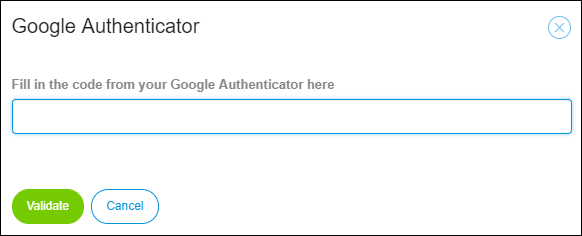
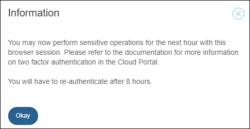

## 1 Introduction

In the **Deploy** and **Operate** categories of the [Developer Portal](http://home.mendix.com), there are several operations that require  **Two-Factor Authentication**.

This document describes the purpose and the fuctionality of two-factor authentication.

## 2 The Puropose

Two-factor authentication (2FA) validates a second authentication mechanism next to your password. It is required for Mendix Cloud node activities done on a production environment. 2FA ensures that you are authenticated when performing sensitive activities, such as deploying packages and handling production data.

For more information, see [Google Authentication](https://www.google.com/landing/2step/#tab=how-it-protects).

## 3 How It Works

Before performing an operation on the production envrionment, you will be required to provide the authentication code.

After entering the authentication code, your browser session is authorized for the next eight hours.

## 4 Setting Up and Disabling

For details on seting up, see [How to Set Up Your Two-Factor Authentication with Google](/howtogeneral/support/how-to-set-up-two-factor-authentication-with-google-authenticator).

If you change your device or phone number, you must contact [Mendix Support](https://support.mendix.com/hc/en-us) to disable the authenticator on your Mendix account.

You can re-activate 2FA by triggering any action that requires 2FA on your production environment.

## 5 Technical Contact

Team members with **App Team – Deploy Permissions** are authorized to have node permissions. The Technical Contact can grant those members different permissions that can differ per environment. For example, you might want to limit the access of external developers to only the acceptance environment.

For more information, see [Security – Node Permissions](/developerportal/settings/node-permissions).

## 6 Related Content
 
*   [Settings](/developerportal/settings)
