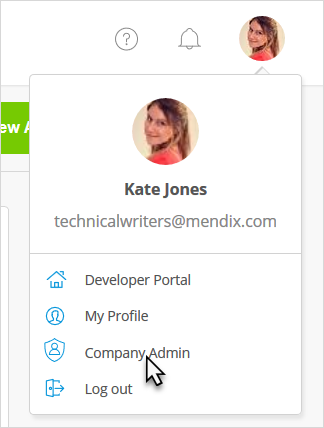
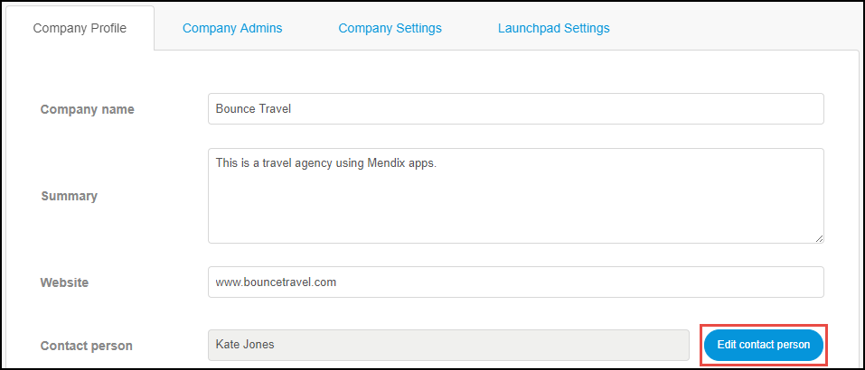
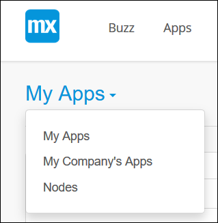
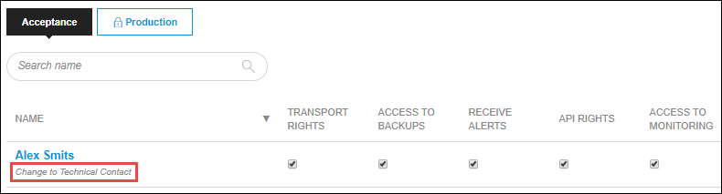

## 1 Introduction

Within the company, it is important to keep the roles of Mendix users up to date. Some roles have important priveleges that cannot be used for unintended purposes.

When the roles and the contact information are up-to-date, this can lead to better internal communication and the operational processes. 

**This how-to will teach you how to do the following:**

* Add a Company Admin
* Change the Company Contact
* Change the App Contact
* Change the Technical Contact

## 2 Prerequisites

Before starting this how-to, make sure you have completed the prerequisites described below:

* Have a Mendix account (MxID)
* Have an app
* To add extra Company Admins, you need to be a Company Admin
* To change the App Contact, you need to have a Scrum Master role or the App Team **settings** permission 
* To change the Technical Contact, you need to be a Technical Contact 

## 3 Adding a Company Admin

A company can have multiple company admins to manage the company's settings, users, apps, and nodes. 

You can add extra Company Admins by following these steps:

1. Go to the [Developer Portal](http://home.mendix.com).
2.  Click your avatar in the top-right corner of the screen:

    

3.  Click **Company Admin** and select the **Company Admins** tab:

    

4. Click **Add Company Admin**.
5.  Select the users that have to be changed into company admins and choose the permissions:

    * Can manage Company – can manage all the settings of the company
    * Can manage Users – can manage only the **Users** page of the company settings
    * Can manage Apps – can manage only the **Apps** page of the company settings
    * Can manage Nodes – can manage only the **Nodes** page of the company settings

    

6. Click **Add**.

## 4 Changing the Company Contact

A company can have multiple Company Admins to manage the company's settings, users, apps, and nodes.

Because there can be multiple Company Admins, one person of the company must be the contact person regarding the company operations.

You can change the Company Contact by following these steps:

1. Go to the [Developer Portal](http://home.mendix.com).
2.  Click on your avatar in the top-right corner of the screen:

    

3. Click **Company Admin**.
4.  Click **Edit contact person**.

    

5. Select the user that will be the new Company Contact and click **Select**. The change will be automatically saved. 

## 5 Changing the App Contact

An app intended for other company users always has a contact person to address questions regarding the app.

You can change the App Contact by following these steps:

1. Go to the [Developer Portal](http://home.mendix.com).
2. Click **Apps** in the top navigation panel and select the app for which you want to change the App Contact.
3. Click **General** under the **Settings** category.
4.  Click **Edit settings** in the top-right corner.

    

5. Below **Contact**, change the new App Contact from the drop-down list.
6. Click **Save**.    

## 6 Change the Technical Contact

A node can have only one Technical Contact to manage the node's environments, deployment repositories, backups, alerts, etc. 

You can change the Technical Contact by following these steps:

1. Go to the [Developer Portal](http://home.mendix.com).
2. Click **Apps** in the top navigation panel.
3.  Click **My Apps**, and in the drop-down list, click **Nodes**.

    

4. Select the node for which you want to change the Technical Contact.
5. Click **Security** under the **Settings** category.
6. Select the **Node Permissions** tab.
7. Below the name of the new Technical Contact, click **Change to Technical Contact**. The Technical Contact will be changed for all environments. The change will be automatically saved.

          

## 7 Change/Add Roles

It is possible to change or add new **App Team** roles for a specific app or on a company level for all apps.

The different settings are described below.

### 7.1 App Team Role Settings on an App Level

You can change the current **App Team** roles or add new ones. Find the role settings of an app by following these steps:

1. Go to the [Developer Portal](http://home.mendix.com).
2. Click **Apps** in the top navigation panel.
4. Select the app you want to manage.
5. Click **Security** under the **Settings** category.
6. Click **Role Settings**.

### 7.2 App Team Role Settings on a Company Level

As a **Company Admin**, you can edit and add new **App Team** roles on a company level. The roles will be available for all the apps within the company.

You can find the **App Team** role settings by following these steps:

1. Go to the [Developer Portal](http://home.mendix.com).
2.  Click your avatar in the top-right corner of the screen:

    

3. Click **Company Admin**.
4. Select the **Roles** tab.

## 8 Related Content

* [Company Admin](/developerportal/companyadmin)
* [How to Deactivate and Activate Users](/developerportal/howto/deactivate-users)
* [How to Delete, Deactivate, and Activate Apps](/developerportal/howto/delete-apps)
* [Security – Node Permissions](/developerportal/settings/node-permissions)
* [Technical Contact](/developerportal/general/technical-contact)
* [Roles Within the Company and Apps](/developerportal/general/roles)
