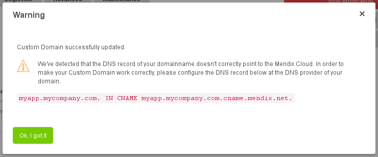
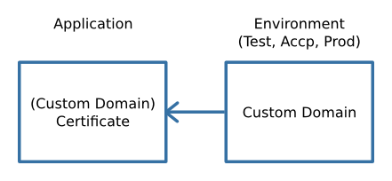
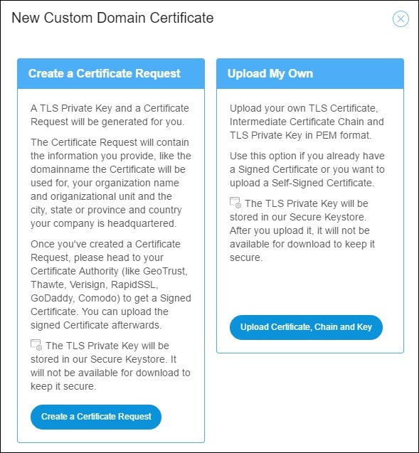
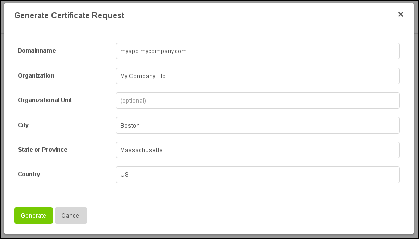
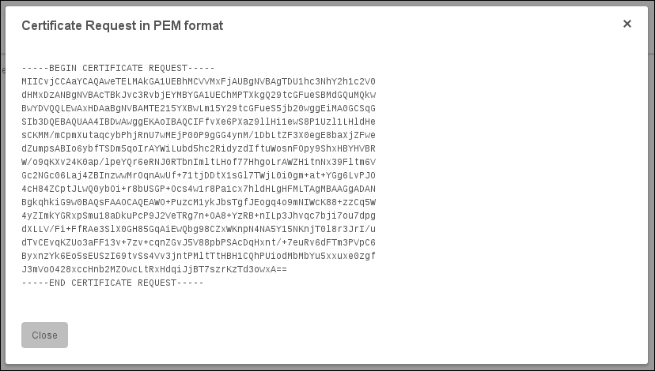
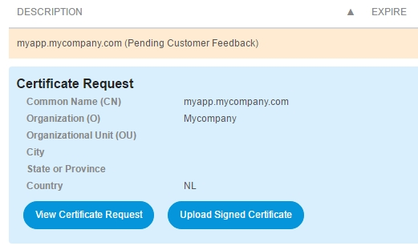
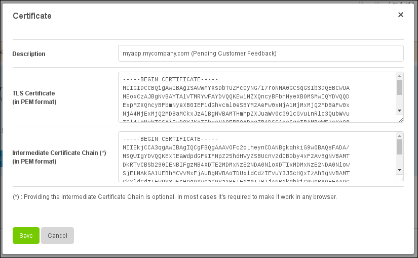
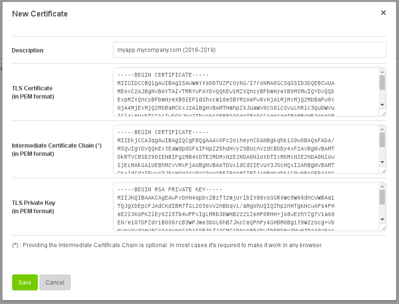
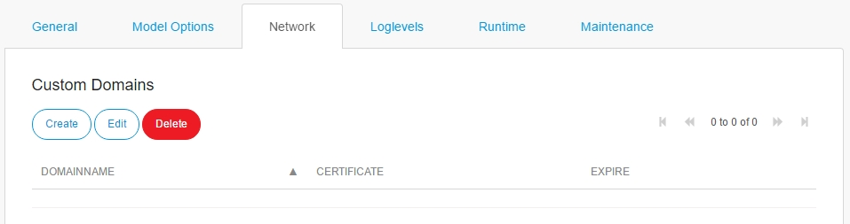
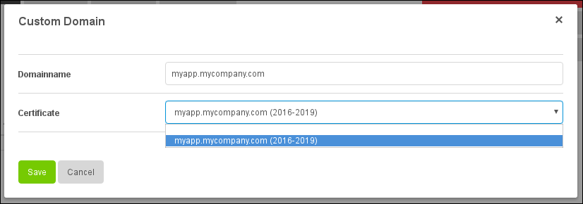

## 1 Introduction

The Mendix Cloud supports adding custom domains such as `https://myapp.mycompany.com/` to your environments. As we only allow HTTPS connections, you have to provide a custom domain certificate (an SSL/TLS certificate). This how-to walks you through the process.

This option is available for free for licensed apps. You cannot add custom domains to free apps.

**This how-to will teach you how to do the following:**

* Generate a certificate request for your custom domain
* Upload a custom domain certificate to the Mendix Cloud
* Renew a custom domain certificate
* Configure a custom domain for your environment

## 2 Prerequisites

### 2.1 General Prerequisites

Before starting this how-to, make sure you have completed the following prerequisites:

* Have a basic knowledge of DNS
* Have a basic knowledge of SSL/TLS certificates:
    * What an SSL/TLS certificate is and what it is used for
    * What an intermediate certificate chain is and what it is used for
    * What an SSL/TLS private key is and what it is used for
    * What a certificate request is and what it is used for
* Have a basic knowledge of certificate authorities (like GeoTrust, Thawte, Verisign, RapidSSL, GoDaddy, Comodo)
* Have the correct permissions (for more information, see [Security-Node Permissions](/developerportal/settings/node-permissions))

### 2.2 Domain Registrar/DNS Provider

Before configuring your custom domain in the Mendix Cloud, you will need to configure a DNS record for your custom domain at your domain registrar/DNS provider.

Please create a CNAME record and point it to `[YOUR-CUSTOM-DOMAIN].cname.mendix.net.`. For example, when your custom domain is `myapp.mycompany.com`, create a CNAME record to `myapp.mycompany.com.cname.mendix.net.` so that Mendix can point your custom domain to your Mendix app.

{}

It's not possible to create a CNAME record for an apex/naked domain (meaning, a domain without a subdomain, like `mycompany.com`), as custom apex/naked domains are currently not supported.

{}

## 3 Managing Custom Domains in the Mendix Cloud

Custom domain certificates (or just "certificates") and custom domains are managed in separate locations in the Mendix Cloud. Certificates are currently managed on the application level.

You can have a collection of certificates. For example when your certificate expires, you can upload a new certificate next to your old certificate. Those can be chosen when you configure a custom domain. This is done on the environment level (test, acceptance, production).

To manage custom domains, follow these steps:

1. Go to the [Developer Portal](http://home.mendix.com) and click **Apps** in the top navigation panel.
2. Click **My Apps** and select **Nodes**.
3. Select the node you want to manage.
4. Click **Environments** under the **Deploy** category.
5. Go to the **Custom Domains** tab.

## 4 Generating a Certificate Request for your Custom Domain

When you do not have an SSL/TLS certificate you have to order one at a certificate authority (like GeoTrust, Thawte, Verisign, RapidSSL, GoDaddy, or Comodo). In order to get a signed SSL/TLS certificate from a certificate authority, you need to provide a certificate signing request (CSR). A private A SSL/TLS key and a CSR tied to that key can be created in the Mendix Cloud for you.

To create a certificate signing request and an RSA key, follow these steps:

1.  Click **New** and then click **Create a Certificate Request**:

    

2.  Fill in and submit the provided fields:

    

3. Click **Generate**. An SSL/TLS private key and a certificate request is generated. The certificate request will be shown in the PEM format.

{}

The SSL/TLS private key will be stored in our secure keystore. It will not be available for download in order to keep it secure.

{}

### 4.1 Upload Signed Certificate 

Before uploading a certificate, go to your certificate authority to get a signed SSL/TLS certificate. After you have received the signed SSL/TLS certificate, you can upload it by following these steps:

1. Select the custom domain certificate.
2. Click **Upload Signed Certificate**. 

Here you can change the description of your certificate and upload the signed SSL/TLS certificate. You can also upload an intermediate certificate chain. The intermediate certificate chain is often provided by your certificate authority.

## 5 Uploading Your Own Custom Domain Certificate

To upload a custom domain certificate, you need to have the following things prepared:

* An SSL/TLS certificate that is signed by your certificate authority
* An intermediate certificate chain provided by your certificate authority
* An SSL/TLS private key

To upload the custom domain certificate, follow these steps:

1. Click **New** and then click **Upload Certificate, Chain and Key**:

    

2. Enter the SSL/TLS certificate, intermediate certificate chain, and SSL/TLS private key in the provided fields. Optionally, you can give your custom domain certificate a description. The description is used when selecting the custom domain certificate when configuring a custom domain later on.

    

3. Click **Save** to save your new custom domain certificate. It will be uploaded to the Mendix Cloud automatically.

{}

The SSL/TLS private key will be hidden after uploading it. It will be stored in our secure keystore and will not be available for download in order to keep it secure.

{}

## 6 Renewing a Custom Domain Certificate

There are two methods for renewing a custom domain certificate:

1. Create a new custom domain certificate (recommended).
2. Update an existing custom domain certificate.

### 6.1 Method 1: Creating a New Custom Domain Certificate (Recommended)

When a custom domain certificate is about to expire, you can renew it by generating a new certificate request (for more information, see [4 Generating a Certificate Request for Your Custom Domain](#Generating)) or by uploading a new custom domain certificate (for more information, see [5 Uploading Your Own Custom Domain Certificate](#Uploading)).

Now select the new certificate for your custom domain (for more information, see [7 Configuring a Custom Domain](#Configuring)).

### 6.2 Method 2: Renewing by Updating an Existing Custom Domain Certificate

You can also renew your custom domain certificate by editing an existing custom domain certificate. Please be aware that the certificate request that you created in the past is required for that.

## 7 Configuring a Custom Domain

After a custom domain certificate has been uploaded, you can start configuring a custom domain for one of your application environments.

To configure a custom domain on your application environment, follow these steps:

1. Click **Environments** under the **Deploy** category.
2. Click **Details** for the environment you want to configure:

    

3. Go to the **Network** tab:

    

4. In **Custom Domains**, you can manage your custom domains. You can configure a custom domain by doing the following:

    * Providing a **Domain name** (like *myapp.mycompany.com*)
    * Selecting a custom domain **Certificate** you have uploaded above

    

6. Click **Save** to save your custom domain. It will be configured for your application environment automatically.

{}

Please make sure you've configured a CNAME record for your custom domain at your domain registrar/DNS provider (for details, see [2.2 Domain Registrar/DNS Provider](#DNS)).

{}

## 8 Frequently Asked Questions

### 8.1 Can I Create a `*.mycompany.com` Wildcard Certificate?

Yes. However, when you create the certificate request via the Mendix Cloud, you will only be able to use the wildcard certificate for all the environments of only one application. When you have your own custom domain certificate, you can upload it to all of your apps and use it for all the environments of all of your apps. You can select the same wildcard certificate per environment by specifying different subdomains. For example, `test.mycompany.com`, `accp.mycompany.com`, and `app.mycompany.com`.

### 8.2 How Do I Properly Construct an Intermediate Certificate Chain?

Your certificate is signed by the certificate authority. They sign your certificate with their intermediate certificate. They also sign their intermediate certificate with their own root certificate. Almost always, the intermediate certficate chain that you will need is just one intermediate certificate. Sometimes there is more then one intermediate certificate; this depends on the CA you use. You do not need to provide the root certificate, as every web browser has it in its trusted keystore.

An intermediate certificate chain chain could look like this from top to bottom:

* Intermediate certificate 2
* Intermediate certificate 1
* Root certificate (optional)

## 9 Related Content

* [Certificates](/deployment/mendixcloud/certificates)
* [Environments](/developerportal/deploy/environments)
* [Mendix Cloud: Deploy](../deploy/mendix-cloud-deploy)
* [How to Upgrade Your Free App to a Licensed App](how-to-upgrade-free-app)
* [Company & App Roles](/developerportal/company-app-roles/index).
