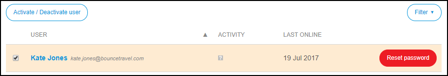
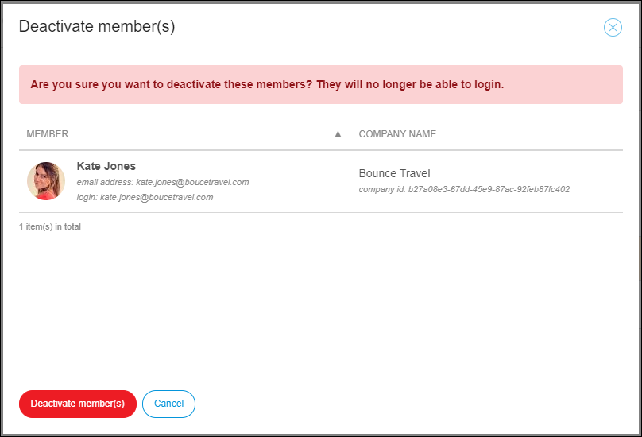
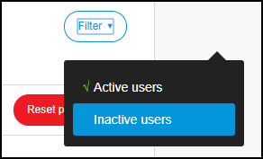
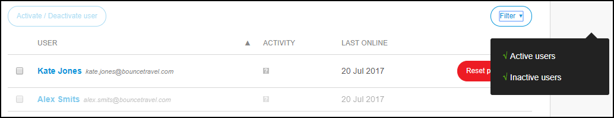
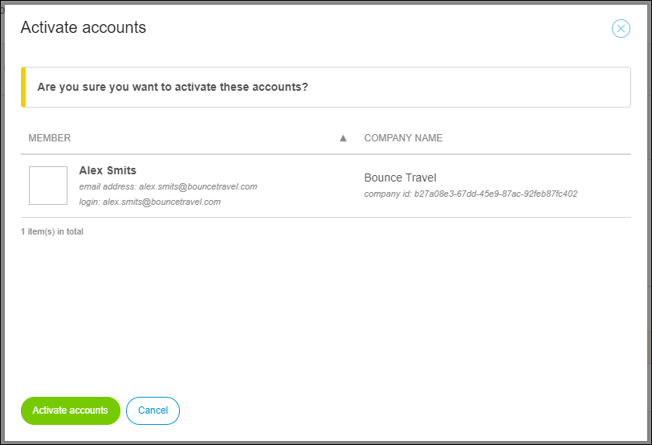

## 1 Introduction

For security reasons, deactivating the Mendix profile of an employee that is leaving your company is recommended.
If the employee returns to your company, the Mendix profile can be activated again. 

{}
If a Mendix user moves to another company or comes from another company that is also using Mendix, the user can **merge their old Mendix account(s)** into the new Mendix account. This action combines all the hard-earned points, certifications, and achievements in the user's efforts to climb the leaderboards.
{}

**This how-to will teach you how to do the following:**

* Deactivate users
* Activate users

## 2 Prerequisites

Before starting this how-to, make sure you have completed the following prerequisites:

* Have the **Company Admin** role in your Mendix company (for more information, see [Company Admin](/developerportal/companyadmin))
* Before deactivating a user, make sure the following points are true for the user:
    * Does not have a **Company Contact** role
    * Does not have an **App Contact** role
    * Does not have a **Technical Contact** role
    * Is not the only **SCRUM Master** in any App Teams
    * Is not involved in unsolved support tickets at [Mendix Support](https://support.mendix.com)

For more information, see [How to Manage Company Roles and App Roles](/developerportal/howto/change-roles) and [Roles Within the Company and Apps](/developerportal/general/roles).

## 3 Company Admin User Settings

To manage the users in your company, follow these steps:

1. Go to the [Developer Portal](http://home.mendix.com).
2.  Click your avatar in the top-right corner of the screen:

    

3. Click **Company Admin**.
4. Click **Users** in the left navigation panel.

### 3.1 Deactivating Users

To deactivate a user, follow these steps:

1.  On the **Users** page of the **Company Admin** settings, select the check boxes of the the users that you want to activate or deactivate, and click **Activate / Deactivate user**.

    

2.  In the pop-up window that appears, click **Deactivate member(s)**:

    

The deactivated user will become inactive and will imidiately dissapear from the list. If you click **Filter** and select **Inactive**, you will see the deactivated users.

You can only deactivate a user. It is not possible to delete a user completely.

   

### 3.2 Activating Users

Follow these steps to activate an inactive user:    

1.  On the **Users** page of the **Company Admin settings** click **Filter**.
2.  Click **Inactive**. The list with company users will be extended with inactive deactivated users.

    

3.  Select the inactive user and click **Activate / Deactivate user**.
4.  In the pop-up window that appears, click **Activate accounts**.         

     

## 4 Related Content

* [Company Admin](/developerportal/companyadmin)
* [How to Manage Company Roles and App Roles](/developerportal/howto/change-roles)
* [How to Set Up Your Community Profile](/community/tools/how-to-set-up-your-profile)
* [Mendix Support](/howtogeneral/support)
* [Roles Within the Company and Apps](/developerportal/general/roles)
* [Technical Contact](/developerportal/general/technical-contact)
