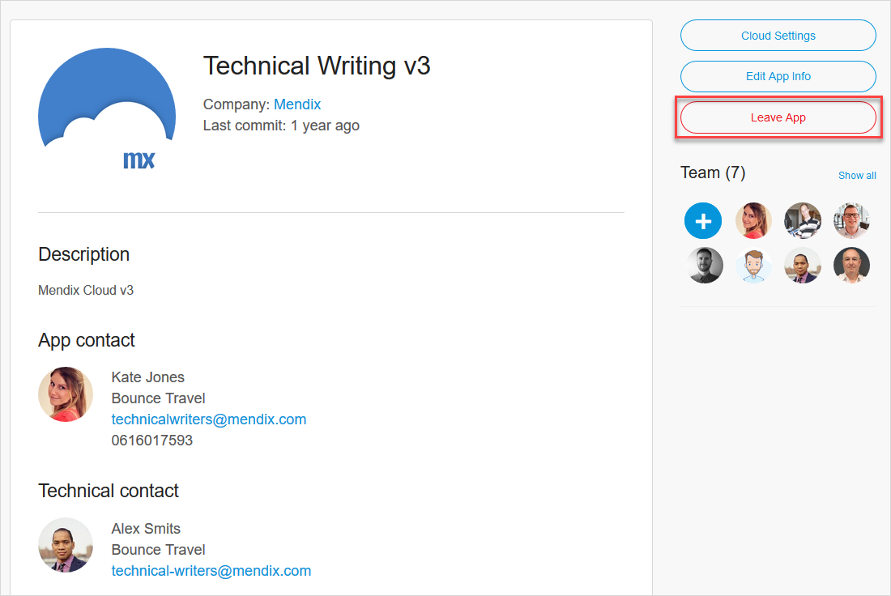
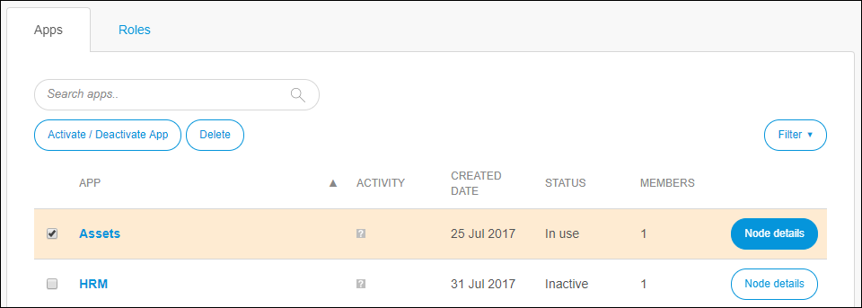
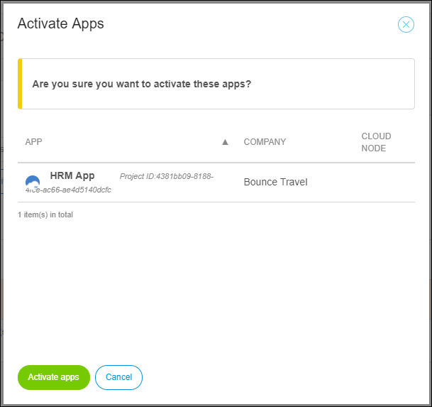

## 1 Introduction

Your ability to delete, deactivate, and activate an app depends on your role.

In an App Team, a SCRUM Master (or a custom role with the **App Settings** permission) is allowed to deactivate and delete an app (even when there are still App Team members for the app).

The Company Admin is allowed to deactivate, delete, as well as activate all the company's apps (with or without App Team members for the app).

For more information, see [Roles Within the Company and Apps](/developerportal/general/roles).

**This how-to will teach you how to do the following:**

* Delete an app (as a SCRUM Master)
* Deactivate an app (as a SCRUM Master)
* Activate an app (as a Company Admin)

## 2 Prerequisites

Before starting this how-to, make sure you have completed the following prerequisites:

* To deactivate or delete an app, have the **SCRUM Master** role on your App Team
* To activate an app, have the **Company Admin** role in your company

{}

Note that you cannot leave the app if you are the **Technical Contact** of the app.

{}

## 3 Deleting an App

If an app that has other App Team members needs to be deleted or deactivated, this can be accomplished by a team member with the SCRUM Master role or another custom role with the App Team's **App Settings permission**.

To view the **App Settings** and delete or deactivate your app, follow these steps:

1. Go to the [Developer Portal](http://home.mendix.com).

2. Click **Apps** in the top navigation panel.

3. Select the app that needs to be deleted or deactivated.

4. In the left menu click **General** under the **Settings** category.

5. Click **Leave App**:

    

6. A confirmation message will appear, asking if you are sure you want to leave the app and stating that the app will be deactivated if you are the only/last member of the App Team. Click **Yes** to continue the process of leaving your app.

7.  If the app will be made inaccessible upon your leaving, a final confirmation is necessary for whether you want to leave or leave and also delete your app:

	

	* Only Free Apps can be deleted
	* App deletion cannot be undone, which means that ALL DATA WILL BE LOST, including all files on the Team Server and all data in the Free App node (if applicable)

## 4 Activating & Deactivating an App

To activate or deactivate an app as  Company Admin, follow these steps:

1. Go to the [Developer Portal](http://home.mendix.com).

2. Click your avatar in the top-right corner of the screen:

    

3. Click **Company Admin**.

4. Click **Apps** in the left navigation panel.

5.  Select an app with the **In Use** status to deactivate and click **Activate / Deactivate App**.

	* Only Free Apps can be deactivated, and a deactivated app will still exist within the company while being invisible to regular users (and only an **Company Admin** can activate an inactive app)
	* Licensed apps with a node can only be offboarded by Mendix Support (to offboard an app, you must [submit a Mendix Support request](https://support.mendix.com/hc/en-us/requests/new))

6. To activate an app, select one with the **Inactive** status:

    

7. Click **Activate / Deactivate App**.
8. In the pop-up window that appears, click **Activate apps**:        

    

{}

Note that when you click Deactivate App, only the account owner can reactivate the app (via their account management screen). When you click Delete App, the app deletion cannot be undone and means that ALL DATA WILL BE LOST, including all files on the Team Server and all data in the Free App node (if applicable). For more information, see How to Delete, Deactivate, and Activate Apps.

{}

## 5 Related Content

* [Roles Within the Company and Apps](/developerportal/general/roles)
* [How to Manage Company Roles and App Roles](/developerportal/howto/change-roles)
* [Company Admin Overview](/developerportal/general/companyadmin-overview)
* [Settings](/developerportal/settings)
