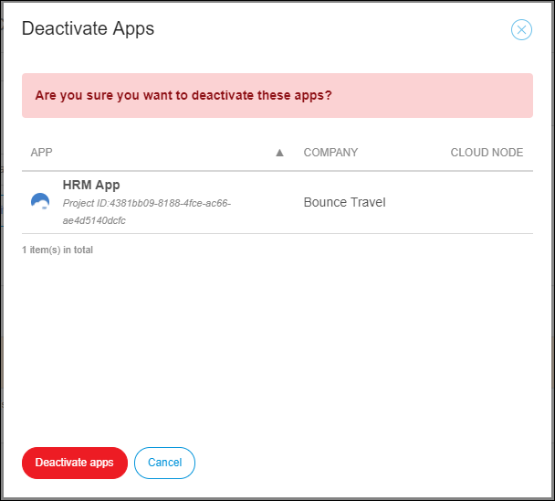
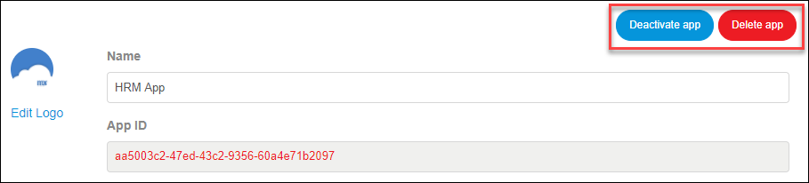

## 1 Introduction

In an App Team, only the SCRUM Master (or a custom role with the **App Settings** permission) is allowed to deactivate the app (even when there are still App Team members for the app).

In addition, the Company Admin is allowed to activate and deactivate all the company's apps (with or without App Team members for the app).

**This how-to will teach you how to do the following:**

* Deactivate apps (Company Admin and SCRUM Master)
* Activate apps (Company Admin)

## 2 Prerequisites

Before starting this how-to, make sure you have completed the following prerequisites:

* To deactivate/activate the company's apps, you must have the **Company Admin** role in your Mendix company
* To deactivate your app, you must have the **SCRUM Master** role in your app 

For more information, see [Roles Within the Company and Apps](/developerportal/general/roles).

To manage the users in your company, follow these steps:

1. Go to the [Developer Portal](http://home.mendix.com).
2.  Click your avatar in the top-right corner of the screen:

    

3. Click **Company Admin**.
4.  Click **Apps** in the left navigation panel.

    

### 3.1 Deactivating Apps

Only Free Apps can be deactivated. The deactivated apps will still exist within the company and will be invisible to regular users. To deactivate an app, follow these steps:

1. In the **Company Admin** settings, click **Apps** in the left menu. 
2. Select the check boxes of the apps that you want to delete.
3. Click **Activate / Deactivate App**.
4.  In the pop-up window that appears, click **Deactivate apps**:

        

{}
Licensed apps with a node can only be offboarded by Mendix Support. To offboard an app, you must [submit a support request](https://support.mendix.com/hc/en-us/requests/new).
{}
    
### 3.2 Deleting Apps

Only Free Apps can be deleted. App deletion cannot be undone and means that ALL DATA WILL BE LOST, including all the files on the Team Server and all the data in the Free App node (if applicable).

To delete an app, follow these steps:

1. In the **Company Admin** settings, click **Apps** in the left navigation menu. 
2. Select the check boxes of the apps that you want to delete.
3. Click **Delete**.

### 3.2 Activating Apps

To activate an inactive app, follow these steps:    

1.  In the **Company Admin** settings, click **Apps** in the left navigation menu.
2.  Select the app with the **inactive** status.
3.  Click **Activate / Deactivate App**.
4.  In the pop-up window that appears, click **Activate apps**.         

    

## 4 App Team Settings

If an app that still has App Team members eeds to be deleted or deactivated, this can be accomplished by a team member with a SCRUM Master role or another custom role with the App Team **App Settings permission**.

To view the **App Settings**, follow these steps:

1. Go to the [Developer Portal](http://home.mendix.com).
2. Click **Apps** in the top navigation panel.
3. Select the app that needs to be deleted or deactivated.
4. In the left menu click **General** under the **Settings** category.
5.  Click **Edit Settings**.

    

### 4.1 Deactivate App

Only Free Apps can be deactivated. The deactivated apps will still exist within the company and will invisible to regular users. The **Company Admin** can activate an inactive app.

To deactivate an app, follow these steps:

1. In the app settings, click **Deactivate App**.
2.  In the **Confirmation** pop-up message, click **Deactivate**.

    

### 4.2 Delete App

Only Free Apps can be deleted. App deletion cannot be undone and means that ALL DATA WILL BE LOST, including all files on the Team Server and all data in the Free App node (if applicable).

To delete an app, follow these steps:

1. In the app settings, click **Delete app**.
2. In the **Confirmation** pop-up message, click **Yes, delete the app**.

## 5 Related Content

* [Company Admin](/developerportal/companyadmin)
* [How to Manage Company Roles and App Roles](/developerportal/howto/change-roles)
* [Roles Within the Company and Apps](/developerportal/general/roles)
* [Settings](/developerportal/settings)
