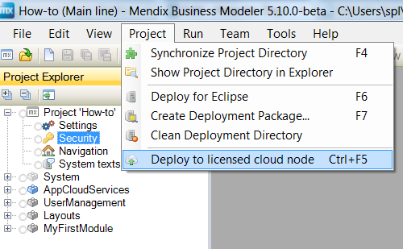
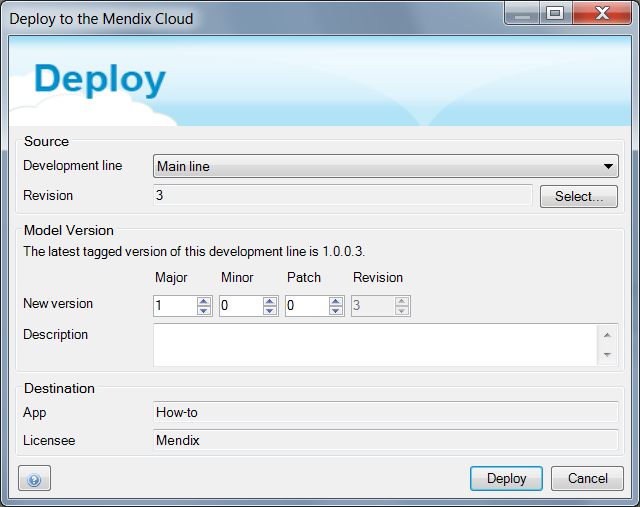
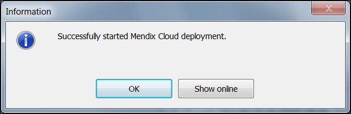
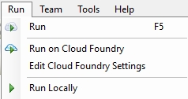
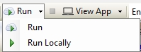

## 1 Introduction

It has never been easier to deploy a Mendix application to the cloud. This how-to will explain the options a developer has to deploy applications to a connected cloud node.

**This how-to will teach you how to do the following:**

* Deploy a licensed app to the Mendix Cloud
* Deploy via the Mendix Modeler
* Deploy the app to an environment
* Deploy a Free App to the Mendix Cloud

## 2 Prerequisites

Before starting this how-to, make sure you have completed the prerequisites described below.

### 2.1 Prerequisites for a Licensed App

* Your app must be linked to a licensed cloud node
* You must have deployment permissions
* Your Google Authenticator must be enabled

### 2.1 Prerequisites for a Free App

* You must have created an app

## 3 Deploying a Licensed App to the Mendix Cloud

There are two methods for deploying your app to the Mendix Cloud. The first option is directly via the Mendix Modeler, and the second is through the Developer Portal.

### 3.1 Deploying via the Modeler

1. Open the [Modeler](http://appstore.home.mendix.com/link/modeler/).
2. Open the licensed app.
3. Click **Project** in the top menu bar and select **Deploy to licensed cloud node**:

    

4. Click **Deploy**:

    

5. The deployment is now in progress. To see the uploaded package, click **Show online**:

    

### 3.2 Creating a Package from Team Server in the Developer Portal

An app can also be deployed without using the Modeler. To do this, follow these steps:

1. Go to the [Developer Portal](http://home.mendix.com).
2. Click **Apps** in the top navigation panel.
3. Select your app.
4. Go to **Environments**.
5. Click **Create package from team server**.
6. Select the preferred branch and revision and click **Next**.
7. Give the build a version number and click **Build this revision**.

The package will now be deployed to the cloud.

## 4 Deploy the App to an Environment

The previous steps explained how to deploy a deployment package to the Mendix Cloud, but the actual app is not running yet! To deploy a deployment package to a node environment, follow these steps:

1. Open the [Developer Portal](http://home.mendix.com).
2. Open your app.
2. Go to **Environments**.
3. In the **Deployment Package Repository**, choose the preferred deployment package and click **Deploy**.
4. Select the preferred environment, and then click **Continue**.
5. Click **Transport**. If asked to do so, clean the environment.
6. Configure the constants (if necessary) by clicking **Constants** and **Edit constants value**. This can also be done in a later stage in the settings.
7. Click **Continue**.
8. Click **Start application**. If asked, click **Synchronize database**.

The app is now deployed and the administrative account can be configured.

## 5 Deploying a Free App to the Mendix Cloud

With a Free App, it's only possible to deploy your app to a Sandbox environment using a Mendix Modeler. There are two methods to do that.

### 5.1 Method 1

Once you have created and worked on your App, you will want to share it with others in the Free App. You can deploy your Free App to a Sandbox environment by clicking **Run** at the top of your Mendix Modeler. This will automatically deploy your app to a Sandbox.

### 5.2 Method 2

If you want to choose whether you want to run your app locally or in the Sandbox, you can enable the Sandbox option by clicking **Run**:

## 6 Related Content

* [How to Configure Custom Domains](custom-domains)
* [How to Link a Different App to a Cloud Node](how-to-link-a-different-app-to-a-node)
* [How to Link Your Free App to a Licensed Cloud Node](how-to-link-app-to-node)
* [How to Manage Company & App Roles](/developerportal/general/change-roles)
* [Roles Within the Company and Apps](/developerportal/general/company-app-roles)
* [How to Set Up Two-Factor Authentication With Google Authenticator](/howtogeneral/support/how-to-set-up-two-factor-authentication-with-google-authenticator)
* [How to Upgrade Your Free App to a Licensed App](how-to-upgrade-free-app)
