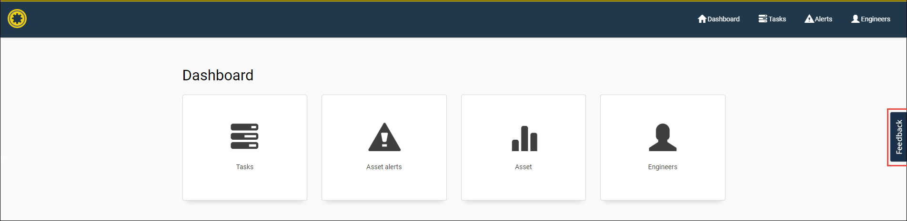
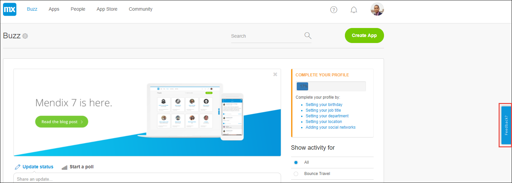
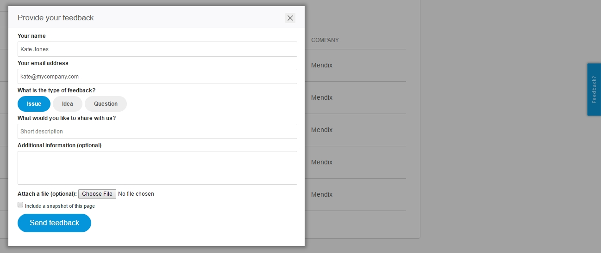

## 1 Introduction

Within Mendix, there are two use cases for the Feedback widget:

*   To provide feedback on your own app

    

*   To provide feedback on the Mendix Platform

    

The purpose of the feedback on Mendix is to provide low priority issues, questions, and ideas on how to improve the Mendix Platform.

{}

The **Feedback** button is not a support option. If there are any platform problems, contact [Mendix Support](http://support.mendix.com).

{}

You can provide feedback on the Mendix Platform on the following pages:

* [Mendix documentation](http://docs.mendix.com)
* [Developer Portal](http://home.mendix.com)
* [App Store](https://appstore.home.mendix.com)
* [Community](https://appstore.home.mendix.com)

**This how-to will teach you how to do the following:**

* Add a feedback story to the Mendix Platform page
* View a list of your own provided feedback

## 2 Prerequisites

Before starting this how-to, make sure you have completed the following prerequisite:

* Log in with your Mendix account (to sign up, click [here](http://www.mendix.com/try-now/?utm_source=documentation&utm_medium=community&utm_campaign=signup))

## 3 Providing Feedback on Mendix

1. In the [Developer Portal](http://home.mendix.com), click the **Feedback** button on the right-side of the screen.
2. Fill in the feedback you want to send to Mendix. A description of the feedback and a screenshot of the screen are optional but recommended.
3. Click **Send Feedback**:

    

## 4 Viewing Your Provided Feedback Items

You can view your own submitted feedback items in the feedback list in your profile settings. Follow these steps to find the list of provided feedback items:

1. Click your profile in the right top corner in the [Developer Portal](http://home.mendix.com).
2. Click **Show Profile**.
3. Go to the **Feedback** tab:

    

## 5 Related Content

* [Feedback](../collaborate/feedback)
* [Mendix Profile](../general/mendix-profile)
* [How to Use the Feedback Widget](gathering-user-feedback)
