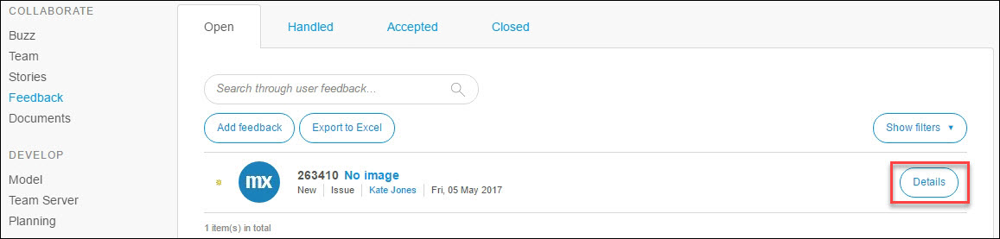

## 1 Introduction

With Mendix, you can make use of the fully integrated feedback cycle functionality. Gathering feedback, evaluating the feedback, and converting valid feedback into actionable user stories is supported by Mendix out of the box. This how-to explains the entire process in detail and aims to enable developers to capture and process valuable user feedback.

**This how-to will teach you how to do the following:**

* Configure the Mendix Feedback Widget
* Gather, receive, and process feedback
* Add a feedback story to the app project backlog
* View a list of your own provided feedback

## 2 Prerequisites

Before starting this how-to, make sure you have completed the following prerequisite:

* Create an app containing a working application model

## 3 Adding the Mendix Feedback Widget to Your App

The Mendix Feedback Widget is automatically included in any new app that you create. To ensure you have the lastest version of the Mendix Feedback Widget included in your app, follow these steps:

1. Download the latest version of the [Mendix Feedback Widget](https://appstore.home.mendix.com/link/app/199/Mendix/Mendix-Feedback-Widget) from the Mendix App Store.
2. When the latest Mendix Feedback Widget is included in your app, you need to ensure that the widget is added to the homepage of the application. Open the homepage from your app **Navigation**:

    

3. If the Mendix Feedback Widget has not been added to the page, add it to the page or layout by selecting **Feedback Widget** under **Add-on** and dropping it into any position in the document:

    

## 4 Configuring the Feedback Widget

To configure the widget, follow these steps:

1. Open the widget **Properties** by double-clicking the widget on the page. 
2. Select the **User** entity that is used in your application to store the name and email address of the user. Note that this object must be a specialization of the **User** entitiy within the **System** module (for example, **Account** in the **Administration** module).
3. Select the **Username attribute** that stores the name of the user and the **Email address attribute**. This will be used to automatically fill in the name and email address of the user who is logged in when submitting feedback in the app.
4. Decide whether you want to allow users to upload a file and screenshot to the feedback item (via **Allow file upload** and **Allow screenshot upload**, respectively). 

    

5. Open the **Configuration** tab of the Mendix Feedback Widget properties.
6. Ensure that the **Feedback server** is set to `https://sprintr.home.mendix.com/`.
7. Ensure that the **Project identifier** is filled in correctly. The project identifier is your **App ID**, and it is automatically filled in for the Mendix Feedback Widget. If necessary, you can find the identifier of your app in the [Developer Portal](http://home.mendix.com) by opening your app and clicking **General** under the **Settings** category:

    

8. If you have configured multiple home pages for different user roles, you need to add the Mendix Feedback Widget to each home page for the user role from which you want to gather feedback. This can easily be done by copying the configured widget to the other relevant layouts and pages.

## 5 Gathering and Receiving Feedback

When a version of an app is deployed containing a Mendix Feedback Widget that has been configured and added to all home pages, you can start gathering feedback. 

When a user is logged into the app, the **Feedback** button will appear on the right side of the screen. Clicking this button will open the **Provide feedback** dialog box that allows the user to enter feedback:

## 6 Reviewing Feedback in the Developer Portal {#reviewing}

Once you have received feedback, you and your team can process the feedback within the Developer Portal.

### 6.1 Processing Feedback

To process the feedback, follow these steps:

1. Open the app in the [Developer Portal](http://home.mendix.com).
2. Click **Feedback** under the **Collaborate** category.
3.  Click **Details** on a feedback item to open its details:

    

4. Process the item by, for example, asking for clarification in the **Leave a comment** box, or by choosing one of the **Actions** displayed in the menu on the right:

    

    These are the response/commenting action options:

    Action | Description
    | --- | --- |
    **Accept feedback** | Clicking this option signifies the feedback is valid and that you want to add a story to your backlog on the basis of the feedback (for more information, see [Adding a Feedback Story to Your Backlog](#adding) below)
    **Mark 'Under review'** | Notifies the user who submitted the feedback and your team that the item is under review.
    **Mark as handled** | Changes the status of the item from open to handled so that the item will not pollute your open items list.
    **Close feedback** | Closes the feedback item (for example, when it is already solved or a duplicate has already been accepted).
    **Convert to idea** | Changes the feedback type to an idea.
    **Convert to question** | Changes the feedback type to a question.
    **Move to app** | Moves the item to another app to which you have access.
    **Delete feedback** | Deletes the feedback.

### 6.2 Adding a Feedback Story to Your Backlog {#adding}

After clicking **Accept feedback**, you can create a story on the basis of the feedback item and add it to your backlog. To do that, follow these steps:

1. Enter a logical name and a description for the user story.
2. Decide whether the feedback item should be classified as a bug or feature.
3. Select the sprint/backlog to which you want to add the story.
4. Select a label (if you have any) that you want to add to the story.

    

## 7 Providing Feedback to the User

Once a feedback item is connected to a user story, the user who submitted the story will automatically be updated on the progress made on that story:

* Adding a story with feedback attached from your backlog to a sprint will result in a message that the item has been planned
* Completing a sprint that contains a story with feedback attached will result in a message that the item has been completed

## 8 Viewing the List of Your Own Feedback Items

You can view your own submitted feedback items in the feedback list in your profile settings.

To find the list of the provided feedback items, follow these steps:

1. Click your profile in the right top corner in the [Developer Portal](http://home.mendix.com).
2. Click **Show Profile**.
3.  Go to the **Feedback** tab.

    

## 9 Related Content

* [Collaborate](/developerportal/collaborate)
* [Feedback](../collaborate/feedback)
* [How to Manage Sprints and Stories](managing-your-application-requirements-with-mendix)
* [Mendix Profile](../general/mendix-profile)
* [How to Provide Feedback on Mendix](feedback-mendix)
* [Stories](../collaborate/stories)
