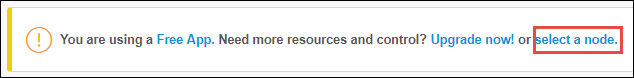
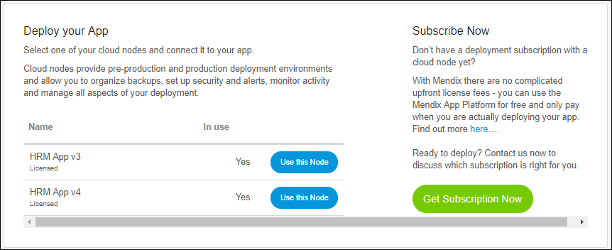
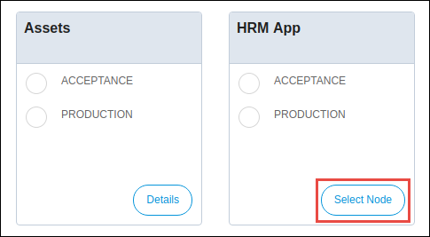
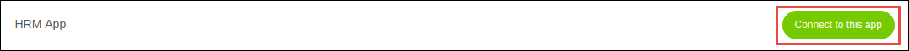

## 1 Introduction

This how-to describes the process of linking your Free App to a licensed cloud node.

**This how-to will teach you how to do the following:**

*   Connect a Free App to a licensed cloud node

## 2 Prerequisites

Before starting this how-to, make sure you have completed the following prerequisites:

*   Have a Free App - with an enabled Team Server (Mendix 5.18 and up)
*   Have a licensed cloud node available
    * if your contract allows for more licensed nodes, please reach out to Mendix Support (see https://support.mendix.com for contact details) so they can create the node for you
    * if your contract does not allow for more licensed nodes, please contact your Customer Success Manager (CSM)
*   You are the [Technical Contact](/developerportal/company-app-roles/technical-contact) of the node
*   Make sure that the Sandbox is unlinked. See [How to Unlink Your Free App from a Sandbox Environment](how-to-unlink-sandbox)
*   Your Two-Factor Google Authenticator is enabled. See [How to Set Up Google Two-Factor Authentication](/howtogeneral/support/how-to-set-up-two-factor-authentication-with-google-authenticator)

## 3 Connect Your Free App to a Licensed Cloud Node
There are two methods to connect your project to a licensed cloud node:

### 3.1 Method 1

1.  Go to the [Developer Portal](http://home.mendix.com).
2.  Click on **Apps** in the top navigation panel.
2.  Select your app.
3.  Go to **Environments** in the left navigation panel.
4.  Click on **Select a node**.

    

5.  Click on **Use this node**.

    

### 3.2 Method 2

1.  Go to the [Developer Portal](http://home.mendix.com).
2.  Click **Apps** in the top navigation panel.
2.  Click **My Apps** and select **Nodes**.

    

3. Select the node that you want to link to an app by clicking **Select Node**.    

    

4.  Choose the app you want to connect by clicking **Connect to this app**.

    

The app is now connected to the licensed cloud node.

## 4 Related Content

*   [How to Configure Custom Domains](custom-domains)
*   [How to Deploy to the Mendix Cloud](deploying-to-the-cloud)
*   [How to Download a Backup](how-to-download-a-backup)
*   [How to Link a Different App to a Cloud Node](how-to-link-a-different-app-to-a-node)
*   [How to Restore a Backup](how-to-restore-a-backup)
*   [How to Unlink Your Free App from a Sandbox Environment](how-to-unlink-sandbox)
*   [How to Set Up Google Two Factor Authentication](/howtogeneral/support/how-to-set-up-two-factor-authentication-with-google-authenticator)
