## 1 Introduction

In this how-to, you will learn how to manage your application requirements in Mendix by creating and configuring sprints and stories. These components are often used in an Agile development environment, in which you and your team work in short development cycles last 2–4 weeks. By adding your sprints to Mendix, you will have a clear overview of your tasks and can easily view the status of your development cycle. You can also manage the progress of tasks and sprints from within the Mendix Modeler.

**This how-to will teach you how to do the following:**

* Add sprints
* Manage stories in the Modeler
* Import, move, and export stories

## 2 Prerequisites

Before starting this how-to, make sure you have completed the following prerequisites:

* Install the Mendix Modeler from the [Mendix App Store](https://appstore.home.mendix.com/link/modelers)

## 3 Creating a New App

To create a new App, follow these steps:

1. Go to the [Developer Portal](https://home.mendix.com/) and log in (create an account [here](https://developers.mendix.com/start-for-free/) if you don't have one yet).
2.  Click **Create New App** in the top-left of the screen:

    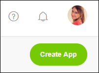

3.  Select a theme or sample app by clicking **View Details**.

    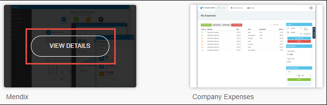

4.  Click **Use this app**:

    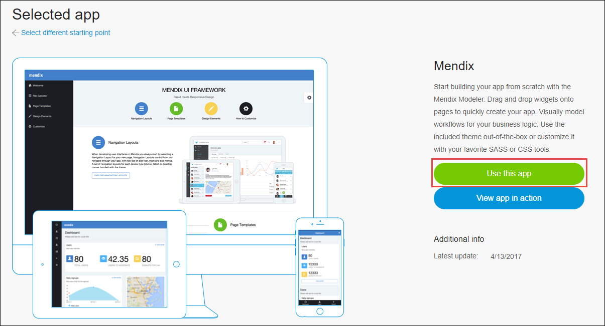

5. Name the app *Company Expenses Demo*.
6. Click **Create App**. You will then be taken to the project dashboard.

## 4 Adding Sprints

The development of a new product, feature, or release usually has multiple sprints. In this section, you will add a new sprint and look at the available options.

To add a sprint, follow these steps:

1.  Click **Stories** in the left menu:

   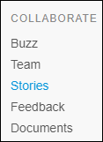

Under the **Collaborate** category you can add sprints, stories, planning, and documents that can be used in your app. The **Stories** page shows the existing stories and sprints.

   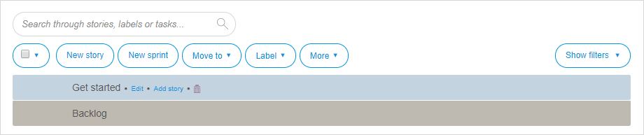

2.  There is one default sprint called **Get started**, which is automatically created when you create a new project. You need a clean sprint, so delete the **Get started** sprint by clicking on the bin.

    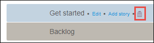

3.  Click **New sprint**.
4.  Under **Plan something**, do the following:
    * Select **Sprint** (when you are working towards a release of your product, you can add the release planning)
    * Below **Name** enter **Sprint 1**
    * Leave the **This sprint comes after** field empty (if there are existing sprints, you can place the new sprint before or after a selected sprint)
    * Set the **Duration** to **2** (weeks)

   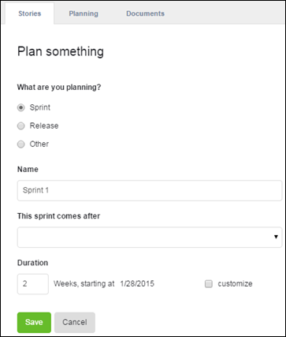

   {}

The default duration of a sprint in Mendix is two weeks, which starts the moment you create the sprint. Check **customize** to select a different start date.

   {}

5.  Click **Save**, and the new sprint will be added to your stories overview.

### 4.1 Adding Story Points

Every sprint contains a number of story points that describe a specific functionality that needs to be implemented, built, or fixed.

To add story points, follow these steps:

1.  Select **Sprint 1** and click **New story**.
2.  For the new story, do the following:
    * Enter *As a user I want to be able to view my company expenses* for the user description
    * Select **Feature** for the **Story type**
    * Select **5 points** for the **Story points**
    * **User expenses** for **Labels** (this will add a new label that can be reused in other stories)
    * Enter *Create an expenses overview page for company employees* for the **Description**

    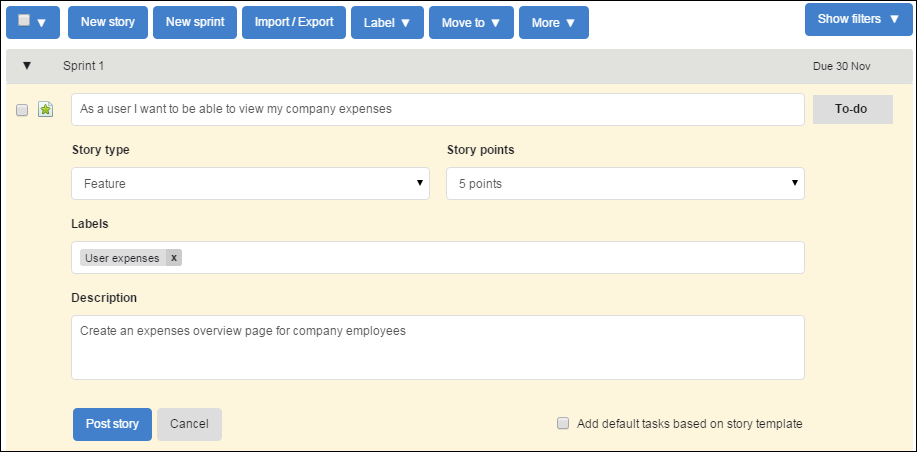

3.  Click **Post story**.

    {}

You can also add Bug story points this way by selecting **Bug** from the **Story type** drop-down menu.
The icon in the top left will change to 

   {}

The new story point is now added to Sprint 1:

   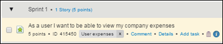

### 4.2 Adding Tasks to a Story

Stories are translated into tasks that need to be completed to finish the story.

To add a task to the story, follow these steps:

1.  Select the story you created and click **Add task**:

    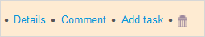

2.  Enter *Add a list view of an employee's expenses*, and then click **Post task**:

    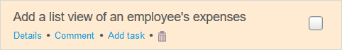

    Ticking the check box on the right will mark the task as completed. You can also add sub-tasks to tasks, which will create a nested structure of stories with tasks.

## 5 Managing Stories in the Mendix Modeler

Besides being able to manage your sprints in the **Developer Portal**, you can also view them in the Mendix Modeler.

To manage stories in the Modeler, follow these steps:

1.  Go to the overview page of your project and click **Edit in Modeler**:

    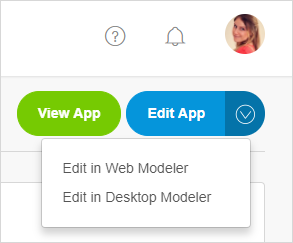

2.  Select a Modeler version when asked, and then log in to the Modeler.
3.  You will now see your sprints in the **Stories** tab at the bottom:

    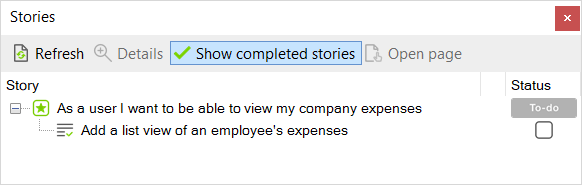

4.  Click the **To-do** status for the first item to change the status to **Running**:

    

5.  Go back to the **Stories** page in the [Developer Portal](http://home.mendix.com).
6.  Expand the first sprint and check the status of the first entry:

    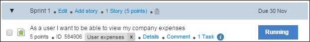

    It is now **Running**, because you changed the status in the Modeler.

    {}

If you change a status or update story points in the Modeler or in the browser, they will automatically be synchronized and available everywhere.

   {}

## 6 Moving Stories

This section will describe a scenario in which the story in Sprint 3 needs to be moved to Sprint 2, as the customer requires the app to be delivered sooner.

{}

Moving a story will move any tasks and sub-tasks as well.

{}

There are two ways to move the story:

### 6.1 Method 1

Select the story you want to move, click **Details**.

   

 and below **Move to** from the right menu, select **Sprint 2**:

    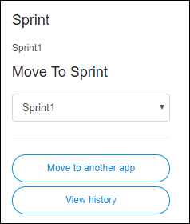

### 6.2 Method 2

Click and drag the story into another sprint or to the **Backlog**:

   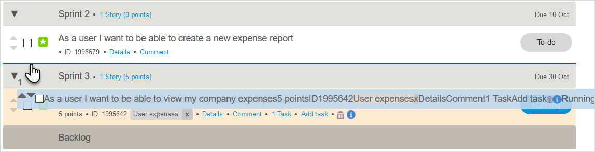

## 7 Importing Stories with Excel

Besides entering your stories manually, you can import them easily with an Excel upload.

To import stories, follow these steps:

1. Download this [example Excel](attachments/collaborate/18580488.xls).
2.  On the **Stories** page click **More** and click **Import/Export**.

    

3.  Select **Update stories from Excel**:

    

4. Click **Browse** to select the example Excel file that contains your user stories.
5.  Click **Import**, and then scroll to the bottom of the page and click **Next**:

    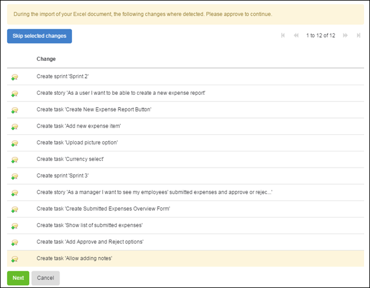

    The **Stories** tab will now list your imported content:

    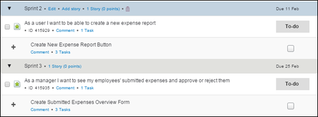

## 8 Exporting Stories

With Mendix, it’s always possible to export data from your application and from the database.

To export sprints and stories, follow these steps:

1.  On the **Stories** page click **More** and click **Import/Export**.

    

    There are three options to choose from, depending on which data you want to export.

2. Select **Export all Stories to Excel**.
3. Click **Export**, and an overview of the export data will be shown.
4. Click **Download** and save the Excel file on your computer.
5. Open the file to see your exported data.

## 9 Related Content

* [App Platform](/refguide7/app-platform)
* [How to Contribute to a GitHub Repository](/howto7/collaboration-project-management/contribute-to-a-github-repository)
* [How to Share the Development Database](/howto7/collaboration-project-management/sharing-the-development-database)
* [How to Start Your Own Repository](/howto7/collaboration-project-management/starting-your-own-repository)
* [How to Use the Excel Exporter](/howto7/integration/using-the-excel-exporter)
* [How to Use the Feedback Widget](gathering-user-feedback)
* [Team Server](/refguide7/team-server)
* [Use Team Server - Version Control](/howto7/collaboration-project-management/using-team-server-_-version-control)
