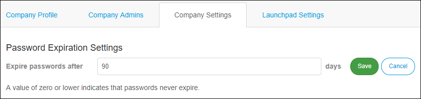

## 1 Introduction

By default, Mendix users must change their password every 90 days.

A Company Admin is allowed to change the password expiration period at the company level.

**This how-to will teach you how to do the following:**

* Change the password expiration

## 2 Prerequisites

Before starting this how-to, make sure you have completed the following prerequisites:

* You must have a MxID
* You must have the Company Admin role

## 3 Add Company Admin

1. Go to the [Developer Portal](http://home.mendix.com).
2.  Click your avatar in the top-right corner of the screen.

    

3. Click **Company Admin** and select the **Company Settings** tab.
4.  Set the password expiration and click **Save**. Note that a value of zero or lower indicates that passwords never expire.

    

## 4 Related Content

* [Company Admin](/developerportal/companyadmin)
* [How to Deactivate and Activate Users](/developerportal/howto/deactivate-users)
* [How to Delete, Deactivate and Activate Apps](/developerportal/howto/delete-apps)
* [How to Manage Company Roles and App Roles](/developerportal/howto/change-roles)
* [Roles Within the Company and Apps](/developerportal/general/roles)
