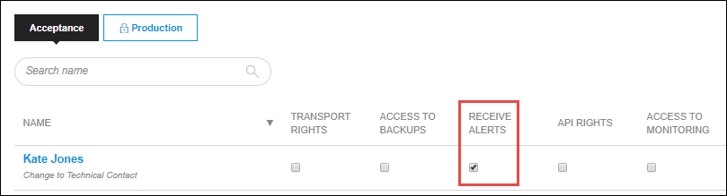
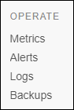
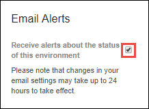

## 1 Introduction

You can manage the email alerts for each environment without the Technical Contact having to switch on **Receive alerts** node permission. 
You can switch the alerts on and off for each environment that you are entitled to. 

**This how-to will teach you how to do the following:**

* Switch alerts on and off for separate environments

## 2 Prerequisites

Before starting this how-to, make sure you have completed the prerequisites described below:

* You need a **Application Operator**, **Business Engineer** or a **SCRUM Master** role. In case or an own defined role, you must have the App Team **Edit** permission for **Monitor**.
    
    
## 2 Receive Alerts

There are 2 ways to start receiving alerts. 

1. The Technical Contact can grant you the **Receive Alerts** permission in **Node Permissions**.
2. You can click on the checkbox of **Email Alerts** on the **Alerts** page.

### 2.1 Node Permissions  

The Technical Contact can grant you the **Receive Alerts** permission by following these steps:

1. Go to the [Developer Portal](http://home.mendix.com).
2. Click **Apps** in the top navigation panel.
3. Click **My Apps** and select **Nodes**.
4. Open the node by clicking **Details**.
5. Click **Security** under the **Settings** category.
6. Select the checkbox below **Receive Alerts**. It is possible to set this permission separately for each environment. The changes will be automatically saved.

    

### 2.2 Alerts Page

You can manage the alerts by yourself, follow these steps:

1. Go to the [Developer Portal](http://home.mendix.com).
2. Click **Apps** in the top navigation panel.
3. Click **My Apps** and select **Nodes**.

    

4. Open the node by clicking **Details**.
5. Click **Alerts** in the left navigation panel. 

    

6. Select the checkbox of **Email Alerts**.  It is possible to set this option separately for each environment. The changes will be automatically saved.

    

## 3 Related Content

* [Alerts](/developerportal/operate/monitoring-application-health)
* [Operate](/developerportal/operate)
* [Security - Node Permissions](/developerportal/settings/node-permissions)
* [Settings](/developerportal/settings)  
* [Technical Contact](/developerportal/settings/technical-contact)
