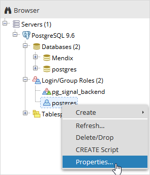
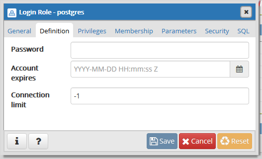

## 1 Introduction

Restoring a backup locally can be useful if you want to test your cloud environment's data without interrupting your live cloud environments. In this way you can reproduce your apps behavior containing data from your cloud environment locally. By using your Mendix Modeler and a Postgres database, you can debug your app using backups of your cloud production/acceptance/test data.

**This how-to will teach you how to do the following:**

* Download a backup from your cloud environment
* Create a new database
* Configure the project settings of the app

## 2 Prerequisites

**Before starting this how-to, make sure you have completed the following prerequisites:**

* [Download a backup](how-to-download-a-backup) that you want to restore locally from the [Developer Portal](http://home.mendix.com)
* Download and run the [Postgres Installer](https://www.postgresql.org/download/windows/)
* When restoring a database hosted in Mendix Cloud v4, you will need a utility such as [7zip](http://www.7-zip.org/) which can unzip **.gz** files.

NOTE: This guideline has been made with Postgres Installer version Version 9.6.5.

## 3 Restoring the Backup to Postgres

Once Postgres is installed and you have downloaded a backup file, it's time to create a local database in Postgres. The backup database will be restored into a local Postgres database.

{}
If your backup came from Mendix Cloud v4, it will have been compressed as a .gz file. You will first have to extract the file(s) from this archive using a tool such as 7zip.

If you have downloaded a full backup, this will also have been archived as a .tar file which you need to extract to get your .backup file containing the database backup. The .backup file in the **db** folder of the archive.
{}

1. Start **PgAdmin 4** from the Windows start menu.
2. Double click **PostgreSQL 9.6**.
3. Right-click **Databases** and **Create** a new database.

    

4. Fill in the **Database** name.
5. Select the correct owner (the default is **postgres**) and click **Save**.
6. Right-click on the newly created database and click **Restore**.

    

7. Upload the correct **.backup** file.
8. Click on the **Restore options** tab.
9. Under **Owner** set **Don’t save** to **Yes**.

    

10. Click **Restore**.
11.	Wait until you see that the backup is **Successfully completed.** in the right corner of the screen.

## 4 Linking the Database to the App in Desktop Modeler

After the backup has been restored as a local Postgres database, you have to link the database to the Desktop Modeler. This tells the Desktop Modeler to use the database that you have just created in Postgresql, rather than the database that was originally created with the app.

1. Open your app in the **Desktop Modeler**.
2. Open **Project... > Settings** from the **Project Explorer**.

    

3. Under the tab **Configurations** click **New**.

    

4. Fill in the database information.
    * **Name**: *{a unique name}*
    * **Type**: *PostreSQL*
    * **URL**: *localhost:5432*
    * **Database name**: *{database name}*
    * **User name**: *{database owner} (set when you created the database in gAdmin; the default is postgres)*
    * **Password**: *{password for database owner}*

    {}The default password for the database owner **postgres** is blank. Mendix will not accept a blank password so you will have to set one in pgAdmin.

    
    
    

    {}

5. Click **OK**.
6. Run the app by clicking **Run Locally**.

## 5 Restoring Files

The steps above restore the database, but do not restore any **FileDocuments** (binary files, such as images).

{}
You are restoring the FileDocuments to the same directory as your original local test files. Please remember to backup the files directory before adding your restored FileDocuments.
{}

If you also want to restore the **FileDocuments**, you need to follow the following steps:

1. Download a **Full snapshot**.

    

2. Select **Project > Show Project Directory in Explorer** from the Desktop Modeler menu

    

3. Navigate to the **deployment/data/files** folder within your project.
4. Extract the **{backup name}.tar** file from the .gz archive using a program like **7-zip**.
5. Extract the entire **tree** folder from the backup archive to the  **deployment/data/files** folder within your project.
6. Run the app by clicking **Run Locally**.

## 5 Related Content

* [Backups](/developerportal/operate/backups)
