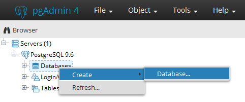
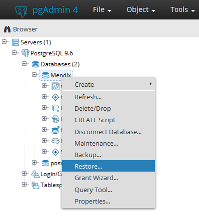
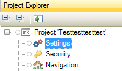
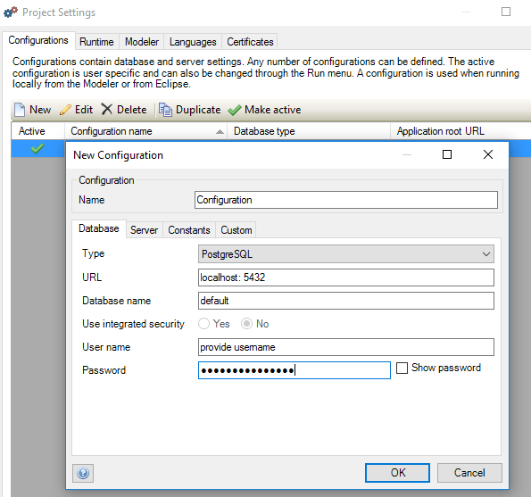
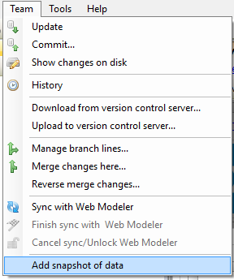
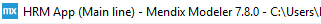

## 1 Introduction

There are 2 different databases:
1. External database (like Postgres).
2. Build-in-database.

**This how-to will teach you how to do the following:**

* Create a new database
* Create a data-snapshot
* Configure the project settings of the app

## 3 External database

This guideline has been made with Postgres Installer version Version 9.6.5

Before starting this how-to, make sure you have completed the following prerequisites:

* Download the [Postgres Installer](https://www.postgresql.org/download/windows/) Version 9.6.5

### 3.1 Postgres

1. Start PgAdmin.
2. Double click **PostgreSQL 9.6**.
3. Click **Database** and **create** a new database.  

    

4. Fill in the **Database** name.
5. Select the correct owner click **Save**.
6. Rightclick on the newly created database and click **Restore**. 

    

7. Upload the correct **.backup** file.
8. Click on the **Restore options** tab.
9. Under **Owner** set **Don’t save** to **Yes**.

    

10. Click **Restore**.
11.	Wait until you see that the backup is **Successfully completed.** in the right corner of the screen.  

### 3.2 Modeler

1. Open Mendix **Desktop Modeler**. 
2. Click below **Project** on **Settings**.

    

3. Under the tab **Configurations** click **New**.

    

| Type | PostreSQL |
| URL | localhost: 5432 |
| Database name | Provide database name |
| User name | Provide user name from PgAdmin |
| Password | Provide same password as in PgAdmin |

4. Click **OK**.
5. Run the app by clicking **Run Locally**.

## 4 Separate Build-in-database (data-snapshot)

If you want to import the build-in-database of another app to a new app, you can use the data-snapshot possibility.

Before starting this how-to, make sure you have completed the following prerequisites:

* Create a data-snaphot from the database of another app.

### 4.1 Create data-snapshot

Create a data-snapshot from a different mendix app database by doing the following:

1. Open the Mendix app in the **Desktop Modeler**.
2. Click **Team** in the top navigation panel.
3. Click **Add snapshot of data**.

    

### 4.2 Transport data-snapshot root directory

Before running the App, perform the following steps:

1. Go to the local root directory of your app containing the newly created data-snaphot **.zip** file.

You can find the root directory in behind the Mendix Desktop Modeler version:

    

2. Copy-paste the data-snapshot .zip file in the root directory of your new app.
