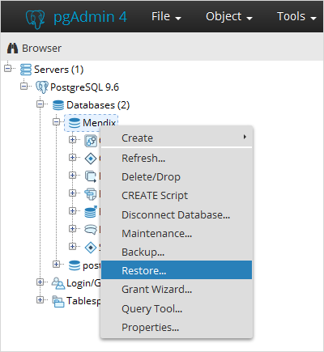
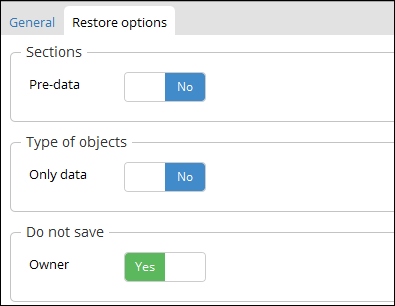
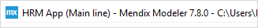

## 1 Introduction

Restoring a backup locally can be useful if you want to test your cloud environment's data without interrupting your live cloud environments. In this way you can reproduce your apps behavior containing data from your cloud environment locally. By using your Mendix Modeler and a Postgres database, you can debug your app using backups of your cloud production/acceptance/test data.

**This how-to will teach you how to do the following:**

* Download a backup from your cloud environment
* Create a new database
* Configure the project settings of the app

**Before starting this how-to, make sure you have completed the following prerequisites:**

* [Download a backup](how-to-download-a-backup) that you want to restore locally from the [Developer Portal](http://home.mendix.com)
* Download the [Postgres Installer](https://www.postgresql.org/download/windows/)
* When restoring a database hosted in Mendix Cloud v4, download [7zip](http://www.7-zip.org/) to convert the backup file from **.gz** to **.backup**. 

NOTE: This guideline has been made with Postgres Installer version Version 9.6.5.

## 2 Postgres

Once the Postgres Installer is installed and you have downloaded a backup file, it's time to create a local database in Postgres. The backup database will be restored into a local Postgres database.

1. Start PgAdmin.
2. Double click **PostgreSQL 9.6**.
3. Click **Database** and **create** a new database.  

    

4. Fill in the **Database** name.
5. Select the correct owner click **Save**.
6. Rightclick on the newly created database and click **Restore**. 

    

7. Upload the correct **.backup** file.
8. Click on the **Restore options** tab.
9. Under **Owner** set **Don’t save** to **Yes**.

    

10. Click **Restore**.
11.	Wait until you see that the backup is **Successfully completed.** in the right corner of the screen.  

## 3 Modeler

After the backup has been restored in a local Postgres database, the database has to be linked to the Mendix Modeler. This means that the Mendix Modeler will be using another database than the database that was originally created. 

1. Open Mendix **Desktop Modeler**. 
2. Click below **Project** on **Settings**.

    

3. Under the tab **Configurations** click **New**.

   

4. Fill in the database information. 

Configuration | Information
---- | ---
Type | PostreSQL
URL | localhost: 5432
Database name | Provide database name
User name | Provide user name from PgAdmin
Password | Provide same password as in PgAdmin

5. Click **OK**.
6. Run the app by clicking **Run Locally**.

## 4 Restore files

If you also want to restore the **FileDocuments** of your backup you need to download a **Full snapshot**. You need to move the **FileDocuments** to the **deployment directory** of your app. You can find the deployment directory behind the Mendix Desktop Modeler version:

 

After navigating to the deployment directory, follow these steps:

1. Open the **<backup>.tar.gz** file using a program like **7-zip**.
2. Copy the files in the **Files** folder from the unpacked backup file to the **Deployment\Data\Files** folder.

## 5 Related Content

* [Backups](/developerportal/operate/backups)
