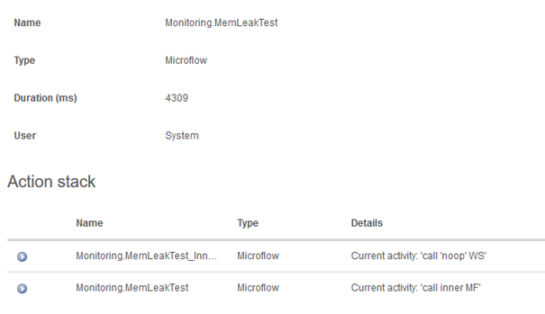

## 1 Introduction

The "Running now" tab can be found on the **Metrics** page of your Cloud node. It can be used to monitor all actions that are currently running in your environment.

## 2 About the "Running now" tab in the Mendix Cloud

It looks something like this:

This page shows all actions currently running the application. And some general information of each action.

The “Details” button allows you to zoom in on the selected action:

And finally the “Kill request” allows you to try and stop the action which, if successful, will lead to the user executing the action to end up with an error.

You can use the information displayed in the “Running now” tab for various purposes:

* To see if any actions are currently running in your application. This can be useful if you want to shutdown the application to perform maintenance.
* If you fear two actions are blocking one another you might be able to prevent the deadlock by killing one of the two action using the “Kill request” button
* If you have a performance or memory problem the listed actions (and their “Details” page(s)) might help you pinpoint the most likely cause of the problem.
* If the above alone is not enough, you can combine the information in this tab page with the information in the “Cache” tab page and/or the “Logs” tab page and/or the “Trends” tab page to gather more information.

## 3 Related Content

* [Troubleshooting your application in the Mendix Cloud: Cache](troubleshooting-mxcloud-cache)
