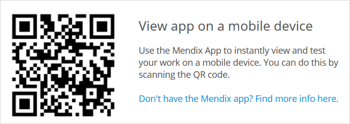
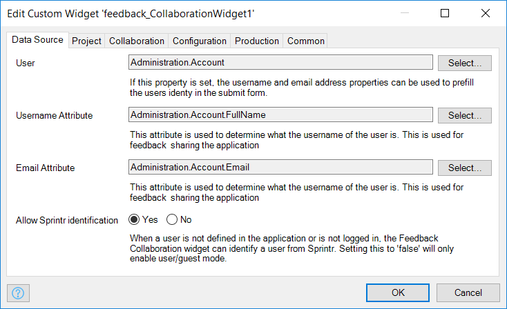

## 1 Introduction

The Mendix Feedback & Collaboration Widget enables you to collaborate more easily and quickly then ever before when developing an app project. With this widget, you make use of the fully integrated Mendix app feedback cycle as well as access editing capabilities in the Web Modeler, check out a mobile view of the app, and easily share the app via email.

**This how-to will teach you how to do the following:**

* Use the widget for leaving feedback on an app, editing an app, get a mobile view of an app, and sharing an app
* Configure the Widget

## 2 Prerequisites

Before starting this how-to, make sure you have completed the following prerequisite:

* Create an app containing a working application model

## 3 Submitting Feedback on an App

When you click the **Feedback** icon, the platform first checks if you are signed in. If you are already signed in, you will be in **Feedback Mode** right away. If you are not signed in, you will need to either **Sign in to Mendix** or **Continue as a guest** to enter the feedback mode:

Once you are in feedback mode, you can click anywhere on the screen to leave a comment:

And voila! A screenshot is created automatically of the current page, which you can choose to attach to your feedback. After clicking **Send**, your feedback will go straight to the [Feedback](../collaborate/feedback) page of your app project in the Developer Portal. For more information, see [Feedback](../collaborate/feedback).

When you are done leaving feedback, you need to exit the feedback mode by clicking this button:

## 4 Editing an App

Clicking the **Edit** icon opens the app page in the Web Modeler. If you have permissions to edit the app, you can start editing and collaborating right away!

## 5 Viewing an App

When you click the **Mobile view**  icon, a pop-up window is displayed that enables viewing your app on a mobile device:

You can access this mobile view by installing the [Mendix mobile app](https://play.google.com/store/apps/details?id=com.mendix.SprintrMobile) and then scanning the QR code in the pop-up window.

For more information, see [Getting the Mendix Mobile App](/refguide/getting-the-mendix-app) and [Developing Hybrid Mobile Apps](/refguide/developing-hybrid-mobile-apps).

## 6 Sharing an App

When you click the **Share** icon on the widget, a pop-up window appears for sharing your app via **Email**:

{}
{}

You can add as many email addresses as you like and email your app to colleagues for further collaboration and feedback.

## 7 Configuring the Feedback & Collaboration Widget

You can configure the widget for certain actions in your app project (for example, to allow screenshots, to hide the Mendix logo, and to hide the **Share** button. All the properties are explained in the properties dialog box for the widget:

