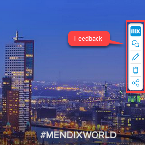
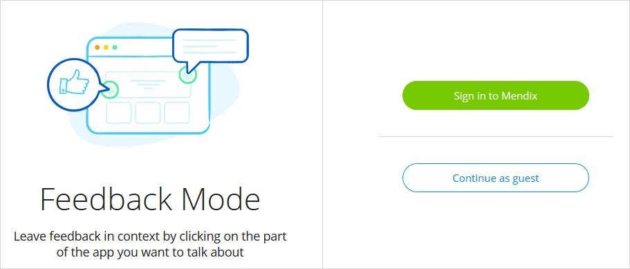
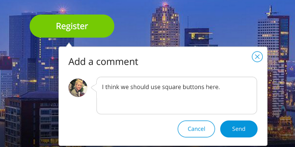

## 1 Introduction

The new Mendix Collaboration Widget enables you to collaborate more easily and quickly then ever before when developing an app project. With this widget, you make use of the fully integrated feedback cycle functionality as well as access editing capabilities in the Web Modeler, view the app you are working on via the Mendix mobile app on your phone, and share the app.

**This how-to will teach you how to do the following:**

* 

## 2 Prerequisites

Before starting this how-to, make sure you have completed the following prerequisite:

* Create an app containing a working application model

## 3 Commenting & Feedback

When you click the comment & feedback icon, the platform checks if you are signed in first. If you are already signed in, you will be in **Feedback Mode** right away. If you are not signed in, to enter the in **Feedback Mode** you will need to either sign in (although you do not have to enter your name on the feedback) **[VERIFY: ACCURATE, HOW WORKS?]** or continue as a guest.

Once you are in Feedback Mode, you can click anywhere on the screen to leave a comment.

And voila! Your feedback will go straight to the **Feedback** page of your app project in the Developer Portal. For more information, see the [Processing Feedback in the Developer Portal](https://docs.mendix.com/developerportal/howto/gathering-user-feedback#6-processing-feedback-in-the-developer-portal) section of *How to Use the Mendix Feedback Widget*.
**[ADD ANCHOR, FIX LINK]**

## 4 Editing

## 5 Phone Icon

## 6 Sharing

## 7 Configuring the Collaboration Widget
