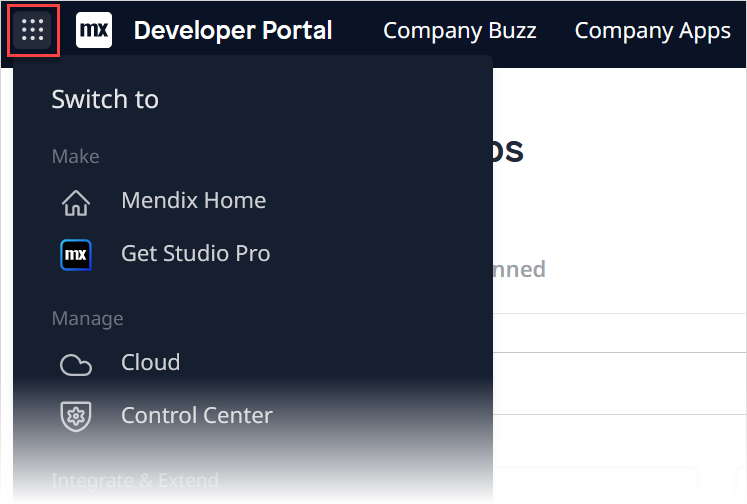
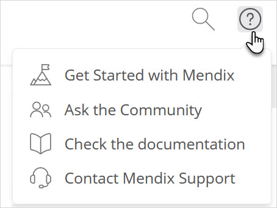

## 1 What Is the Developer Portal?

The [Developer Portal](http://sprintr.home.mendix.com) is one of the three key components of the Mendix Platform. The other two are [Mendix Studio Pro](/refguide/modeling) and [Mendix Studio](/studio/). In the Developer Portal, Mendix developers can collaborate, deploy, and manage their apps, and manage their company and users. 

The Developer Portal also offers open, well-defined APIs, enabling third-party developers to integrate their own widgets and plugins. For more information, see [API Documentation](/apidocs-mxsdk/apidocs/).

## 2 Navigation {#navigation}

To create a new app click **Create App**, which will open a page where you can choose a starting pointing for your new app:

On the right side of the top bar, you can search and access your [Mendix Profile](/developerportal/community-tools/mendix-profile). You can also click the **+** icon to create a new app.

On the left side of the top bar, you open an access menu by clicking the **Switch-to** menu:

{}

{}

You can then access the following parts of the Mendix Platform:

* **Mendix Home** – the [My Apps](/developerportal/apps-list/) page
* [Studio](/studio/)
* **Get Studio Pro** – the [Studio Pro](/refguide/) download page in the [Mendix Marketplace](/appstore/)
* **Cloud**  – the [Nodes](/developerportal/deploy/node-permissions) page, which shows a list of all the licensed Mendix Cloud nodes to which you have access
	* Clicking **Details** on this page opens the [Environments](/developerportal/deploy/environments) page for the app that is deployed to a node
	* For details on the **Cluster Manager** option in the top bar, see [Creating a Private Cloud Cluster](/developerportal/deploy/private-cloud-cluster)
* [Control Center](/developerportal/control-center/)
* [Marketplace](/appstore/)
* [Data Hub](/data-hub/)
* [Academy](https://academy.mendix.com/link/home)
* [Docs](https://docs.mendix.com/)
* [Forum](/developerportal/community-tools/mendix-forum)
* [Community](community-tools)

Click [Company Buzz](collaborate/buzz) to communicate with colleagues, team members, stakeholders, and any other Mendix users in your company.

Click [Company Apps](/developerportal/apps-list/#my-company-apps) to see all the apps created by members of your company.

If you want to turn on the old navigation/header, click your avatar and toggle **New Navigation** to **Off**.

## 3 Getting Assistance

Clicking the question icon in the Developer Portal brings up the options Mendix provides for getting assistance:

* **Ask the Community** – click this to go to the [Mendix Forum](https://forum.mendixcloud.com/index4.html)
* **Check the documentation** – click this to go to the [Mendix Documentation](https://docs.mendix.com/)
* **Contact Mendix Support** – click this to go to [Mendix Support](https://support.mendix.com/hc/en-us)

## 4 Guide Categories

The *Developer Portal Guide* is divided into the following categories:

{}
